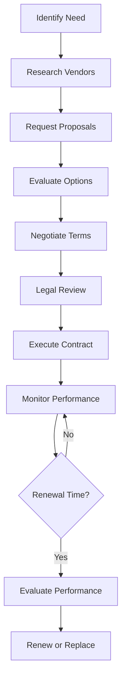

# Vendor and Supplier Contract Management

Manage vendor and supplier contracts to ensure favorable terms and reliable service delivery.

## Purpose

Establish systematic contract management procedures that secure favorable vendor terms, ensure reliable service delivery, and maintain compliance with procurement policies while supporting operational needs and cost optimization.

## Roles and Responsibilities

**Business Leader:**

- Negotiate major contracts and approve contract terms
- Review vendor performance and authorize contract renewals
- Establish procurement policies and vendor selection criteria

**Operations Leader:**

- Identify operational needs and vendor requirements
- Evaluate vendor performance and service quality
- Coordinate with vendors on service delivery and issues

**Finance Leader:**

- Review contract financial terms and payment obligations
- Monitor contract compliance and payment schedules
- Analyze vendor costs and negotiate pricing improvements

**Department Leaders:**

- Specify departmental vendor requirements and service levels
- Monitor vendor performance within their areas
- Report vendor issues and recommend contract modifications

## Process Steps

### Vendor Selection Phase

- **Identify service requirements** - Define specific needs, service levels, and performance expectations
- **Research potential vendors** - Evaluate vendor capabilities, references, and industry reputation
- **Request proposals** - Solicit competitive bids with detailed specifications and evaluation criteria
- **Evaluate vendor proposals** - Compare pricing, capabilities, and terms using standardized scoring matrix

### Contract Negotiation Phase

- **Review contract terms** - Analyze proposed terms for pricing, service levels, and liability provisions
- **Negotiate improvements** - Secure favorable pricing, payment terms, and performance guarantees
- **Include aviation requirements** - Ensure contracts address airport access, security, and safety requirements
- **Obtain legal review** - Have attorney review contracts for liability and compliance issues

### Contract Execution Phase

- **Finalize contract documents** - Complete all contract paperwork with proper signatures and dates
- **Establish vendor accounts** - Set up vendor in accounting system with payment terms and contacts
- **Communicate contract terms** - Brief relevant team members on vendor capabilities and procedures
- **Schedule performance reviews** - Establish regular vendor evaluation meetings and metrics

### Contract Administration Phase

- **Monitor vendor performance** - Track service delivery against contract specifications and service levels
- **Process vendor payments** - Ensure timely payment per contract terms and resolve billing issues
- **Manage contract modifications** - Process change orders and contract amendments as needed
- **Prepare renewal evaluations** - Assess vendor performance and market conditions for renewal decisions

## Process Mapping

## Tools and Resources

- **Contract Management System**: Digital contract storage and tracking capabilities
- **Vendor Database**: Contact information and performance history
- **Proposal Evaluation Matrix**: Standardized vendor comparison tools
- **Legal Counsel**: Attorney specializing in commercial contracts
- **Performance Metrics Templates**: Vendor evaluation and scorecard formats
- **Procurement Policies**: Company guidelines for vendor selection and contracting

## Success Metrics

**Completion Time:** Contract negotiations completed within 45 days of vendor selection.

**Quality Standard:** 95% of contracts include appropriate aviation-specific terms and liability protections.

**Safety Standard:** All safety-critical vendor contracts include emergency response and backup service provisions.

**Client Satisfaction:** Vendor services support 98% client satisfaction with FBO operations.

## Common Issues and Solutions

**Issue:** Vendor service quality declining after contract execution
**Solution:** Implement regular performance reviews with measurable service level agreements. Include performance improvement requirements and contract termination provisions for persistent issues.

**Issue:** Contract terms not addressing aviation-specific requirements
**Solution:** Develop aviation contract templates with standard airport access, security clearance, and insurance requirements. Require legal review for all aviation service contracts.

**Issue:** Vendor payment disputes affecting service relationships
**Solution:** Establish clear invoice review procedures and payment schedules. Maintain open communication with vendors and resolve disputes promptly to preserve service quality.

## Safety Considerations

⚠️ **WARNING:** Ensure all vendor contracts include appropriate insurance coverage and liability protection for airport operations

⚡ **CAUTION:** Verify vendor personnel have required airport security clearances and safety training

ℹ️ **NOTE:** Include emergency contact procedures and backup service provisions in all critical vendor contracts

✅ **BEST PRACTICE:** Maintain multiple vendors for critical services to ensure operational continuity

## Regulatory References

- **14 CFR Part 139** - Airport Operating Certificate (vendor requirements for airport operations)
- **Transportation Security Administration (TSA) Regulations** - Airport security requirements for vendors
- **Uniform Commercial Code (UCC)** - Commercial contract law and requirements
- **Company Procurement Policies** - Internal vendor selection and contract approval procedures
