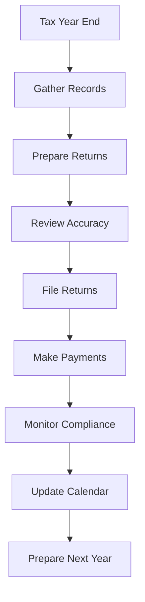

# Tax Filing and Compliance

Manage tax filing and compliance obligations to meet regulatory requirements and minimize tax liability.

## Purpose

Establish systematic tax filing and compliance procedures that ensure timely and accurate tax returns, maintain regulatory compliance, and optimize tax efficiency while minimizing audit risk and penalties.

## Roles and Responsibilities

**Finance Leader:**

- Coordinate tax preparation and filing activities
- Maintain tax records and supporting documentation
- Monitor compliance with tax regulations and deadlines

**Business Leader:**

- Review and approve tax returns before filing
- Make strategic tax planning decisions
- Authorize tax professional services and representation

**External CPA:**

- Prepare complex tax returns and provide tax planning advice
- Represent company in tax audits and examinations
- Provide updates on tax law changes affecting aviation businesses

**Operations Leader:**

- Provide operational data supporting tax calculations
- Ensure tax considerations are included in operational decisions
- Coordinate with finance on tax-related operational requirements

## Process Steps

### Tax Planning Phase

- **Review tax law changes** - Monitor federal, state, and local tax regulation updates affecting aviation businesses
- **Plan tax strategies** - Identify opportunities for tax optimization and compliance improvements
- **Organize supporting documentation** - Collect and organize records needed for tax preparation
- **Schedule tax preparation activities** - Coordinate timing with CPA and establish filing deadlines

### Tax Preparation Phase

- **Compile financial data** - Gather income statements, balance sheets, and detailed transaction records
- **Calculate taxable income** - Determine federal and state taxable income with appropriate adjustments
- **Prepare tax returns** - Complete all required federal, state, and local tax forms
- **Review return accuracy** - Verify calculations and supporting documentation before filing

### Filing and Payment Phase

- **Submit tax returns** - File returns by required deadlines using electronic filing when available
- **Process tax payments** - Make required tax payments and estimated tax deposits
- **Obtain filing confirmations** - Verify successful filing and maintain confirmation records
- **Update tax calendars** - Schedule future filing deadlines and payment requirements

### Compliance Monitoring Phase

- **Track filing deadlines** - Monitor all upcoming tax obligations and payment due dates
- **Maintain tax records** - Organize and store tax returns and supporting documentation per retention requirements
- **Respond to tax notices** - Address any correspondence from tax authorities promptly and accurately
- **Prepare for potential audits** - Maintain audit-ready documentation and establish audit response procedures

## Process Mapping

## Tools and Resources

- **Tax Preparation Software**: Professional tax software for complex business returns
- **Tax Calendar System**: Deadline tracking and reminder system
- **Document Management**: Secure storage for tax returns and supporting documentation
- **CPA Firm**: External tax professionals specializing in aviation businesses
- **Tax Research Resources**: Access to current tax regulations and interpretations
- **Banking System**: Electronic tax payment and deposit capabilities

## Success Metrics

**Completion Time:** All tax returns filed by required deadlines with no late filing penalties.

**Quality Standard:** 100% accuracy in tax filings with no errors requiring amended returns.

**Safety Standard:** Tax compliance supports continued operating certificates and regulatory approvals.

**Client Satisfaction:** Tax efficiency supports competitive pricing and service quality for clients.

## Common Issues and Solutions

**Issue:** Complex aviation transactions requiring specialized tax treatment
**Solution:** Work with CPA specializing in aviation industry tax issues. Develop procedures for common aviation transactions like aircraft sales, leases, and maintenance reserves.

**Issue:** Multiple state tax obligations due to aircraft operations across state lines
**Solution:** Implement state tax tracking system and work with multi-state tax specialist. Monitor aircraft movements and establish nexus tracking procedures.

**Issue:** Tax law changes affecting aviation fuel taxes and exemptions
**Solution:** Subscribe to aviation tax update services and maintain current exemption certificates. Review fuel tax obligations quarterly and adjust procedures as needed.

## Safety Considerations

⚠️ **WARNING:** Ensure tax compliance doesn't compromise safety expenditures or regulatory compliance

⚡ **CAUTION:** Maintain confidentiality of tax information and limit access to authorized personnel

ℹ️ **NOTE:** Tax planning should consider aviation industry cycles and seasonal operational patterns

✅ **BEST PRACTICE:** Use qualified aviation tax professionals to ensure compliance with industry-specific regulations

## Regulatory References

- **Internal Revenue Code** - Federal tax obligations and compliance requirements
- **State Tax Codes** - Applicable state income and sales tax regulations
- **Aviation Fuel Tax Regulations** - Federal and state fuel tax requirements and exemptions
- **14 CFR Part 91** - General Operating Rules (record-keeping requirements supporting tax filings)
