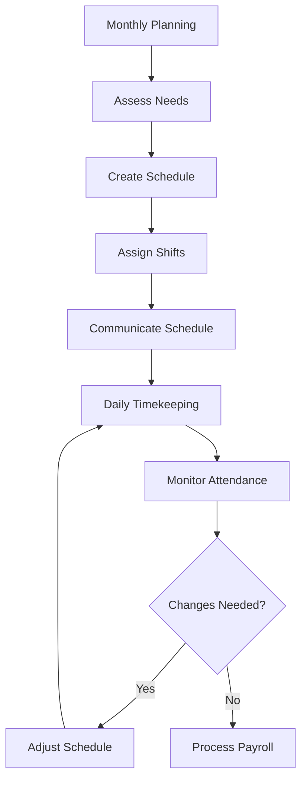

# Team Member Scheduling and Timekeeping

Manage team member scheduling and timekeeping to optimize staffing and ensure accurate payroll processing.

## Purpose

Establish systematic scheduling and timekeeping procedures that ensure adequate staffing for all operational needs, maintain accurate time records for payroll processing, and support team member work-life balance while meeting client service requirements.

## Roles and Responsibilities

**Finance Leader:**

- Review and approve billing policies and procedures
- Oversee invoice accuracy and accounts receivable
- Monitor financial performance and budgets
- Ensure compliance with financial regulations
- Coordinate with external accounting services

**Operations Leader:**

- Oversee daily operations and coordinate between departments
- Authorize emergency response procedures and resource allocation
- Monitor safety compliance and operational excellence
- Coordinate scheduling across departments for operational coverage
- Review billing disputes and approve service adjustments
- Ensure regulatory compliance across all operations
## Process Steps

### Schedule Planning Phase

- **Assess staffing requirements** - Determine minimum staffing needs by department and shift
- **Review historical patterns** - Analyze seasonal trends and operational demands affecting staffing
- **Coordinate department needs** - Balance staffing across line service, maintenance, flight training, and administration
- **Plan for special events** - Adjust schedules for air shows, training events, and peak operational periods

### Schedule Creation Phase

- **Develop master schedule** - Create monthly schedules ensuring adequate coverage for all operations
- **Assign specific shifts** - Match team member qualifications and availability to operational needs
- **Build in flexibility** - Include provisions for schedule adjustments and emergency coverage
- **Communicate schedules** - Distribute schedules to team members with adequate advance notice

### Timekeeping Management Phase

- **Record time worked** - Capture accurate start and end times for all team members
- **Track break periods** - Monitor meal breaks and rest periods per labor regulations
- **Document overtime hours** - Record and approve overtime work with proper authorization
- **Process time-off requests** - Handle vacation, sick leave, and personal time requests

### Schedule Adjustment Phase

- **Handle schedule changes** - Process requests for schedule modifications and coverage arrangements
- **Manage call-outs** - Coordinate emergency coverage for unexpected absences
- **Monitor attendance patterns** - Track attendance trends and address chronic issues
- **Update schedule records** - Maintain accurate records of all schedule changes and adjustments

## Process Mapping

## Tools and Resources

- **Scheduling Software**: Digital scheduling system with mobile access
- **Timekeeping System**: Electronic time clocks or mobile time tracking
- **Staffing Matrix**: Minimum staffing requirements by department and time period
- **Time-Off Tracking**: Vacation and sick leave accrual and usage tracking
- **Overtime Authorization Forms**: Approval documentation for overtime work
- **Schedule Templates**: Standard shift patterns and coverage models

## Success Metrics

**Completion Time:** Monthly schedules published 2 weeks before start of month.

**Quality Standard:** 98% schedule adherence with minimal last-minute changes or coverage gaps.

**Safety Standard:** Minimum staffing maintained for all safety-critical operations without exception.

**Client Satisfaction:** Adequate staffing supports 95% client satisfaction with service availability and response times.

## Common Issues and Solutions

**Issue:** Difficulty finding coverage for unexpected absences affecting service delivery
**Solution:** Maintain on-call list of qualified team members and cross-train personnel for multiple roles. Establish clear call-out procedures and response expectations.

**Issue:** Overtime costs exceeding budget due to scheduling inefficiencies
**Solution:** Analyze overtime patterns and adjust base schedules to reduce regular overtime needs. Implement scheduling software to optimize shift assignments and minimize gaps.

**Issue:** Timekeeping errors causing payroll inaccuracies and team member concerns
**Solution:** Implement digital timekeeping systems with supervisor approval workflows. Provide training on proper time recording and establish error correction procedures.

## Safety Considerations

⚠️ **WARNING:** Ensure minimum staffing levels are maintained for all safety-critical operations including fuel handling and aircraft marshalling

⚡ **CAUTION:** Monitor team member fatigue and ensure adequate rest periods between shifts per aviation safety standards

ℹ️ **NOTE:** Schedule coordination is essential for maintaining safety coverage during shift changes and breaks

✅ **BEST PRACTICE:** Use scheduling software to optimize coverage while controlling labor costs and supporting team member preferences

## Regulatory References

- **Fair Labor Standards Act (FLSA)** - Federal wage and hour regulations including overtime requirements
- **OSHA 29 CFR 1910** - Occupational Safety Standards (work hour limitations and rest requirements)
- **14 CFR Part 91** - General Operating Rules (crew duty time limitations for flight operations)
- **State Labor Laws** - Applicable state regulations for work schedules and time-off benefits
