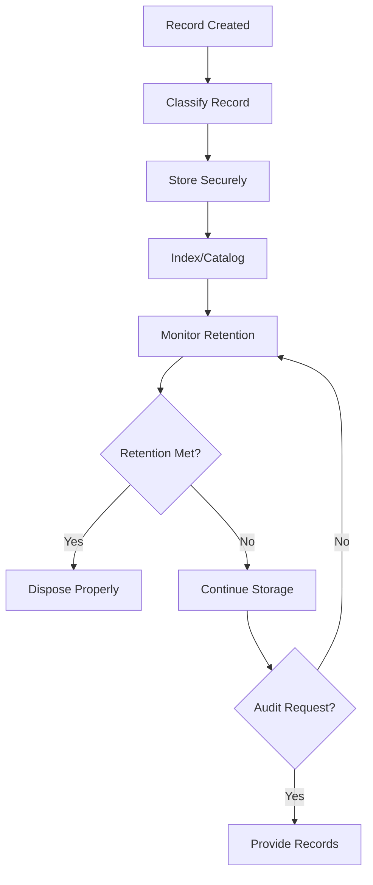

# Record-Keeping for Regulatory Compliance

Maintain regulatory records to ensure compliance with aviation and business regulations.

## Purpose

Establish systematic record-keeping procedures that ensure compliance with all applicable regulations, support audit activities, and maintain organized documentation for operational and legal requirements while protecting confidential information.

## Roles and Responsibilities

**Finance Leader:**

- Review and approve billing policies and procedures
- Oversee invoice accuracy and accounts receivable
- Monitor financial performance and budgets
- Ensure compliance with financial regulations
- Coordinate with external accounting services

**Operations Leader:**

- Oversee daily operations and coordinate between departments
- Authorize emergency response procedures and resource allocation
- Monitor safety compliance and operational excellence
- Coordinate scheduling across departments for operational coverage
- Review billing disputes and approve service adjustments
- Ensure regulatory compliance across all operations
## Process Steps

### Record Classification Phase

- **Identify regulatory requirements** - Determine record-keeping obligations for aviation, safety, environmental, and business regulations
- **Classify record types** - Categorize records by regulatory requirement and retention period
- **Establish retention schedules** - Define how long each record type must be maintained
- **Create filing systems** - Organize records for easy retrieval and audit support

### Document Management Phase

- **Capture records accurately** - Ensure all required information is recorded completely and legibly
- **Verify record completeness** - Review documents for accuracy and required signatures or approvals
- **Store records securely** - Maintain physical and digital records with appropriate access controls
- **Index records systematically** - Create searchable indexes for efficient record retrieval

### Compliance Monitoring Phase

- **Review retention compliance** - Monitor records against retention schedules and dispose of expired documents
- **Audit record quality** - Regularly review record-keeping practices for compliance and completeness
- **Update procedures** - Revise record-keeping procedures based on regulatory changes and audit findings
- **Train team members** - Provide ongoing training on proper record-keeping practices and requirements

### Audit Support Phase

- **Prepare audit documentation** - Organize records for regulatory inspections and external audits
- **Coordinate with auditors** - Provide requested documentation and support audit activities
- **Address audit findings** - Implement corrective actions for record-keeping deficiencies
- **Update procedures** - Revise record-keeping practices based on audit recommendations

## Process Mapping

## Tools and Resources

- **Document Management System**: Digital record storage and retrieval capabilities
- **Record Retention Schedule**: Detailed requirements for each record type
- **Filing Systems**: Physical and digital organization methods
- **Access Control System**: Security measures for confidential records
- **Audit Tracking Tools**: Systems for managing audit requests and responses
- **Regulatory Update Services**: Notifications of changes affecting record-keeping requirements

## Success Metrics

**Completion Time:** All regulatory records filed and indexed within 24 hours of creation.

**Quality Standard:** 100% of required records maintained with complete documentation and proper retention.

**Safety Standard:** Safety and maintenance records support regulatory compliance and audit requirements.

**Client Satisfaction:** Record-keeping supports efficient service delivery and client information protection.

## Common Issues and Solutions

**Issue:** Missing or incomplete records discovered during audits or inspections
**Solution:** Implement daily record review procedures and establish backup documentation processes. Create checklists for required documentation and conduct regular internal audits.

**Issue:** Records stored in multiple locations making retrieval difficult
**Solution:** Centralize record storage using document management system with consistent indexing. Establish single source of truth for each record type and eliminate duplicate storage.

**Issue:** Team members not following proper record-keeping procedures
**Solution:** Provide regular training on record-keeping requirements and consequences of non-compliance. Implement supervisor review procedures and establish accountability measures.

## Safety Considerations

⚠️ **WARNING:** Ensure safety and maintenance records are maintained per FAA requirements to support continued airworthiness

⚡ **CAUTION:** Protect confidential client and team member information with appropriate access controls and security measures

ℹ️ **NOTE:** Record retention requirements vary by regulation - ensure compliance with longest applicable retention period

✅ **BEST PRACTICE:** Use digital document management systems to improve record security, accessibility, and disaster recovery

## Regulatory References

- **14 CFR Part 91** - General Operating Rules (aircraft and maintenance record requirements)
- **14 CFR Part 61** - Certification: Pilots, Flight Instructors, and Ground Instructors (training records)
- **OSHA 29 CFR 1910.1020** - Access to Employee Exposure and Medical Records
- **Fair Labor Standards Act (FLSA)** - Team member record-keeping requirements
