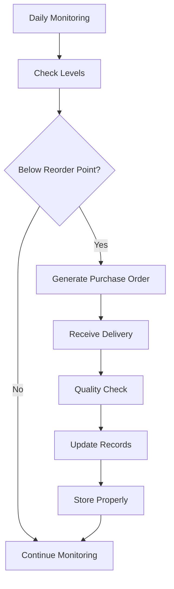

# Inventory Management for Fuel and Supplies

Manage fuel and supply inventory to ensure adequate stock levels while minimizing carrying costs.

## Purpose

Establish systematic inventory management procedures that ensure adequate fuel and supply availability for all operations, minimize carrying costs and waste, and maintain accurate inventory records while supporting operational efficiency and client service requirements.

## Roles and Responsibilities

**Operations Leader:**

- Establish inventory level requirements and reorder points
- Monitor inventory usage patterns and operational needs
- Coordinate with suppliers on delivery schedules and emergency orders

**Line Service Technician:**

- Monitor fuel levels and report consumption patterns
- Conduct daily inventory checks and record usage
- Identify supply needs and report inventory shortages

**Finance Leader:**

- Monitor inventory costs and budget compliance
- Process purchase orders and vendor payments
- Analyze inventory turnover and carrying costs

**Fuel System Operator:**

- Maintain fuel quality and conduct required testing
- Monitor fuel deliveries and verify quantities received
- Ensure fuel storage compliance with safety regulations

## Process Steps

### Inventory Monitoring Phase

- **Conduct daily inventory checks** - Record fuel levels, supply quantities, and usage patterns
- **Monitor consumption rates** - Track fuel sales and supply usage to predict future needs
- **Identify reorder points** - Establish minimum stock levels triggering procurement actions
- **Check inventory quality** - Verify fuel quality and inspect supplies for damage or expiration

### Procurement Planning Phase

- **Calculate order quantities** - Determine optimal order sizes balancing availability and carrying costs
- **Schedule deliveries** - Coordinate fuel deliveries and supply shipments with operational needs
- **Evaluate vendor options** - Compare pricing, delivery terms, and service quality from multiple suppliers
- **Process purchase orders** - Generate and approve purchase orders for fuel and supplies

### Receiving and Storage Phase

- **Verify deliveries** - Confirm quantities received match purchase orders and delivery documents
- **Conduct quality inspections** - Test fuel quality and inspect supplies for damage or defects
- **Update inventory records** - Record received quantities and update stock levels immediately
- **Store items properly** - Place inventory in appropriate storage areas following safety and security procedures

### Inventory Control Phase

- **Track inventory movement** - Record all fuel sales and supply usage with accurate documentation
- **Conduct periodic counts** - Perform monthly physical inventory counts to verify record accuracy
- **Investigate discrepancies** - Research and resolve differences between physical counts and records
- **Optimize inventory levels** - Adjust reorder points and quantities based on usage patterns and costs

## Process Mapping

## Tools and Resources

- **Inventory Management System**: Digital tracking of fuel and supply levels
- **Fuel Monitoring Equipment**: Tank level sensors and fuel quality testing equipment
- **Purchase Order System**: Procurement workflow and vendor coordination tools
- **Quality Testing Equipment**: Fuel testing kits and supply inspection tools
- **Storage Areas**: Secure, organized storage for supplies and equipment
- **Vendor Contacts**: Supplier information and emergency ordering procedures

## Success Metrics

**Completion Time:** Inventory replenishment completed within 24 hours of reaching reorder points.

**Quality Standard:** 99% inventory accuracy with less than 1% variance between physical counts and records.

**Safety Standard:** Fuel quality testing completed per regulations with no compromised fuel delivered to aircraft.

**Client Satisfaction:** 100% fuel and supply availability supporting uninterrupted client service.

## Common Issues and Solutions

**Issue:** Fuel contamination discovered during quality testing requiring tank cleaning
**Solution:** Implement enhanced fuel testing protocols and maintain relationships with fuel cleaning specialists. Establish backup fuel sources for emergency supply during tank maintenance.

**Issue:** Supply shortages affecting operational capabilities and client service
**Solution:** Establish safety stock levels for critical supplies and maintain relationships with multiple suppliers. Implement automated reorder systems for high-usage items.

**Issue:** Inventory shrinkage due to theft, damage, or unrecorded usage
**Solution:** Implement security measures for valuable inventory and establish usage tracking procedures. Conduct regular cycle counts and investigate variances immediately.

## Safety Considerations

⚠️ **WARNING:** Ensure fuel quality testing meets regulatory requirements to prevent contaminated fuel from reaching aircraft

⚡ **CAUTION:** Store hazardous materials per OSHA and EPA requirements with proper labeling and safety equipment

ℹ️ **NOTE:** Maintain adequate inventory levels to support emergency operations and unexpected demand

✅ **BEST PRACTICE:** Use automated inventory management systems to improve accuracy and reduce manual tracking errors

## Regulatory References

- **14 CFR Part 91** - General Operating Rules (fuel quality requirements)
- **OSHA 29 CFR 1910.106** - Flammable Liquids (fuel storage and handling requirements)
- **EPA 40 CFR Part 280** - Underground Storage Tank regulations
- **ASTM D1655** - Standard Specification for Aviation Turbine Fuels (Jet A quality standards)
