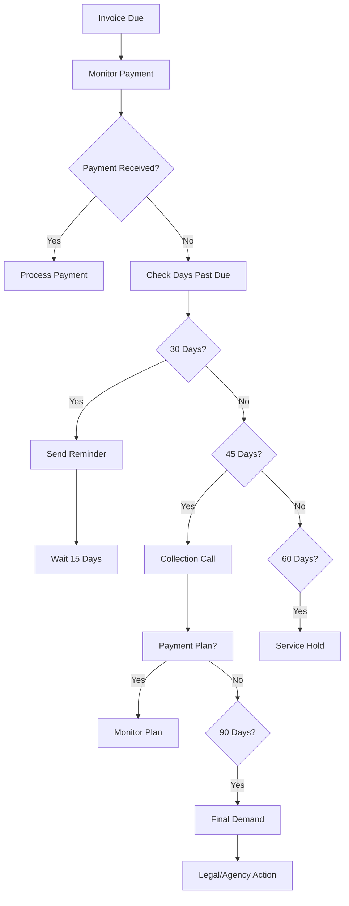

# Payment Processing and Collections

Process payments and manage collections to maintain healthy cash flow and minimize outstanding receivables.

## Purpose

Establish efficient payment processing and collections procedures that ensure timely payment collection, minimize bad debt, and maintain positive client relationships while supporting operational cash flow requirements.

## Roles and Responsibilities

**Finance Leader:**

- Review and approve billing policies and procedures
- Oversee invoice accuracy and accounts receivable
- Monitor financial performance and budgets
- Ensure compliance with financial regulations
- Coordinate with external accounting services

**Client Service Representative:**

- Manage client communications and service requests
- Process documentation and billing
- Obtain client authorizations and approvals
- Coordinate scheduling and aircraft availability
- Maintain professional client relationships

**Business Leader:**

- Approve marketing budget and resource allocation
- Review financial projections and business development strategies
- Provide strategic direction for market expansion
- Monitor competitive positioning and pricing strategies
- Oversee vendor contracts and supplier relationships

**Operations Leader:**

- Oversee daily operations and coordinate between departments
- Authorize emergency response procedures and resource allocation
- Monitor safety compliance and operational excellence
- Coordinate scheduling across departments for operational coverage
- Review billing disputes and approve service adjustments
- Ensure regulatory compliance across all operations
## Process Steps

### Payment Processing Phase

- **Accept payment methods** - Process cash, check, credit card, and ACH payments using secure systems
- **Verify payment accuracy** - Confirm payment amount matches invoice total and account balance
- **Apply payments to accounts** - Post payments to correct client accounts and invoice numbers
- **Generate payment receipts** - Provide immediate confirmation of payment with transaction details

### Account Monitoring Phase

- **Review aging reports** - Monitor accounts receivable aging on weekly basis to identify collection opportunities
- **Identify delinquent accounts** - Flag accounts past due based on established payment terms
- **Assess collection priority** - Evaluate account value and collection probability to prioritize efforts
- **Document collection activities** - Record all collection communications and actions taken

### Collection Procedures Phase

- **Send payment reminders** - Issue friendly payment reminders at 30 days past due
- **Make collection calls** - Contact clients at 45 days past due to discuss payment arrangements
- **Negotiate payment plans** - Work with clients to establish realistic payment schedules when needed
- **Implement service holds** - Restrict services for accounts 60+ days past due per policy

### Advanced Collections Phase

- **Send final demand notices** - Issue formal collection letters at 90 days past due
- **Coordinate with legal counsel** - Engage attorney for accounts requiring legal action
- **Process collection agency referrals** - Transfer uncollectable accounts to external agencies
- **Manage account write-offs** - Process bad debt write-offs per established authorization limits

## Process Mapping

## Tools and Resources

- **Payment Processing System**: Credit card and ACH processing capabilities
- **Accounting Software**: Accounts receivable management and aging reports
- **Collection Letters**: Standardized templates for payment reminders and demands
- **Client Communication Log**: Record of all collection activities and responses
- **Payment Plan Templates**: Structured agreements for extended payment arrangements
- **Legal Counsel Contact**: Attorney specializing in commercial collections

## Success Metrics

- **Completion Time:** Payment processing completed within 2 hours of receipt.

**Quality Standard:** 95% of payments processed accurately without requiring corrections.

**Safety Standard:** No service disruptions due to collection activities that compromise flight safety.

**Client Satisfaction:** 90% of clients rate payment process as convenient and professional.

## Common Issues and Solutions

- **Issue:** Client disputes invoice accuracy affecting payment timing
- **Solution:** Provide detailed service documentation and work with client to resolve discrepancies. Adjust billing if error confirmed and process corrected invoice promptly.

**Issue:** Credit card processing failures causing payment delays
**Solution:** Maintain backup payment processors and alternative payment methods. Contact client immediately to arrange alternative payment when processing fails.

**Issue:** Client financial difficulties preventing timely payment
**Solution:** Work with client to establish realistic payment plan while maintaining service relationship. Consider requiring deposits for future services.

## Safety Considerations

⚠️ **WARNING:** Never deny emergency services due to account status - safety always takes priority over collections

⚡ **CAUTION:** Coordinate service holds with operations to ensure no safety-critical services are affected

ℹ️ **NOTE:** Maintain professional communication during collection activities to preserve client relationships

✅ **BEST PRACTICE:** Document all collection activities thoroughly to support legal action if necessary

## Regulatory References

- **Fair Debt Collection Practices Act (FDCPA)** - Federal collection regulations
- **State Commercial Collection Laws** - Applicable state regulations for business collections
- **14 CFR Part 91** - General Operating Rules (emergency service requirements)
- **Company Credit and Collection Policy** - Internal procedures and authorization limits
