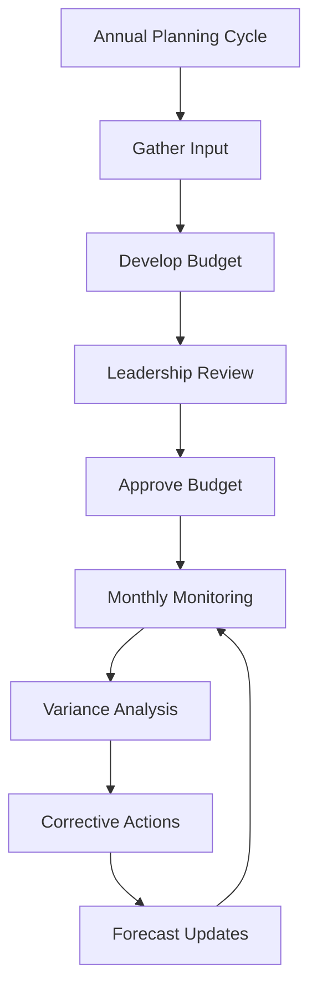

# Budget Planning and Monitoring

Develop and monitor budgets to ensure financial planning accuracy and operational cost control.

## Purpose

Establish systematic budget planning and monitoring procedures that support strategic decision-making, control operational costs, and ensure financial resources are allocated effectively to support FBO operations and growth objectives.

## Roles and Responsibilities

**Finance Leader:**

- Review and approve billing policies and procedures
- Oversee invoice accuracy and accounts receivable
- Monitor financial performance and budgets
- Ensure compliance with financial regulations
- Coordinate with external accounting services

**Business Leader:**

- Approve marketing budget and resource allocation
- Review financial projections and business development strategies
- Provide strategic direction for market expansion
- Monitor competitive positioning and pricing strategies
- Oversee vendor contracts and supplier relationships

**Operations Leader:**

- Oversee daily operations and coordinate between departments
- Authorize emergency response procedures and resource allocation
- Monitor safety compliance and operational excellence
- Coordinate scheduling across departments for operational coverage
- Review billing disputes and approve service adjustments
- Ensure regulatory compliance across all operations
## Process Steps

### Budget Planning Phase

- **Review previous year performance** - Analyze actual results versus budget to identify trends and improvement opportunities
- **Gather operational input** - Collect budget requests and forecasts from all department leaders
- **Research market conditions** - Review industry trends, fuel prices, and economic factors affecting operations
- **Develop revenue projections** - Forecast income from fuel sales, hangar rentals, maintenance, and flight training

### Budget Development Phase

- **Create expense budgets** - Develop detailed expense budgets by category including personnel, fuel, maintenance, and overhead
- **Establish capital expenditure plans** - Plan equipment purchases, facility improvements, and major repairs
- **Build contingency reserves** - Allocate funds for unexpected expenses and emergency situations
- **Calculate profitability targets** - Set realistic profit margins and return on investment goals

### Budget Approval Phase

- **Prepare budget presentation** - Create executive summary with key assumptions and strategic initiatives
- **Conduct budget review meetings** - Present budget to leadership team with supporting analysis
- **Incorporate feedback** - Revise budget based on leadership input and strategic priorities
- **Finalize approved budget** - Document final budget and distribute to department leaders

### Budget Monitoring Phase

- **Track monthly performance** - Compare actual results to budget on monthly basis
- **Analyze variances** - Investigate significant differences between actual and budgeted amounts
- **Prepare variance reports** - Document explanations for budget deviations and corrective actions
- **Update forecasts** - Revise projections based on actual performance and changing conditions

## Process Mapping

## Tools and Resources

- **Budgeting Software**: Financial planning and analysis tools
- **Historical Financial Data**: Previous year actuals and multi-year trends
- **Industry Benchmarks**: Aviation industry financial performance standards
- **Budget Templates**: Standardized formats for departmental budget submissions
- **Variance Report Templates**: Monthly performance analysis formats
- **Forecasting Models**: Revenue and expense projection tools

## Success Metrics

**Completion Time:** Annual budget completed and approved by December 15th for following year.

**Quality Standard:** Budget variance within 5% of actual results for major expense categories.

**Safety Standard:** Safety and maintenance budgets fully funded with no deferrals affecting airworthiness.

**Client Satisfaction:** Budget supports service quality standards that maintain 95% client satisfaction.

## Common Issues and Solutions

**Issue:** Fuel price volatility causing significant budget variances
**Solution:** Implement quarterly fuel price reviews and establish fuel price hedging strategies. Create fuel surcharge policies for extreme price movements.

**Issue:** Unexpected maintenance expenses exceeding budget allocations
**Solution:** Establish equipment replacement schedules and increase contingency reserves. Implement preventive maintenance programs to reduce unexpected repairs.

**Issue:** Revenue shortfalls due to economic conditions or weather impacts
**Solution:** Develop multiple revenue scenarios and cost reduction plans. Monitor leading indicators and implement contingency plans early.

## Safety Considerations

⚠️ **WARNING:** Never compromise safety expenditures to meet budget targets - safety investments protect lives and prevent larger costs

⚡ **CAUTION:** Ensure maintenance and equipment budgets support regulatory compliance and operational safety

ℹ️ **NOTE:** Budget planning should include adequate reserves for emergency situations and regulatory compliance

✅ **BEST PRACTICE:** Involve operational leaders in budget planning to ensure realistic assumptions and operational support

## Regulatory References

- **14 CFR Part 91** - General Operating Rules (maintenance requirements affecting budgets)
- **OSHA 29 CFR 1910** - Occupational Safety Standards (safety equipment and training budgets)
- **Generally Accepted Accounting Principles (GAAP)** - Financial reporting and budgeting standards
- **Company Financial Policies** - Internal budget approval and monitoring procedures
