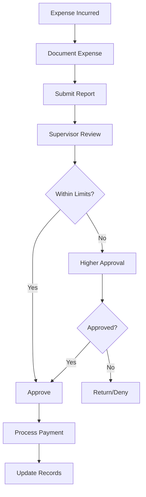

# Expense Tracking and Approval

Track and approve expenses to maintain cost control and ensure proper authorization for all expenditures.

## Purpose

Establish systematic expense tracking and approval procedures that ensure proper authorization, accurate documentation, and effective cost control while supporting operational needs and maintaining audit compliance.

## Roles and Responsibilities

**Finance Leader:**

- Review and approve billing policies and procedures
- Oversee invoice accuracy and accounts receivable
- Monitor financial performance and budgets
- Ensure compliance with financial regulations
- Coordinate with external accounting services

**Business Leader:**

- Approve marketing budget and resource allocation
- Review financial projections and business development strategies
- Provide strategic direction for market expansion
- Monitor competitive positioning and pricing strategies
- Oversee vendor contracts and supplier relationships
## Process Steps

### Expense Documentation Phase

- **Collect expense receipts** - Maintain all receipts and supporting documentation for business expenses
- **Complete expense reports** - Use standardized forms with detailed descriptions and business purposes
- **Verify expense accuracy** - Ensure all amounts and descriptions are correct before submission
- **Attach supporting documentation** - Include receipts, contracts, and any required approvals

### Approval Workflow Phase

- **Submit for initial approval** - Route expense reports to immediate supervisor for review
- **Verify budget availability** - Confirm sufficient budget allocation for requested expenses
- **Obtain required authorizations** - Secure additional approvals for expenses exceeding limits
- **Document approval decisions** - Record approval status and any conditions or restrictions

### Processing Phase

- **Review expense compliance** - Verify expenses meet company policies and regulatory requirements
- **Process approved payments** - Generate payments to vendors or reimburse team members
- **Update accounting records** - Post expenses to appropriate accounts and cost centers
- **Reconcile expense accounts** - Verify expense posting accuracy and resolve discrepancies

### Monitoring Phase

- **Track spending patterns** - Monitor departmental and category spending trends
- **Analyze budget variances** - Compare actual expenses to budgeted amounts and investigate significant differences
- **Generate expense reports** - Prepare monthly expense summaries for leadership review
- **Identify cost optimization opportunities** - Review spending patterns for potential savings

## Process Mapping

## Tools and Resources

- **Expense Management System**: Digital expense reporting and approval workflow
- **Expense Report Templates**: Standardized forms for different expense types
- **Authorization Matrix**: Approval limits by position and expense category
- **Vendor Payment System**: Accounts payable processing and payment capabilities
- **Budget Tracking Software**: Real-time budget monitoring and variance reporting
- **Receipt Management App**: Mobile receipt capture and documentation tools

## Success Metrics

**Completion Time:** Expense reports processed and paid within 5 business days of approval.

**Quality Standard:** 98% of expense reports submitted with complete documentation requiring no additional information.

**Safety Standard:** All safety-related expenses approved immediately without delays affecting operations.

**Client Satisfaction:** Vendor payments processed timely to maintain service quality and vendor relationships.

## Common Issues and Solutions

- **Issue:** Missing receipts or incomplete documentation delaying expense processing
- **Solution:** Implement digital receipt capture system and provide training on documentation requirements. Establish procedures for handling lost receipts with supervisor attestation.

**Issue:** Expenses exceeding budget allocations requiring additional approvals
**Solution:** Provide real-time budget monitoring tools to department leaders. Establish quarterly budget reviews to identify and address spending trends early.

**Issue:** Delayed expense approvals affecting vendor relationships and operations
**Solution:** Implement automated approval routing with escalation procedures. Establish emergency approval processes for time-sensitive operational expenses.

## Safety Considerations

⚠️ **WARNING:** Prioritize safety-related expenses to prevent delays that could compromise operational safety

⚡ **CAUTION:** Ensure fuel and maintenance expenses are processed promptly to maintain operational readiness

ℹ️ **NOTE:** Maintain separation of duties between expense approval and payment processing for internal control

✅ **BEST PRACTICE:** Use digital expense management systems to improve accuracy and reduce processing time

## Regulatory References

- **Internal Revenue Service (IRS) Publication 463** - Travel, Entertainment, Gift, and Car Expenses
- **OSHA 29 CFR 1910** - Occupational Safety Standards (safety equipment expenses)
- **14 CFR Part 145** - Repair Station Operating Rules (maintenance expense documentation)
- **Sarbanes-Oxley Act** - Internal controls over financial reporting
