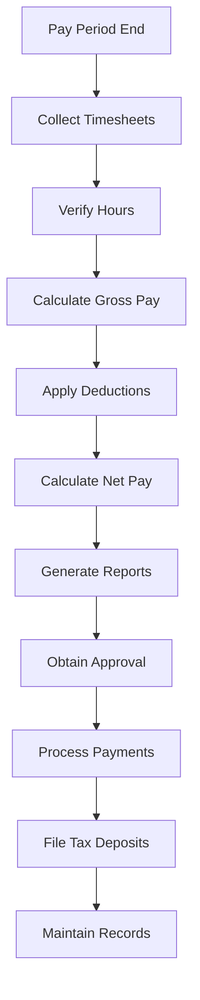

# Payroll Administration for Team Members

Administer payroll operations to ensure accurate and timely compensation for all team members.

## Purpose

Establish systematic payroll administration procedures that ensure accurate calculation, timely payment, and regulatory compliance for all team member compensation while maintaining confidentiality and supporting operational staffing needs.

## Roles and Responsibilities

**Finance Leader:**

- Review and approve billing policies and procedures
- Oversee invoice accuracy and accounts receivable
- Monitor financial performance and budgets
- Ensure compliance with financial regulations
- Coordinate with external accounting services

**Business Leader:**

- Approve marketing budget and resource allocation
- Review financial projections and business development strategies
- Provide strategic direction for market expansion
- Monitor competitive positioning and pricing strategies
- Oversee vendor contracts and supplier relationships

**Operations Leader:**

- Oversee daily operations and coordinate between departments
- Authorize emergency response procedures and resource allocation
- Monitor safety compliance and operational excellence
- Coordinate scheduling across departments for operational coverage
- Review billing disputes and approve service adjustments
- Ensure regulatory compliance across all operations
## Process Steps

### Timekeeping Collection Phase

- **Collect timesheet data** - Gather hours worked from all team members using approved timekeeping systems
- **Verify hours accuracy** - Review submitted hours against schedules and actual work performed
- **Process time-off requests** - Apply approved vacation, sick leave, and other time-off benefits
- **Calculate overtime hours** - Identify and calculate overtime compensation per labor regulations

### Payroll Calculation Phase

- **Calculate gross wages** - Compute regular and overtime pay based on approved rates and hours
- **Apply pre-tax deductions** - Process health insurance, retirement contributions, and other pre-tax benefits
- **Calculate tax withholdings** - Determine federal, state, and local tax obligations per current regulations
- **Process post-tax deductions** - Apply garnishments, union dues, and other post-tax deductions

### Payroll Processing Phase

- **Generate payroll registers** - Create detailed payroll reports for review and approval
- **Obtain payroll approval** - Secure authorization from Business Leader before processing payments
- **Process direct deposits** - Submit electronic payments to team member bank accounts
- **Generate pay statements** - Create detailed pay stubs showing earnings, deductions, and year-to-date totals

### Compliance and Reporting Phase

- **File tax deposits** - Submit payroll tax payments to appropriate agencies on required schedules
- **Prepare quarterly reports** - Complete Form 941 and state quarterly payroll tax returns
- **Maintain payroll records** - Organize and store payroll documentation per retention requirements
- **Update year-end reporting** - Prepare W-2 forms and annual payroll tax reconciliations

## Process Mapping

## Tools and Resources

- **Payroll Software**: Automated payroll processing and tax calculation system
- **Timekeeping System**: Electronic time tracking with approval workflows
- **Tax Rate Tables**: Current federal, state, and local tax withholding rates
- **Benefits Administration System**: Health insurance and retirement plan management
- **Banking System**: Direct deposit processing and payment distribution
- **Payroll Records Storage**: Secure document management for payroll documentation

## Success Metrics

- **Completion Time:** Payroll processed and payments distributed within 2 business days of pay period end.

**Quality Standard:** 99.5% payroll accuracy with less than 0.5% requiring corrections or adjustments.

**Safety Standard:** No payroll delays affecting team member availability for safety-critical operations.

**Client Satisfaction:** Team member satisfaction with payroll accuracy and timeliness maintains 98% positive rating.

## Common Issues and Solutions

- **Issue:** Timekeeping errors causing payroll inaccuracies and team member concerns
- **Solution:** Implement digital timekeeping systems with supervisor approval workflows. Provide training on proper time recording and establish correction procedures for errors.

**Issue:** Tax regulation changes affecting withholding calculations
**Solution:** Subscribe to payroll tax update services and maintain current tax tables. Work with payroll service provider to ensure compliance with new regulations.

**Issue:** Direct deposit failures causing payment delays
**Solution:** Maintain backup payment methods including paper checks. Verify banking information regularly and provide immediate notification of payment issues.

## Safety Considerations

⚠️ **WARNING:** Ensure payroll processing never delays critical staffing for safety operations

⚡ **CAUTION:** Protect confidential payroll information and maintain secure access controls

ℹ️ **NOTE:** Coordinate payroll schedules with operational needs to ensure adequate staffing coverage

✅ **BEST PRACTICE:** Use automated payroll systems to reduce errors and improve processing efficiency

## Regulatory References

- **Fair Labor Standards Act (FLSA)** - Federal wage and hour regulations
- **Internal Revenue Code** - Federal tax withholding and reporting requirements
- **State Labor Laws** - Applicable state wage and hour regulations
- **Employee Retirement Income Security Act (ERISA)** - Benefits administration requirements
