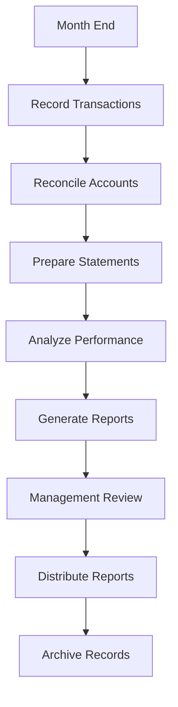

# Financial Reporting and Reconciliation

Generate financial reports and perform reconciliations to maintain accurate financial records and support decision-making.

## Purpose

Establish systematic financial reporting and reconciliation procedures that ensure accurate financial records, provide timely management information, and support regulatory compliance while enabling informed business decision-making.

## Roles and Responsibilities

**Finance Leader:**

- Review and approve billing policies and procedures
- Oversee invoice accuracy and accounts receivable
- Monitor financial performance and budgets
- Ensure compliance with financial regulations
- Coordinate with external accounting services

**Business Leader:**

- Approve marketing budget and resource allocation
- Review financial projections and business development strategies
- Provide strategic direction for market expansion
- Monitor competitive positioning and pricing strategies
- Oversee vendor contracts and supplier relationships

**Operations Leader:**

- Oversee daily operations and coordinate between departments
- Authorize emergency response procedures and resource allocation
- Monitor safety compliance and operational excellence
- Coordinate scheduling across departments for operational coverage
- Review billing disputes and approve service adjustments
- Ensure regulatory compliance across all operations
## Process Steps

### Monthly Closing Phase

- **Complete transaction recording** - Ensure all monthly transactions are recorded in accounting system
- **Process accruals and deferrals** - Record month-end adjustments for proper period matching
- **Reconcile bank accounts** - Match bank statements to accounting records and resolve differences
- **Reconcile accounts receivable** - Verify client account balances and aging accuracy

### Financial Statement Preparation Phase

- **Generate trial balance** - Produce preliminary financial position for review and adjustment
- **Prepare income statement** - Summarize revenue and expenses for the reporting period
- **Create balance sheet** - Present assets, liabilities, and equity at period end
- **Develop cash flow statement** - Show cash receipts and disbursements by operating, investing, and financing activities

### Analysis and Reporting Phase

- **Calculate key financial ratios** - Compute profitability, liquidity, and efficiency metrics
- **Prepare variance analysis** - Compare actual results to budget and prior periods
- **Create management dashboard** - Summarize key performance indicators for leadership review
- **Generate departmental reports** - Provide detailed financial information by operational area

### Review and Distribution Phase

- **Review financial accuracy** - Verify report accuracy and resolve any discrepancies
- **Obtain management approval** - Present reports to leadership team for review and approval
- **Distribute reports** - Provide financial information to authorized recipients per distribution schedule
- **Archive financial records** - Store completed reports and supporting documentation securely

## Process Mapping

## Tools and Resources

- **Accounting Software**: General ledger and financial reporting system
- **Bank Reconciliation Tools**: Automated matching and exception reporting
- **Financial Analysis Templates**: Ratio calculations and variance analysis formats
- **Report Distribution System**: Secure report delivery and access controls
- **Document Management System**: Financial record storage and retrieval
- **External Accountant**: CPA firm for complex accounting issues and annual reviews

## Success Metrics

**Completion Time:** Monthly financial reports completed and distributed within 10 business days of month end.

**Quality Standard:** 99% accuracy in financial reports with less than 1% requiring restatements.

**Safety Standard:** Financial reporting supports safety budget monitoring and compliance verification.

**Client Satisfaction:** Financial transparency supports client confidence and relationship management.

## Common Issues and Solutions

- **Issue:** Bank reconciliation discrepancies delaying month-end closing
- **Solution:** Implement daily cash management procedures and automated bank feeds. Investigate and resolve discrepancies immediately rather than accumulating them.

**Issue:** Missing transaction documentation affecting report accuracy
**Solution:** Establish daily transaction review procedures and require supporting documentation for all entries. Implement digital document capture and approval workflows.

**Issue:** Complex aviation transactions requiring specialized accounting treatment
**Solution:** Develop aviation-specific chart of accounts and work with CPA specializing in aviation industry. Create procedures for common aviation transactions.

## Safety Considerations

⚠️ **WARNING:** Ensure financial reporting accurately reflects safety and maintenance expenditures for regulatory compliance

⚡ **CAUTION:** Protect confidential financial information and maintain appropriate access controls

ℹ️ **NOTE:** Financial reports should support safety decision-making and regulatory compliance monitoring

✅ **BEST PRACTICE:** Use automated reconciliation tools to improve accuracy and reduce manual errors

## Regulatory References

- **Generally Accepted Accounting Principles (GAAP)** - Financial reporting standards
- **Internal Revenue Code** - Tax reporting and compliance requirements
- **14 CFR Part 91** - General Operating Rules (financial record requirements)
- **Sarbanes-Oxley Act** - Internal controls over financial reporting
