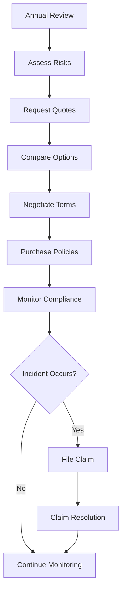

# Insurance Policy Management

Manage insurance policies to ensure adequate coverage and cost-effective risk management.

## Purpose

Establish systematic insurance policy management procedures that ensure adequate coverage for all operational risks, maintain cost-effective premiums, and provide prompt claims processing while supporting regulatory compliance and operational continuity.

## Roles and Responsibilities

**Finance Leader:**

- Review and approve billing policies and procedures
- Oversee invoice accuracy and accounts receivable
- Monitor financial performance and budgets
- Ensure compliance with financial regulations
- Coordinate with external accounting services

**Safety Officer:**

- Monitor safety compliance across all operations
- Conduct safety investigations and reporting
- Coordinate safety training and certification
- Ensure regulatory safety compliance
- Authorize safety equipment and improvements

**Business Leader:**

- Approve marketing budget and resource allocation
- Review financial projections and business development strategies
- Provide strategic direction for market expansion
- Monitor competitive positioning and pricing strategies
- Oversee vendor contracts and supplier relationships

**Operations Leader:**

- Oversee daily operations and coordinate between departments
- Authorize emergency response procedures and resource allocation
- Monitor safety compliance and operational excellence
- Coordinate scheduling across departments for operational coverage
- Review billing disputes and approve service adjustments
- Ensure regulatory compliance across all operations
## Process Steps

### Coverage Assessment Phase

- **Evaluate operational risks** - Identify all potential liability exposures from FBO operations
- **Review regulatory requirements** - Ensure coverage meets FAA, airport authority, and lender requirements
- **Assess coverage adequacy** - Compare current coverage to operational needs and industry standards
- **Identify coverage gaps** - Determine areas where additional insurance protection may be needed

### Policy Procurement Phase

- **Request insurance quotes** - Solicit competitive proposals from qualified aviation insurance providers
- **Compare coverage options** - Evaluate policy terms, limits, deductibles, and exclusions
- **Negotiate policy terms** - Secure favorable rates and coverage provisions with insurance carriers
- **Finalize policy selection** - Choose optimal coverage balancing protection and cost considerations

### Policy Administration Phase

- **Maintain policy documentation** - Organize insurance certificates and policy documents for easy access
- **Monitor policy compliance** - Ensure operational activities comply with policy terms and conditions
- **Process policy changes** - Handle coverage modifications, endorsements, and certificate requests
- **Coordinate renewal activities** - Plan renewal process and gather information for underwriting review

### Claims Management Phase

- **Report incidents promptly** - Notify insurance carriers of potential claims within required timeframes
- **Document claim details** - Provide thorough incident documentation and supporting evidence
- **Coordinate claim investigations** - Work with adjusters and provide access to facilities and records
- **Monitor claim resolution** - Track claim status and ensure prompt settlement of valid claims

## Process Mapping

## Tools and Resources

- **Insurance Broker**: Aviation insurance specialist with FBO experience
- **Policy Management System**: Digital storage and tracking of insurance documents
- **Risk Assessment Tools**: Checklists and evaluation criteria for operational risks
- **Claims Reporting System**: Procedures and forms for incident reporting
- **Certificate Tracking**: System for monitoring insurance certificate requirements
- **Legal Counsel**: Attorney specializing in aviation insurance and liability issues

## Success Metrics

**Completion Time:** Policy renewals completed 30 days before expiration with no coverage gaps.

**Quality Standard:** 100% of required insurance certificates current and meeting all regulatory requirements.

**Safety Standard:** Insurance coverage supports all safety operations without restrictions affecting compliance.

**Client Satisfaction:** Insurance coverage enables full service delivery without operational limitations.

## Common Issues and Solutions

- **Issue:** Insurance rates increasing significantly at renewal due to claims history
- **Solution:** Implement enhanced safety programs and risk management initiatives. Work with broker to find alternative markets and consider higher deductibles to reduce premiums.

**Issue:** Policy exclusions limiting coverage for specific FBO operations
**Solution:** Work with aviation insurance specialist to find carriers offering broader coverage. Consider separate policies for excluded activities if operationally necessary.

**Issue:** Claims processing delays affecting vendor relationships and operations
**Solution:** Maintain strong relationships with insurance carriers and adjusters. Provide prompt documentation and follow up regularly on claim status.

## Safety Considerations

⚠️ **WARNING:** Ensure insurance coverage includes all aviation operations to prevent gaps that could result in uninsured losses

⚡ **CAUTION:** Review policy terms regularly to ensure operational changes don't create coverage exclusions

ℹ️ **NOTE:** Maintain current certificates of insurance for all parties requiring proof of coverage

✅ **BEST PRACTICE:** Work with insurance brokers specializing in aviation to ensure appropriate coverage and competitive rates

## Regulatory References

- **14 CFR Part 91** - General Operating Rules (insurance requirements for aircraft operations)
- **Airport Operating Agreements** - Insurance requirements specified by airport authority
- **State Insurance Regulations** - Applicable state requirements for commercial insurance
- **Lender Requirements** - Insurance coverage required by financing agreements
