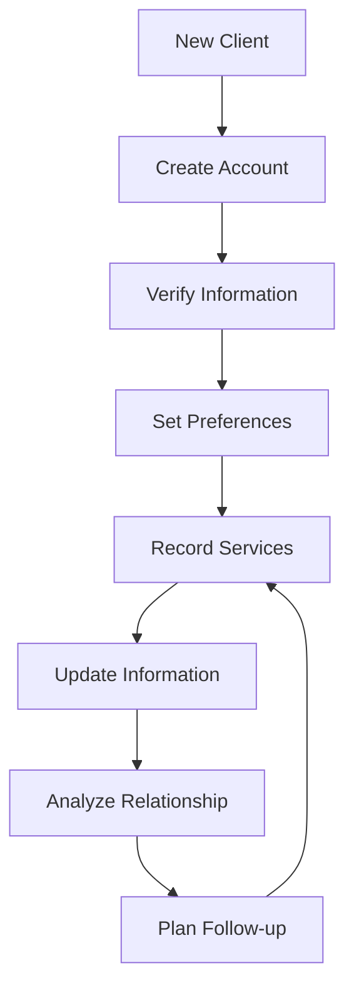

# Client Account Management in CRM

Manage client accounts in CRM system to maintain accurate client information and support relationship management.

## Purpose

Establish systematic client account management procedures that ensure accurate client information, support relationship building, and enable effective communication while providing insights for business development and service improvement initiatives.

## Roles and Responsibilities

**Client Service Representative:**

- Manage client communications and service requests
- Process documentation and billing
- Obtain client authorizations and approvals
- Coordinate scheduling and aircraft availability
- Maintain professional client relationships

**Business Leader:**

- Approve marketing budget and resource allocation
- Review financial projections and business development strategies
- Provide strategic direction for market expansion
- Monitor competitive positioning and pricing strategies
- Oversee vendor contracts and supplier relationships

**Operations Leader:**

- Oversee daily operations and coordinate between departments
- Authorize emergency response procedures and resource allocation
- Monitor safety compliance and operational excellence
- Coordinate scheduling across departments for operational coverage
- Review billing disputes and approve service adjustments
- Ensure regulatory compliance across all operations
## Process Steps

### Account Setup Phase

- **Create client profiles** - Establish new client accounts with complete contact and aircraft information
- **Verify client information** - Confirm accuracy of contact details, aircraft data, and service preferences
- **Set communication preferences** - Record preferred contact methods and communication frequency
- **Establish service history** - Document initial services and create baseline for future interactions

### Information Maintenance Phase

- **Update contact information** - Maintain current addresses, phone numbers, and email contacts
- **Record aircraft changes** - Update aircraft ownership, registration, and specification changes
- **Track service preferences** - Document client preferences for fuel, hangar, catering, and other services
- **Maintain billing information** - Keep current billing addresses and payment method preferences

### Interaction Documentation Phase

- **Record service interactions** - Document all client contacts including services provided and issues resolved
- **Log communication history** - Maintain record of phone calls, emails, and in-person meetings
- **Track client feedback** - Record compliments, complaints, and suggestions for service improvement
- **Note special requirements** - Document any unique client needs or accommodation requests

### Relationship Analysis Phase

- **Monitor client activity** - Track service frequency and spending patterns for relationship health
- **Identify growth opportunities** - Analyze client needs for additional services or expanded relationships
- **Generate client reports** - Create summaries of client activity and relationship status
- **Plan follow-up activities** - Schedule proactive communications and relationship-building initiatives

## Process Mapping

## Tools and Resources

- **CRM Software**: Client relationship management system with aviation-specific features
- **Client Database**: Centralized repository for all client information and history
- **Communication Templates**: Standardized formats for client correspondence
- **Service History Reports**: Detailed records of all services provided to each client
- **Analytics Dashboard**: Client relationship metrics and performance indicators
- **Mobile CRM Access**: Field access to client information for line service team

## Success Metrics

**Completion Time:** Client account updates completed within 24 hours of service delivery or information changes.

**Quality Standard:** 98% accuracy in client contact information with less than 2% returned communications.

**Safety Standard:** Aircraft information accuracy supports proper service delivery and safety compliance.

**Client Satisfaction:** CRM data supports personalized service resulting in 95% client satisfaction ratings.

## Common Issues and Solutions

**Issue:** Incomplete or outdated client information affecting service delivery and communication
**Solution:** Implement regular client information verification procedures and establish annual client data review process. Train team members to update information during each client interaction.

**Issue:** Multiple team members updating same client records causing data conflicts
**Solution:** Establish clear data ownership rules and implement CRM system with conflict resolution capabilities. Train users on proper update procedures and coordination requirements.

**Issue:** Client privacy concerns about information storage and usage
**Solution:** Develop clear privacy policies and obtain client consent for information usage. Implement data security measures and provide clients with access to their information.

## Safety Considerations

⚠️ **WARNING:** Ensure aircraft information accuracy in CRM to prevent service errors that could affect flight safety

⚡ **CAUTION:** Protect confidential client information with appropriate access controls and security measures

ℹ️ **NOTE:** Maintain accurate emergency contact information for all clients to support incident response

✅ **BEST PRACTICE:** Use CRM data to anticipate client needs and provide proactive service excellence

## Regulatory References

- **14 CFR Part 91** - General Operating Rules (aircraft identification and service requirements)
- **Privacy Act** - Protection of personal information and data security requirements
- **State Privacy Laws** - Applicable state regulations for client information protection
- **Company Privacy Policy** - Internal procedures for client information handling and protection
