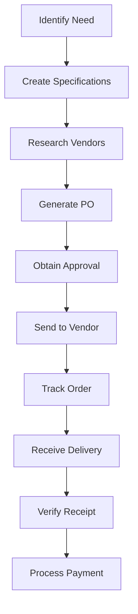

# Purchase Order Processing

Process purchase orders to ensure proper authorization and accurate procurement of goods and services.

## Purpose

Establish systematic purchase order processing procedures that ensure proper authorization, accurate procurement, and effective cost control while supporting operational needs and maintaining vendor relationships through efficient purchasing processes.

## Roles and Responsibilities

**Finance Leader:**

- Review and approve billing policies and procedures
- Oversee invoice accuracy and accounts receivable
- Monitor financial performance and budgets
- Ensure compliance with financial regulations
- Coordinate with external accounting services

**Operations Leader:**

- Oversee daily operations and coordinate between departments
- Authorize emergency response procedures and resource allocation
- Monitor safety compliance and operational excellence
- Coordinate scheduling across departments for operational coverage
- Review billing disputes and approve service adjustments
- Ensure regulatory compliance across all operations
## Process Steps

### Purchase Request Phase

- **Identify procurement needs** - Determine specific requirements for goods or services needed
- **Specify detailed requirements** - Create detailed specifications including quantities, quality standards, and delivery requirements
- **Research vendor options** - Identify qualified suppliers and compare pricing and capabilities
- **Obtain budget approval** - Verify sufficient budget allocation for requested purchases

### Purchase Order Creation Phase

- **Generate purchase order** - Create formal purchase order with complete specifications and terms
- **Include delivery requirements** - Specify delivery location, timing, and any special handling requirements
- **Add payment terms** - Include approved payment terms and billing instructions
- **Obtain required approvals** - Secure authorization from appropriate leaders per approval matrix

### Vendor Coordination Phase

- **Submit purchase order** - Send approved purchase order to selected vendor with confirmation request
- **Confirm order acceptance** - Verify vendor acceptance and delivery commitment
- **Track order status** - Monitor order progress and coordinate on any delivery changes
- **Communicate delivery requirements** - Ensure vendor understands airport access and delivery procedures

### Receipt and Processing Phase

- **Verify deliveries** - Confirm received items match purchase order specifications and quantities
- **Inspect quality** - Check delivered goods for damage, defects, or quality issues
- **Process vendor invoices** - Match invoices to purchase orders and delivery receipts
- **Update inventory records** - Record received items in inventory management system

## Process Mapping

## Tools and Resources

- **Purchase Order System**: Digital procurement workflow and approval system
- **Vendor Database**: Supplier contact information and performance history
- **Approval Matrix**: Authorization limits by position and purchase category
- **Receiving Documentation**: Forms and procedures for delivery verification
- **Budget Tracking System**: Real-time budget monitoring and purchase impact analysis
- **Inventory Management System**: Integration with inventory tracking and control

## Success Metrics

**Completion Time:** Purchase orders processed and sent to vendors within 2 business days of approval.

**Quality Standard:** 95% of deliveries received match purchase order specifications without requiring returns or exchanges.

**Safety Standard:** All safety-critical supplies ordered and received within required timeframes to maintain operational safety.

**Client Satisfaction:** Procurement efficiency supports uninterrupted service delivery and operational excellence.

## Common Issues and Solutions

**Issue:** Vendor delivery delays affecting operational capabilities and client service
**Solution:** Maintain relationships with multiple suppliers for critical items and establish emergency procurement procedures. Monitor vendor performance and address delivery issues promptly.

**Issue:** Purchase orders exceeding budget allocations requiring additional approvals
**Solution:** Implement real-time budget checking in purchase order system and provide budget visibility to requestors. Establish emergency purchase procedures for safety-critical items.

**Issue:** Received goods not matching purchase order specifications
**Solution:** Establish detailed receiving procedures with quality inspection requirements. Train receiving personnel on specification verification and return procedures for non-conforming items.

## Safety Considerations

⚠️ **WARNING:** Prioritize safety-critical purchases to prevent delays that could compromise operational safety or regulatory compliance

⚡ **CAUTION:** Ensure aviation-specific supplies meet regulatory requirements and quality standards

ℹ️ **NOTE:** Coordinate deliveries with airport security requirements and operational schedules

✅ **BEST PRACTICE:** Use electronic purchase order systems to improve accuracy and reduce processing time

## Regulatory References

- **14 CFR Part 91** - General Operating Rules (equipment and supply requirements)
- **OSHA 29 CFR 1910** - Occupational Safety Standards (safety equipment procurement requirements)
- **Uniform Commercial Code (UCC)** - Commercial purchase and sales law
- **Company Procurement Policies** - Internal purchasing authorization and procedures
