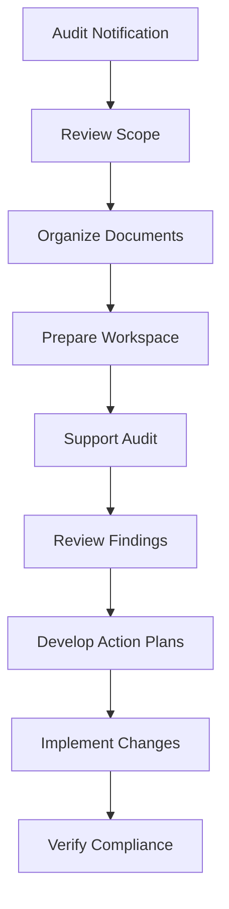

# Audit Preparation and Support

Prepare for and support audit activities to ensure compliance verification and operational transparency.

## Purpose

Establish systematic audit preparation and support procedures that ensure efficient audit processes, demonstrate regulatory compliance, and provide transparent access to operational documentation while minimizing business disruption and audit costs.

## Roles and Responsibilities

**Finance Leader:**

- Review and approve billing policies and procedures
- Oversee invoice accuracy and accounts receivable
- Monitor financial performance and budgets
- Ensure compliance with financial regulations
- Coordinate with external accounting services

**Business Leader:**

- Approve marketing budget and resource allocation
- Review financial projections and business development strategies
- Provide strategic direction for market expansion
- Monitor competitive positioning and pricing strategies
- Oversee vendor contracts and supplier relationships
## Process Steps

### Pre-Audit Preparation Phase

- **Review audit scope** - Understand audit objectives, timeline, and documentation requirements
- **Organize required documentation** - Gather all records specified in audit request or regulatory requirements
- **Conduct internal review** - Perform preliminary review to identify potential issues or documentation gaps
- **Prepare audit workspace** - Establish dedicated area for auditor use with necessary equipment and access

### Documentation Organization Phase

- **Compile regulatory records** - Organize all required compliance documentation by category and date
- **Prepare financial records** - Ensure accounting records are complete and properly supported
- **Gather operational documentation** - Collect maintenance logs, training records, and operational procedures
- **Create document index** - Develop organized listing of all available documentation for auditor reference

### Audit Support Phase

- **Coordinate auditor access** - Provide facility access and coordinate with airport security for auditor clearance
- **Support information requests** - Respond promptly to auditor questions and additional documentation requests
- **Facilitate interviews** - Schedule and coordinate auditor meetings with relevant team members
- **Monitor audit progress** - Track audit activities and address any issues or concerns promptly

### Post-Audit Activities Phase

- **Review audit findings** - Analyze audit results and recommendations for accuracy and completeness
- **Develop corrective action plans** - Create specific plans to address any audit findings or recommendations
- **Implement improvements** - Execute corrective actions and process improvements identified during audit
- **Follow up on compliance** - Monitor implementation of corrective actions and verify effectiveness

## Process Mapping

## Tools and Resources

- **Document Management System**: Organized storage and retrieval of audit documentation
- **Audit Checklist**: Comprehensive list of required documentation by audit type
- **Conference Facilities**: Meeting rooms and equipment for auditor use
- **External CPA Firm**: Professional audit support and representation
- **Legal Counsel**: Attorney specializing in regulatory compliance and audit issues
- **Corrective Action Tracking**: System for monitoring implementation of audit recommendations

## Success Metrics

**Completion Time:** Audit documentation prepared and organized within 5 business days of audit notification.

**Quality Standard:** 100% of requested documentation provided to auditors without delays or missing records.

**Safety Standard:** Audit processes don't disrupt safety-critical operations or compromise regulatory compliance.

**Client Satisfaction:** Audit activities conducted with minimal impact on client service delivery.

## Common Issues and Solutions

**Issue:** Missing or incomplete documentation discovered during audit preparation
**Solution:** Implement regular internal audit procedures to identify documentation gaps before external audits. Establish backup documentation procedures and maintain duplicate records for critical items.

**Issue:** Auditor requests exceeding scope or requiring excessive resources
**Solution:** Clarify audit scope and objectives with audit leader. Coordinate with legal counsel if requests appear unreasonable or outside audit authority.

**Issue:** Audit findings requiring significant operational changes
**Solution:** Develop phased implementation plans for major changes and coordinate with operations to minimize service disruption. Prioritize safety-critical findings for immediate implementation.

## Safety Considerations

⚠️ **WARNING:** Ensure audit activities don't compromise safety operations or create security vulnerabilities

⚡ **CAUTION:** Coordinate auditor facility access with airport security requirements and operational schedules

ℹ️ **NOTE:** Maintain confidentiality of client information during audit activities and limit auditor access to necessary records only

✅ **BEST PRACTICE:** Use audit activities as opportunities to improve procedures and demonstrate operational excellence

## Regulatory References

- **14 CFR Part 91** - General Operating Rules (record-keeping requirements supporting audits)
- **14 CFR Part 139** - Airport Operating Certificate (audit and inspection requirements)
- **OSHA 29 CFR 1910** - Occupational Safety Standards (audit and inspection procedures)
- **Generally Accepted Auditing Standards (GAAS)** - Professional audit standards and procedures
