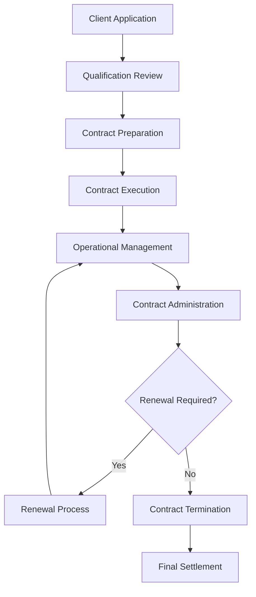

# Aircraft Rental Contract Management

Manage aircraft rental contracts to ensure proper client qualification, clear terms, and comprehensive liability protection while supporting safe and compliant aircraft operations.

## Purpose

Establish systematic aircraft rental contract management procedures that ensure proper client qualification, clear operational terms, comprehensive liability protection, and regulatory compliance while supporting safe aircraft operations and protecting organizational interests.

## Roles and Responsibilities

**Business Leader:**

- Approve rental contract terms and pricing structures
- Review client qualification criteria and credit requirements
- Oversee rental fleet utilization and revenue optimization
- Monitor competitive positioning and market analysis
- Authorize contract modifications and special arrangements

**Operations Leader:**

- Oversee aircraft availability and scheduling coordination
- Monitor aircraft maintenance status and airworthiness
- Coordinate with maintenance team for aircraft readiness
- Ensure operational compliance with rental agreements
- Authorize aircraft releases and return procedures

**Safety Officer:**

- Review client pilot qualifications and currency requirements
- Verify aircraft airworthiness and maintenance compliance
- Monitor safety incidents and operational concerns
- Ensure regulatory compliance for rental operations
- Coordinate safety training and certification requirements

**Client Service Representative:**

- Process rental applications and client qualification
- Coordinate contract execution and documentation
- Manage client communications and service delivery
- Process billing and payment for rental services
- Maintain client relationship and satisfaction

## Process Steps

### Client Qualification Phase

- **Review rental application** - Assess client pilot qualifications, experience, and currency requirements
- **Verify pilot credentials** - Confirm current medical certificate, flight review, and aircraft type ratings
- **Conduct background check** - Review client history, credit standing, and previous rental experience
- **Assess insurance coverage** - Verify client aircraft insurance coverage meets minimum requirements

### Contract Development Phase

- **Prepare rental agreement** - Create comprehensive contract with clear terms, conditions, and liability provisions
- **Define operational parameters** - Establish aircraft use limitations, geographic restrictions, and operational requirements
- **Set pricing structure** - Determine hourly rates, minimum charges, and additional service fees
- **Include safety requirements** - Specify preflight inspection, weather minimums, and operational procedures

### Contract Execution Phase

- **Review contract terms** - Ensure client understands all terms, conditions, and operational requirements
- **Obtain required signatures** - Complete contract execution with proper authorization and witness signatures
- **Collect security deposit** - Process required deposit payment and establish billing account
- **Provide orientation briefing** - Conduct aircraft familiarization and operational procedures review

### Operational Management Phase

- **Monitor aircraft utilization** - Track rental hours, fuel consumption, and maintenance requirements
- **Coordinate scheduling** - Manage aircraft availability and client reservation requirements
- **Process billing** - Generate accurate invoices for rental time and additional services
- **Maintain communication** - Provide regular updates on aircraft status and operational requirements

### Contract Administration Phase

- **Track contract compliance** - Monitor adherence to terms, conditions, and operational requirements
- **Process contract modifications** - Handle changes to rental terms, pricing, or operational parameters
- **Manage renewals** - Coordinate contract renewal process and terms renegotiation
- **Handle terminations** - Process contract termination and final settlement procedures

## Process Mapping

## Tools and Resources

- **Rental Management System**: Digital contract storage and tracking capabilities
- **Client Database**: Pilot qualification and rental history tracking
- **Contract Templates**: Standardized rental agreement templates with aviation-specific terms
- **Insurance Verification System**: Client insurance coverage validation procedures
- **Billing System**: Automated rental billing and payment processing
- **Legal Counsel**: Attorney specializing in aviation contracts and liability issues

## Success Metrics

- **Completion Time:** Rental contracts processed and executed within 48 hours of client qualification approval
- **Quality Standard:** 100% of rental contracts include comprehensive liability protection and regulatory compliance terms
- **Safety Standard:** Zero safety incidents related to rental contract terms or client qualification procedures
- **Client Satisfaction:** 95% client satisfaction with rental contract terms and administrative procedures

## Common Issues and Solutions

- **Issue:** Client pilot qualifications not meeting aircraft type requirements
- **Solution:** Implement comprehensive qualification review process with clear minimum requirements. Provide training options for clients needing additional qualifications.

- **Issue:** Insurance coverage disputes affecting aircraft availability
- **Solution:** Establish clear insurance requirements and verification procedures. Work with aviation insurance specialists to resolve coverage issues promptly.

- **Issue:** Contract terms not addressing specific operational requirements
- **Solution:** Develop aircraft-specific contract templates with detailed operational parameters. Include clear weather minimums, geographic restrictions, and maintenance requirements.

- **Issue:** Billing disputes affecting client relationships and revenue
- **Solution:** Implement transparent billing procedures with detailed time tracking and fuel consumption documentation. Provide clear billing statements and dispute resolution procedures.

## Safety Considerations

- ⚠️ **WARNING**: Never release aircraft for rental without verifying current airworthiness and maintenance compliance
- ⚠️ **WARNING**: Ensure all rental clients meet minimum pilot qualification and currency requirements before contract execution
- ⚡ **CAUTION**: Verify client insurance coverage meets minimum liability requirements for aircraft operations
- ⚡ **CAUTION**: Monitor weather conditions and operational restrictions during rental periods
- ℹ️ **NOTE**: Maintain current aircraft documentation and logbook entries for all rental operations
- ℹ️ **NOTE**: Conduct regular contract reviews to ensure terms remain current with regulatory requirements
- ✅ **BEST PRACTICE**: Implement comprehensive client orientation program for new rental clients
- ✅ **BEST PRACTICE**: Maintain detailed records of all rental operations and client communications

## Regulatory References

- **14 CFR Part 91** - General Operating and Flight Rules (rental aircraft operations)
- **14 CFR Part 61** - Certification: Pilots, Flight Instructors, and Ground Instructors (pilot qualification requirements)
- **FAA Advisory Circular 91-57** - Model Aircraft Operating Standards (operational requirements)
- **State Aviation Regulations** - Applicable state requirements for aircraft rental operations
- **Insurance Requirements** - Minimum liability coverage requirements for aircraft operations

## Aviation Industry Requirements

### Aircraft Rental Standards
- **Pilot Qualification**: Current medical certificate, flight review, and aircraft type ratings
- **Insurance Coverage**: Minimum liability coverage as specified by aircraft value and operations
- **Operational Limitations**: Weather minimums, geographic restrictions, and aircraft-specific requirements
- **Maintenance Compliance**: Current airworthiness and maintenance status verification

### Contract Requirements
- **Liability Protection**: Comprehensive liability provisions protecting both client and organization
- **Operational Terms**: Clear definition of authorized use, limitations, and requirements
- **Financial Terms**: Pricing structure, payment terms, and security deposit requirements
- **Regulatory Compliance**: Terms ensuring compliance with FAA and state aviation regulations
