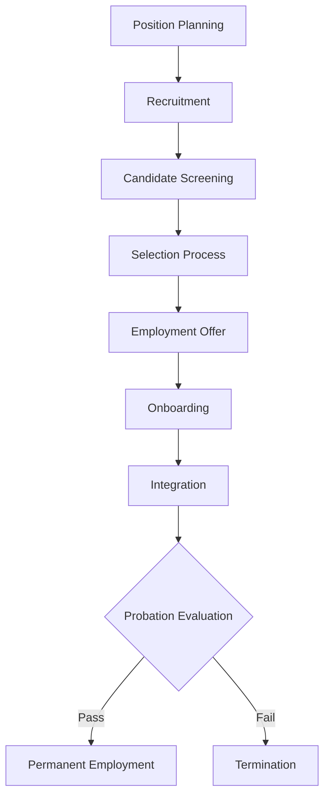

# Team Member Hiring and Onboarding

Manage team member recruitment, hiring, and onboarding processes to ensure qualified candidates, legal compliance, and successful integration into aviation operations.

## Purpose

Establish systematic team member hiring and onboarding procedures that ensure qualified candidate selection, legal compliance with employment regulations, comprehensive orientation, and successful integration into aviation operations while protecting organizational interests and maintaining operational excellence.

## Roles and Responsibilities

**Business Leader:**

- Approve hiring budgets and compensation structures
- Review candidate qualifications and selection criteria
- Oversee recruitment strategies and market positioning
- Monitor hiring metrics and organizational growth
- Authorize employment offers and compensation packages

**Operations Leader:**

- Define position requirements and operational needs
- Participate in candidate interviews and evaluation
- Coordinate onboarding with operational departments
- Ensure new team members meet operational standards
- Monitor integration and performance during probation period

**Safety Officer:**

- Review safety-related position requirements and qualifications
- Verify safety training and certification requirements
- Ensure compliance with safety regulations and procedures
- Coordinate safety orientation and training programs
- Monitor safety performance during probation period

**Client Service Representative:**

- Manage recruitment process and candidate communications
- Coordinate interviews and candidate evaluation procedures
- Process employment documentation and legal compliance
- Manage onboarding program and orientation activities
- Maintain employment records and compliance documentation

## Process Steps

### Position Planning Phase

- **Define position requirements** - Develop detailed job description with qualifications, responsibilities, and operational requirements
- **Establish compensation structure** - Determine salary range, benefits package, and performance incentives
- **Plan recruitment strategy** - Identify recruitment sources, advertising methods, and candidate screening criteria
- **Prepare hiring documentation** - Develop application forms, interview guides, and evaluation criteria

### Recruitment Phase

- **Post position openings** - Advertise positions through appropriate channels and aviation industry networks
- **Screen initial applications** - Review resumes and applications against minimum qualification requirements
- **Conduct preliminary interviews** - Assess candidate qualifications, experience, and cultural fit
- **Verify candidate credentials** - Confirm education, certifications, and employment history

### Selection Phase

- **Conduct comprehensive interviews** - Evaluate technical skills, operational knowledge, and interpersonal abilities
- **Administer skill assessments** - Test aviation-specific skills, safety knowledge, and operational procedures
- **Check references and background** - Verify employment history, professional references, and background information
- **Evaluate candidate fit** - Assess alignment with organizational values, safety culture, and operational requirements

### Employment Offer Phase

- **Prepare employment offer** - Create comprehensive offer letter with terms, conditions, and benefits
- **Negotiate employment terms** - Discuss compensation, benefits, and employment conditions
- **Obtain required approvals** - Secure leadership approval for employment offer and compensation package
- **Execute employment agreement** - Complete employment documentation and legal compliance requirements

### Onboarding Phase

- **Complete employment documentation** - Process all required employment forms, tax documents, and benefit enrollments
- **Conduct orientation program** - Provide comprehensive introduction to organization, policies, and procedures
- **Coordinate department integration** - Arrange introductions and training with operational departments
- **Implement training program** - Provide job-specific training, safety orientation, and operational procedures

### Integration Phase

- **Monitor performance progress** - Track new team member performance and integration during probation period
- **Provide support and feedback** - Offer regular feedback, support, and guidance during initial employment period
- **Conduct probation evaluation** - Assess performance and determine permanent employment status
- **Complete integration process** - Finalize employment status and transition to regular team member procedures

## Process Mapping

## Tools and Resources

- **Recruitment Management System**: Digital application tracking and candidate management
- **Job Description Templates**: Standardized templates for aviation positions
- **Interview Guides**: Structured interview questions and evaluation criteria
- **Background Check Services**: Professional background verification and reference checking
- **Onboarding Program**: Comprehensive orientation and training materials
- **Employment Documentation**: Standardized employment forms and legal compliance documents

## Success Metrics

- **Completion Time:** Hiring process completed within 30 days from position posting to employment start date
- **Quality Standard:** 90% of new team members successfully complete probation period and achieve permanent employment
- **Safety Standard:** 100% of new team members complete required safety training and certification before operational duties
- **Client Satisfaction:** New team members achieve operational proficiency within 90 days of employment start date

## Common Issues and Solutions

- **Issue:** Limited qualified candidates for specialized aviation positions
- **Solution:** Expand recruitment networks, develop internal training programs, and consider relocation assistance for qualified candidates.

- **Issue:** Background check delays affecting hiring timeline
- **Solution:** Establish relationships with multiple background check providers and implement conditional employment offers with background verification requirements.

- **Issue:** New team members not meeting operational performance standards
- **Solution:** Enhance onboarding program with comprehensive training, mentoring, and performance monitoring during probation period.

- **Issue:** Employment documentation compliance issues
- **Solution:** Implement standardized employment documentation procedures with legal review and regular compliance audits.

## Safety Considerations

- ⚠️ **WARNING**: Never allow new team members to perform safety-critical duties without completing required training and certification
- ⚠️ **WARNING**: Ensure all team members complete safety orientation and emergency procedures training before operational duties
- ⚡ **CAUTION**: Verify all required certifications and qualifications before employment offer and operational duties
- ⚡ **CAUTION**: Monitor new team member performance closely during probation period to ensure safety compliance
- ℹ️ **NOTE**: Provide comprehensive safety training and emergency procedures orientation during onboarding
- ℹ️ **NOTE**: Maintain detailed records of all training, certifications, and performance evaluations
- ✅ **BEST PRACTICE**: Implement mentoring program pairing new team members with experienced personnel
- ✅ **BEST PRACTICE**: Conduct regular performance reviews and provide constructive feedback during probation period

## Regulatory References

- **Title VII of Civil Rights Act** - Equal employment opportunity and anti-discrimination requirements
- **Americans with Disabilities Act (ADA)** - Disability accommodation and non-discrimination requirements
- **Fair Labor Standards Act (FLSA)** - Minimum wage, overtime, and employment classification requirements
- **Immigration Reform and Control Act (IRCA)** - Employment eligibility verification requirements
- **State Employment Laws** - Applicable state requirements for employment practices and documentation

## Aviation Industry Requirements

### Employment Standards
- **Aviation Qualifications**: Required certifications, ratings, and experience for aviation positions
- **Safety Training**: Mandatory safety orientation and emergency procedures training
- **Regulatory Compliance**: Understanding of FAA regulations and operational requirements
- **Operational Procedures**: Knowledge of aviation operations and safety protocols

### Legal Compliance
- **Equal Employment Opportunity**: Non-discrimination in hiring and employment practices
- **Background Verification**: Comprehensive background checks for aviation positions
- **Documentation Requirements**: Complete employment documentation and legal compliance
- **Training Requirements**: Mandatory training and certification for aviation operations
