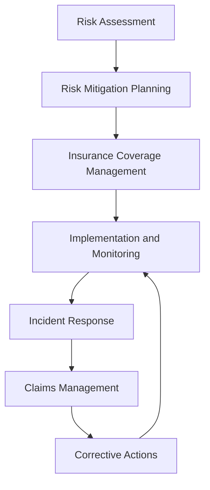

# Liability and Risk Management

Manage liability exposure and risk mitigation strategies to protect organizational interests, team members, and clients while ensuring regulatory compliance and operational sustainability.

## Purpose

Establish systematic liability and risk management procedures that identify operational risks, implement mitigation strategies, ensure adequate insurance coverage, and protect organizational interests while maintaining regulatory compliance and supporting safe aviation operations.

## Roles and Responsibilities

**Business Leader:**

- Approve risk management strategies and insurance coverage levels
- Review liability exposure assessments and mitigation plans
- Oversee insurance policy procurement and renewal processes
- Monitor risk management performance and cost optimization
- Authorize risk mitigation investments and safety improvements

**Operations Leader:**

- Oversee operational risk identification and assessment procedures
- Coordinate risk mitigation implementation across departments
- Monitor safety compliance and incident prevention programs
- Ensure regulatory compliance for risk management activities
- Authorize emergency response and incident management procedures

**Safety Officer:**

- Conduct operational risk assessments and safety evaluations
- Monitor safety incidents and near-miss reporting
- Coordinate safety training and risk awareness programs
- Ensure compliance with safety regulations and procedures
- Investigate incidents and recommend corrective actions

**Finance Leader:**

- Review insurance coverage adequacy and cost optimization
- Monitor liability exposure and financial risk assessment
- Coordinate insurance claims processing and settlement
- Ensure compliance with financial regulations and reporting
- Manage risk management budget and cost allocation

## Process Steps

### Risk Assessment Phase

- **Identify operational risks** - Conduct comprehensive review of all operational activities and potential liability exposures
- **Evaluate risk severity** - Assess probability and potential impact of identified risks on operations and financial stability
- **Analyze regulatory requirements** - Review applicable FAA, OSHA, and state regulations for compliance requirements
- **Document risk inventory** - Create detailed risk register with assessment criteria and mitigation strategies

### Risk Mitigation Planning Phase

- **Develop mitigation strategies** - Create specific action plans to reduce or eliminate identified risks
- **Prioritize risk responses** - Rank risks by severity and allocate resources for mitigation implementation
- **Establish monitoring procedures** - Define ongoing risk monitoring and assessment protocols
- **Create contingency plans** - Develop response procedures for high-impact risk scenarios

### Insurance Coverage Management Phase

- **Assess coverage requirements** - Review current insurance policies and identify coverage gaps
- **Evaluate policy options** - Compare insurance products and coverage levels for optimal protection
- **Negotiate policy terms** - Work with insurance providers to secure favorable coverage and rates
- **Monitor policy compliance** - Ensure operational activities comply with insurance policy requirements

### Implementation and Monitoring Phase

- **Implement mitigation strategies** - Execute risk reduction measures across operational departments
- **Monitor risk indicators** - Track key risk indicators and performance metrics
- **Conduct regular assessments** - Perform periodic risk reviews and update mitigation strategies
- **Update risk documentation** - Maintain current risk register and mitigation plan documentation

### Incident Response and Claims Management Phase

- **Respond to incidents** - Implement immediate response procedures for safety incidents and liability events
- **Document incident details** - Create comprehensive incident reports with supporting evidence
- **Coordinate claims processing** - Work with insurance carriers and legal counsel on claims handling
- **Implement corrective actions** - Apply lessons learned to prevent future incidents

## Process Mapping

## Tools and Resources

- **Risk Management System**: Digital risk assessment and tracking capabilities
- **Insurance Broker**: Aviation insurance specialist with FBO experience
- **Legal Counsel**: Attorney specializing in aviation liability and risk management
- **Safety Management System**: Comprehensive safety program and incident reporting
- **Claims Management System**: Digital claims tracking and processing procedures
- **Risk Assessment Templates**: Standardized risk evaluation and documentation tools

## Success Metrics

- **Completion Time:** Risk assessments completed within 30 days and mitigation strategies implemented within 90 days
- **Quality Standard:** 100% of identified risks have documented mitigation strategies and monitoring procedures
- **Safety Standard:** Zero preventable incidents resulting from unaddressed risk exposures
- **Client Satisfaction:** Risk management procedures support 95% client confidence in operational safety

## Common Issues and Solutions

- **Issue:** Insurance coverage gaps identified during risk assessment
- **Solution:** Work with aviation insurance specialists to secure additional coverage or policy endorsements. Consider self-insurance options for specific risks.

- **Issue:** Risk mitigation strategies not effectively implemented across departments
- **Solution:** Establish clear implementation timelines and accountability measures. Provide training and resources to support mitigation strategy execution.

- **Issue:** Incident response procedures not coordinated with insurance requirements
- **Solution:** Develop integrated incident response protocols that address both operational and insurance notification requirements. Train team members on proper incident reporting procedures.

- **Issue:** Risk assessment not capturing emerging aviation industry risks
- **Solution:** Establish regular risk review cycles and industry monitoring procedures. Participate in aviation industry risk management forums and training programs.

## Safety Considerations

- ⚠️ **WARNING**: Never operate without adequate insurance coverage for all aviation activities and liability exposures
- ⚠️ **WARNING**: Ensure all team members understand and follow safety procedures to prevent liability incidents
- ⚡ **CAUTION**: Monitor regulatory changes that may affect liability exposure and insurance requirements
- ⚡ **CAUTION**: Verify all contractors and vendors maintain adequate insurance coverage for aviation operations
- ℹ️ **NOTE**: Maintain current documentation of all risk assessments, mitigation strategies, and insurance policies
- ℹ️ **NOTE**: Conduct regular training on risk awareness and incident prevention procedures
- ✅ **BEST PRACTICE**: Implement proactive risk management culture with regular safety briefings and training
- ✅ **BEST PRACTICE**: Establish relationships with aviation insurance specialists and legal counsel for expert guidance

## Regulatory References

- **14 CFR Part 91** - General Operating and Flight Rules (operational risk management)
- **14 CFR Part 139** - Airport Operating Certificate (airport liability requirements)
- **OSHA 29 CFR 1910** - Occupational Safety and Health Standards (workplace safety)
- **State Aviation Regulations** - Applicable state requirements for aviation operations
- **Insurance Requirements** - Minimum liability coverage requirements for aviation operations

## Aviation Industry Requirements

### Risk Management Standards
- **Operational Risk Assessment**: Comprehensive evaluation of all aviation operational risks
- **Safety Management System**: Integrated safety program with risk management components
- **Insurance Coverage**: Adequate liability coverage for all aviation operations and exposures
- **Regulatory Compliance**: Compliance with FAA, OSHA, and state aviation regulations

### Liability Protection
- **Comprehensive Coverage**: Protection for aircraft operations, ground handling, and client services
- **Claims Management**: Efficient claims processing and settlement procedures
- **Legal Defense**: Access to legal counsel for liability defense and regulatory compliance
- **Risk Transfer**: Effective use of insurance and contractual risk transfer mechanisms
