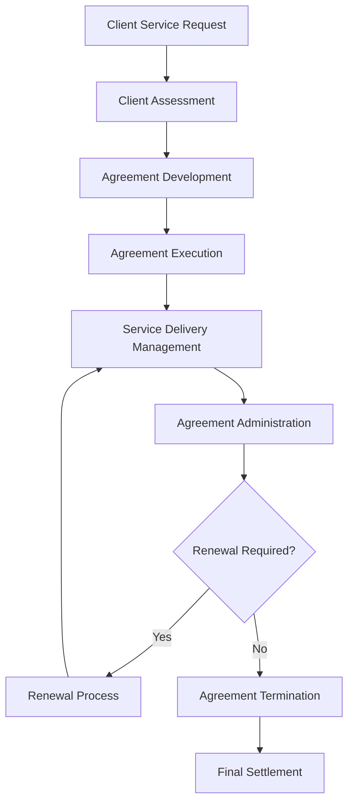

# Client Service Agreements

Develop and manage comprehensive client service agreements that establish clear terms, conditions, and expectations for FBO services while protecting organizational interests and ensuring regulatory compliance.

## Purpose

Establish systematic procedures for developing, executing, and managing client service agreements that define service scope, pricing, liability protection, and operational requirements while ensuring clear client expectations and organizational protection.

## Roles and Responsibilities

**Business Leader:**

- Approve service agreement terms and pricing structures
- Review client qualification criteria and service requirements
- Oversee agreement negotiation and client relationship management
- Monitor service delivery performance and client satisfaction
- Authorize agreement modifications and special arrangements

**Operations Leader:**

- Oversee service delivery coordination and quality assurance
- Monitor operational compliance with agreement terms
- Coordinate with service teams for delivery requirements
- Ensure service standards meet agreement specifications
- Authorize service modifications and special requests

**Safety Officer:**

- Review safety requirements and compliance standards
- Verify operational procedures meet safety regulations
- Monitor safety incidents and operational concerns
- Ensure regulatory compliance for service operations
- Coordinate safety training and certification requirements

**Finance Leader:**

- Review pricing structures and financial terms
- Monitor billing accuracy and payment compliance
- Oversee financial risk assessment and mitigation
- Coordinate with accounting for revenue recognition
- Authorize financial modifications and payment terms

**Client Service Representative:**

- Process service requests and client qualification
- Coordinate agreement execution and documentation
- Manage client communications and service delivery
- Process billing and payment for services
- Maintain client relationship and satisfaction

## Process Steps

### Client Assessment Phase

- **Review service requirements** - Assess client needs, service scope, and operational requirements
- **Evaluate client qualification** - Verify client eligibility, credit standing, and service history
- **Assess operational capacity** - Determine ability to meet client service requirements
- **Review safety considerations** - Evaluate safety implications and regulatory compliance needs

### Agreement Development Phase

- **Prepare service agreement** - Create comprehensive contract with clear terms, conditions, and service specifications
- **Define service scope** - Establish detailed service descriptions, limitations, and operational parameters
- **Set pricing structure** - Determine service rates, minimum charges, and additional service fees
- **Include liability provisions** - Specify liability protection, insurance requirements, and risk allocation

### Agreement Execution Phase

- **Review agreement terms** - Ensure client understands all terms, conditions, and service requirements
- **Obtain required signatures** - Complete agreement execution with proper authorization and witness signatures
- **Establish billing account** - Set up client account and payment processing procedures
- **Provide service orientation** - Conduct service delivery procedures and client communication protocols

### Service Delivery Management Phase

- **Coordinate service delivery** - Manage service scheduling and resource allocation
- **Monitor service quality** - Track service delivery performance and client satisfaction
- **Process billing** - Generate accurate invoices for services and additional charges
- **Maintain communication** - Provide regular updates on service status and operational requirements

### Agreement Administration Phase

- **Track agreement compliance** - Monitor adherence to terms, conditions, and service requirements
- **Process agreement modifications** - Handle changes to service terms, pricing, or operational parameters
- **Manage renewals** - Coordinate agreement renewal process and terms renegotiation
- **Handle terminations** - Process agreement termination and final settlement procedures

## Process Mapping

## Tools and Resources

- **Service Management System**: Digital agreement storage and tracking capabilities
- **Client Database**: Service history and agreement tracking
- **Agreement Templates**: Standardized service agreement templates with aviation-specific terms
- **Billing System**: Automated service billing and payment processing
- **Legal Counsel**: Attorney specializing in aviation service contracts and liability issues
- **Service Documentation**: Standard operating procedures and quality assurance protocols

## Success Metrics

- **Completion Time:** Service agreements processed and executed within 72 hours of client qualification approval
- **Quality Standard:** 100% of service agreements include comprehensive liability protection and regulatory compliance terms
- **Safety Standard:** Zero safety incidents related to service agreement terms or delivery procedures
- **Client Satisfaction:** 95% client satisfaction with service agreement terms and delivery procedures

## Common Issues and Solutions

- **Issue:** Service scope not clearly defined leading to client expectations mismatch
- **Solution:** Develop detailed service specifications with clear limitations and operational parameters. Include comprehensive service descriptions and quality standards.

- **Issue:** Pricing disputes affecting client relationships and revenue
- **Solution:** Implement transparent pricing structures with detailed service breakdowns. Provide clear billing statements and dispute resolution procedures.

- **Issue:** Service delivery not meeting agreement specifications
- **Solution:** Establish quality assurance procedures with regular monitoring and client feedback. Implement corrective action protocols for service deficiencies.

- **Issue:** Liability protection inadequate for aviation operations
- **Solution:** Work with aviation legal counsel to develop comprehensive liability provisions. Include appropriate insurance requirements and risk allocation terms.

## Safety Considerations

- ⚠️ **WARNING**: Never provide services without verifying client qualification and safety compliance requirements
- ⚠️ **WARNING**: Ensure all service delivery meets aviation safety standards and regulatory requirements
- ⚡ **CAUTION**: Verify service scope and limitations are clearly communicated to prevent operational conflicts
- ⚡ **CAUTION**: Monitor service delivery quality and safety compliance throughout agreement term
- ℹ️ **NOTE**: Maintain current service documentation and quality assurance records for all operations
- ℹ️ **NOTE**: Conduct regular agreement reviews to ensure terms remain current with regulatory requirements
- ✅ **BEST PRACTICE**: Implement comprehensive client orientation program for new service agreements
- ✅ **BEST PRACTICE**: Maintain detailed records of all service delivery and client communications

## Regulatory References

- **14 CFR Part 91** - General Operating and Flight Rules (aviation service operations)
- **14 CFR Part 139** - Certification of Airports (airport service requirements)
- **FAA Advisory Circulars** - Applicable guidance for aviation service operations
- **State Aviation Regulations** - Applicable state requirements for aviation services
- **OSHA Standards** - Workplace safety requirements for service operations

## Aviation Industry Requirements

### Service Agreement Standards
- **Service Scope**: Clear definition of services, limitations, and operational parameters
- **Quality Standards**: Specific quality requirements and performance expectations
- **Safety Compliance**: Aviation safety standards and regulatory compliance requirements
- **Liability Protection**: Comprehensive liability provisions protecting both client and organization

### Contract Requirements
- **Service Specifications**: Detailed service descriptions with quality and performance standards
- **Operational Terms**: Clear definition of service delivery, scheduling, and coordination requirements
- **Financial Terms**: Pricing structure, payment terms, and billing procedures
- **Regulatory Compliance**: Terms ensuring compliance with FAA and state aviation regulations

