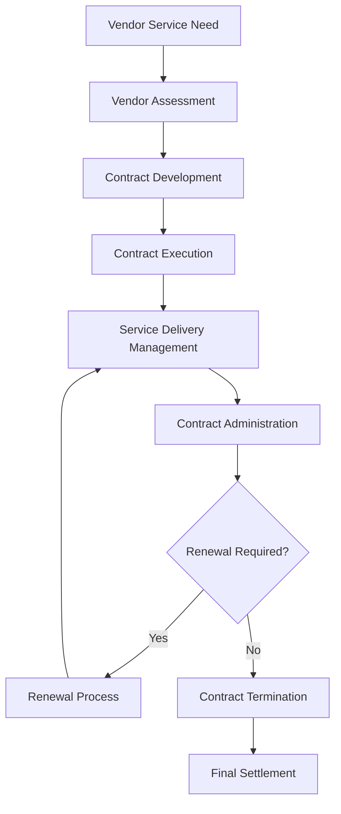

# Vendor Partnership Contracts

Oversee vendor and partnership contract administration to ensure reliable service delivery, quality standards, and organizational protection while maintaining strategic business relationships.

## Purpose

Establish systematic procedures for developing, executing, and managing vendor and partnership contracts that ensure reliable service delivery, quality standards, and organizational protection while supporting operational excellence and strategic business objectives.

## Roles and Responsibilities

**Business Leader:**

- Approve vendor partnership terms and strategic objectives
- Review vendor qualification criteria and performance requirements
- Oversee contract negotiation and relationship management
- Monitor vendor performance and service quality standards
- Authorize contract modifications and strategic partnerships

**Operations Leader:**

- Oversee vendor service delivery coordination and quality assurance
- Monitor operational compliance with contract terms
- Coordinate with vendors for service requirements and scheduling
- Ensure service standards meet contract specifications
- Authorize service modifications and operational requirements

**Safety Officer:**

- Review vendor safety requirements and compliance standards
- Verify vendor operational procedures meet safety regulations
- Monitor vendor safety performance and incident reporting
- Ensure regulatory compliance for vendor operations
- Coordinate vendor safety training and certification requirements

**Finance Leader:**

- Review contract pricing structures and financial terms
- Monitor vendor billing accuracy and payment compliance
- Oversee financial risk assessment and vendor performance
- Coordinate with accounting for vendor payment processing
- Authorize financial modifications and payment terms

**Client Service Representative:**

- Coordinate vendor service delivery and client satisfaction
- Process vendor service requests and quality monitoring
- Manage vendor communications and service coordination
- Monitor client feedback on vendor service quality
- Maintain vendor relationship and performance tracking

## Process Steps

### Vendor Assessment Phase

- **Review vendor qualifications** - Assess vendor capabilities, experience, and financial stability
- **Evaluate service requirements** - Determine specific service needs and quality standards
- **Conduct vendor research** - Review vendor history, references, and industry reputation
- **Assess risk factors** - Evaluate potential risks and liability exposure

### Contract Development Phase

- **Prepare partnership agreement** - Create comprehensive contract with clear terms, conditions, and service specifications
- **Define service scope** - Establish detailed service descriptions, quality standards, and performance expectations
- **Set pricing structure** - Determine service rates, payment terms, and performance incentives
- **Include liability provisions** - Specify liability protection, insurance requirements, and risk allocation

### Contract Execution Phase

- **Review contract terms** - Ensure vendor understands all terms, conditions, and service requirements
- **Obtain required signatures** - Complete contract execution with proper authorization and witness signatures
- **Establish vendor account** - Set up vendor account and payment processing procedures
- **Provide orientation briefing** - Conduct service delivery procedures and communication protocols

### Service Delivery Management Phase

- **Coordinate service delivery** - Manage vendor scheduling and resource allocation
- **Monitor service quality** - Track vendor performance and service delivery standards
- **Process vendor billing** - Review and approve vendor invoices for services
- **Maintain communication** - Provide regular updates on service requirements and performance expectations

### Contract Administration Phase

- **Track contract compliance** - Monitor adherence to terms, conditions, and service requirements
- **Process contract modifications** - Handle changes to service terms, pricing, or operational parameters
- **Manage renewals** - Coordinate contract renewal process and terms renegotiation
- **Handle terminations** - Process contract termination and final settlement procedures

## Process Mapping

## Tools and Resources

- **Vendor Management System**: Digital contract storage and vendor tracking capabilities
- **Vendor Database**: Service history and performance tracking
- **Contract Templates**: Standardized vendor agreement templates with aviation-specific terms
- **Billing System**: Automated vendor billing and payment processing
- **Legal Counsel**: Attorney specializing in vendor contracts and liability issues
- **Quality Assurance System**: Vendor performance monitoring and evaluation procedures

## Success Metrics

- **Completion Time:** Vendor contracts processed and executed within 96 hours of vendor qualification approval
- **Quality Standard:** 100% of vendor contracts include comprehensive liability protection and quality assurance terms
- **Safety Standard:** Zero safety incidents related to vendor contract terms or service delivery procedures
- **Client Satisfaction:** 95% client satisfaction with vendor service quality and delivery performance

## Common Issues and Solutions

- **Issue:** Vendor service quality not meeting contract specifications
- **Solution:** Implement comprehensive quality assurance procedures with regular monitoring and performance evaluation. Establish corrective action protocols for quality deficiencies.

- **Issue:** Vendor pricing disputes affecting service delivery and relationships
- **Solution:** Implement transparent pricing structures with detailed service breakdowns. Provide clear billing procedures and dispute resolution protocols.

- **Issue:** Vendor scheduling conflicts affecting operational requirements
- **Solution:** Establish clear scheduling procedures with advance notice requirements. Implement backup vendor arrangements for critical services.

- **Issue:** Vendor liability protection inadequate for aviation operations
- **Solution:** Work with aviation legal counsel to develop comprehensive liability provisions. Include appropriate insurance requirements and risk allocation terms.

## Safety Considerations

- ⚠️ **WARNING**: Never engage vendors without verifying safety compliance and regulatory requirements
- ⚠️ **WARNING**: Ensure all vendor services meet aviation safety standards and operational requirements
- ⚡ **CAUTION**: Verify vendor qualifications and safety records before contract execution
- ⚡ **CAUTION**: Monitor vendor safety performance and compliance throughout contract term
- ℹ️ **NOTE**: Maintain current vendor documentation and safety compliance records for all operations
- ℹ️ **NOTE**: Conduct regular contract reviews to ensure terms remain current with regulatory requirements
- ✅ **BEST PRACTICE**: Implement comprehensive vendor orientation program for new partnerships
- ✅ **BEST PRACTICE**: Maintain detailed records of all vendor service delivery and performance evaluations

## Regulatory References

- **14 CFR Part 91** - General Operating and Flight Rules (aviation service operations)
- **14 CFR Part 139** - Certification of Airports (airport service requirements)
- **FAA Advisory Circulars** - Applicable guidance for aviation service operations
- **OSHA Standards** - Workplace safety requirements for vendor operations
- **State Aviation Regulations** - Applicable state requirements for aviation services

## Aviation Industry Requirements

### Vendor Contract Standards
- **Service Scope**: Clear definition of services, quality standards, and performance expectations
- **Safety Compliance**: Aviation safety standards and regulatory compliance requirements
- **Liability Protection**: Comprehensive liability provisions protecting both vendor and organization
- **Quality Assurance**: Specific quality requirements and performance monitoring procedures

### Contract Requirements
- **Service Specifications**: Detailed service descriptions with quality and performance standards
- **Operational Terms**: Clear definition of service delivery, scheduling, and coordination requirements
- **Financial Terms**: Pricing structure, payment terms, and billing procedures
- **Regulatory Compliance**: Terms ensuring compliance with FAA and state aviation regulations

