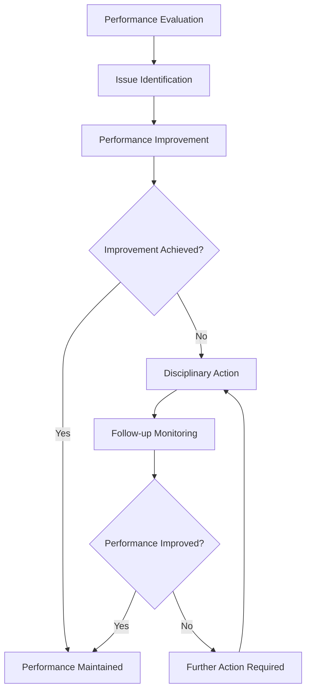

# Performance Management and Discipline

Administer performance management and disciplinary procedures to ensure team member excellence, operational standards, and organizational compliance while maintaining fair and consistent practices.

## Purpose

Establish systematic procedures for managing team member performance, addressing performance issues, and administering disciplinary actions that ensure operational excellence, regulatory compliance, and organizational protection while maintaining fair and consistent practices.

## Roles and Responsibilities

**Business Leader:**

- Approve performance management policies and disciplinary procedures
- Review performance standards and evaluation criteria
- Oversee disciplinary action decisions and appeals
- Monitor performance management effectiveness and outcomes
- Authorize termination decisions and separation procedures

**Operations Leader:**

- Oversee performance evaluation and goal setting procedures
- Monitor operational performance standards and compliance
- Coordinate performance improvement plans and training
- Ensure disciplinary actions support operational objectives
- Authorize performance-related operational decisions

**Safety Officer:**

- Review safety-related performance issues and concerns
- Verify safety compliance and training requirements
- Monitor safety incidents and performance implications
- Ensure disciplinary actions address safety concerns
- Coordinate safety training and certification requirements

**Finance Leader:**

- Review performance-related compensation and benefits
- Monitor performance impact on organizational costs
- Oversee financial implications of disciplinary actions
- Coordinate with payroll for performance-related changes
- Authorize performance-based financial modifications

**Client Service Representative:**

- Provide feedback on client-facing performance issues
- Coordinate client communication during performance matters
- Monitor client satisfaction and performance impact
- Maintain client relationships during performance issues
- Document client feedback for performance evaluations

## Process Steps

### Performance Evaluation Phase

- **Conduct regular evaluations** - Perform scheduled performance reviews and assessments
- **Set performance goals** - Establish clear objectives and performance expectations
- **Document performance** - Maintain detailed records of performance observations and feedback
- **Provide feedback** - Deliver constructive feedback and development guidance

### Performance Issue Identification Phase

- **Identify performance concerns** - Recognize performance issues and areas for improvement
- **Document performance problems** - Record specific performance deficiencies and concerns
- **Assess performance impact** - Evaluate impact on operations, safety, and client satisfaction
- **Determine improvement needs** - Identify specific areas requiring attention and development

### Performance Improvement Phase

- **Develop improvement plan** - Create structured plan for performance enhancement
- **Provide training support** - Offer additional training and development opportunities
- **Monitor improvement progress** - Track performance improvement and development efforts
- **Provide ongoing feedback** - Deliver regular feedback on improvement progress

### Disciplinary Action Phase

- **Review performance history** - Assess complete performance record and improvement efforts
- **Determine disciplinary level** - Select appropriate disciplinary action based on circumstances
- **Document disciplinary action** - Record disciplinary decision and supporting documentation
- **Implement disciplinary measures** - Execute disciplinary action and monitor compliance

### Follow-up and Monitoring Phase

- **Monitor performance improvement** - Track post-disciplinary performance and compliance
- **Provide support and guidance** - Offer ongoing support for performance improvement
- **Evaluate disciplinary effectiveness** - Assess impact of disciplinary action on performance
- **Document outcomes** - Record final outcomes and lessons learned

## Process Mapping

## Tools and Resources

- **Performance Management System**: Digital performance tracking and evaluation capabilities
- **Team Member Database**: Performance history and evaluation records
- **Evaluation Templates**: Standardized performance evaluation forms and procedures
- **Training Resources**: Performance improvement and development materials
- **Legal Counsel**: Attorney specializing in employment law and disciplinary procedures
- **Documentation System**: Performance and disciplinary record management

## Success Metrics

- **Completion Time:** Performance evaluations completed within 30 days of scheduled review dates
- **Quality Standard:** 100% of performance issues addressed through appropriate improvement or disciplinary procedures
- **Safety Standard:** Zero safety incidents related to performance management or disciplinary procedures
- **Client Satisfaction:** 95% client satisfaction with team member performance and service delivery

## Common Issues and Solutions

- **Issue:** Performance standards not clearly defined leading to inconsistent evaluations
- **Solution:** Develop comprehensive performance standards with specific, measurable criteria. Provide training on evaluation procedures and standards application.

- **Issue:** Disciplinary actions not consistently applied across team members
- **Solution:** Implement standardized disciplinary procedures with clear guidelines and documentation requirements. Ensure consistent application through training and oversight.

- **Issue:** Performance improvement plans not effectively addressing root causes
- **Solution:** Conduct thorough performance analysis to identify underlying issues. Develop targeted improvement plans with specific goals and timelines.

- **Issue:** Legal risks from improper disciplinary procedures or documentation
- **Solution:** Work with employment legal counsel to develop compliant procedures. Ensure proper documentation and consistent application of disciplinary measures.

## Safety Considerations

- ⚠️ **WARNING**: Never ignore safety-related performance issues that could compromise operational safety
- ⚠️ **WARNING**: Ensure all disciplinary actions comply with employment laws and regulatory requirements
- ⚡ **CAUTION**: Verify performance documentation is accurate and complete before taking disciplinary action
- ⚡ **CAUTION**: Monitor performance improvement efforts to ensure safety standards are maintained
- ℹ️ **NOTE**: Maintain confidentiality of performance and disciplinary information
- ℹ️ **NOTE**: Conduct regular reviews of performance management procedures for effectiveness
- ✅ **BEST PRACTICE**: Provide regular performance feedback and development opportunities
- ✅ **BEST PRACTICE**: Document all performance discussions and disciplinary actions thoroughly

## Regulatory References

- **Fair Labor Standards Act (FLSA)** - Employment standards and compensation requirements
- **Title VII of Civil Rights Act** - Anti-discrimination and equal employment opportunity
- **Americans with Disabilities Act (ADA)** - Disability accommodation requirements
- **Family and Medical Leave Act (FMLA)** - Leave and employment protection requirements
- **State Employment Laws** - Applicable state employment and labor regulations

## Aviation Industry Requirements

### Performance Management Standards
- **Safety Compliance**: Aviation safety standards and regulatory compliance requirements
- **Operational Excellence**: Performance standards supporting safe and efficient operations
- **Client Service**: Performance requirements ensuring excellent client experience
- **Regulatory Compliance**: Performance standards meeting FAA and industry requirements

### Disciplinary Requirements
- **Consistent Application**: Fair and consistent application of disciplinary procedures
- **Documentation**: Comprehensive documentation of performance issues and disciplinary actions
- **Legal Compliance**: Compliance with employment laws and regulatory requirements
- **Safety Focus**: Disciplinary procedures that prioritize safety and operational excellence

