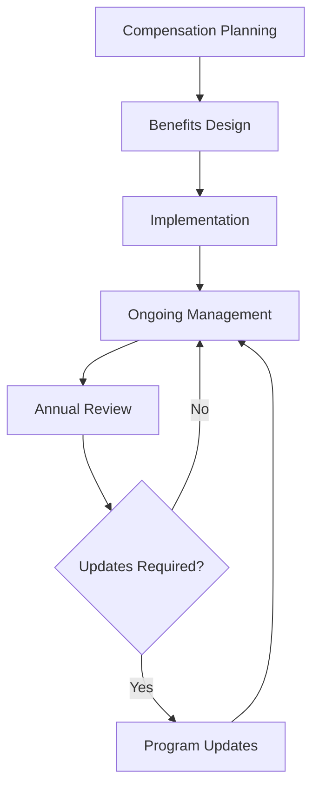

# Benefits and Compensation Administration

Manage benefits and compensation programs to ensure competitive team member packages, regulatory compliance, and organizational sustainability while supporting team member retention and satisfaction.

## Purpose

Establish systematic procedures for administering team member benefits and compensation programs that ensure competitive packages, regulatory compliance, and organizational sustainability while supporting team member retention, satisfaction, and operational excellence.

## Roles and Responsibilities

**Business Leader:**

- Approve compensation structures and benefits packages
- Review market competitiveness and organizational affordability
- Oversee benefits program design and vendor relationships
- Monitor compensation and benefits effectiveness and costs
- Authorize compensation modifications and benefits changes

**Operations Leader:**

- Oversee compensation alignment with operational requirements
- Monitor performance-based compensation and incentives
- Coordinate compensation with operational performance standards
- Ensure compensation supports operational objectives
- Authorize operational compensation adjustments

**Safety Officer:**

- Review safety-related compensation and benefits
- Verify safety incentive programs and compliance requirements
- Monitor safety performance impact on compensation
- Ensure benefits support safety and wellness objectives
- Coordinate safety training and certification benefits

**Finance Leader:**

- Oversee compensation and benefits budget management
- Monitor compensation costs and benefits expenses
- Coordinate payroll processing and benefits administration
- Review financial impact of compensation and benefits changes
- Authorize financial modifications and budget adjustments

**Client Service Representative:**

- Provide feedback on compensation impact on client service
- Coordinate client communication during compensation matters
- Monitor client satisfaction and compensation relationships
- Maintain client relationships during compensation issues
- Document client feedback for compensation considerations

## Process Steps

### Compensation Planning Phase

- **Conduct market analysis** - Research competitive compensation levels and industry standards
- **Review organizational budget** - Assess financial capacity for compensation and benefits
- **Develop compensation structure** - Create competitive and equitable compensation framework
- **Establish performance criteria** - Define performance-based compensation and incentive programs

### Benefits Program Design Phase

- **Design benefits package** - Develop comprehensive benefits program meeting team member needs
- **Select benefits vendors** - Choose reliable vendors for health, retirement, and other benefits
- **Establish eligibility criteria** - Define team member eligibility for various benefits
- **Create enrollment procedures** - Develop clear enrollment and administration procedures

### Implementation and Administration Phase

- **Implement compensation structure** - Execute new compensation programs and structures
- **Launch benefits programs** - Begin benefits enrollment and administration
- **Provide team member communication** - Deliver clear information about compensation and benefits
- **Establish administration procedures** - Create ongoing administration and management procedures

### Ongoing Management Phase

- **Monitor compensation effectiveness** - Track compensation competitiveness and team member satisfaction
- **Administer benefits programs** - Manage ongoing benefits administration and vendor relationships
- **Process compensation changes** - Handle compensation adjustments and modifications
- **Maintain compliance** - Ensure regulatory compliance for compensation and benefits

### Review and Optimization Phase

- **Conduct annual reviews** - Perform comprehensive compensation and benefits reviews
- **Assess program effectiveness** - Evaluate program success and team member satisfaction
- **Identify improvement opportunities** - Recognize areas for enhancement and optimization
- **Implement program updates** - Execute improvements and modifications as needed

## Process Mapping

## Tools and Resources

- **Compensation Management System**: Digital compensation tracking and administration capabilities
- **Benefits Administration Platform**: Benefits enrollment and management system
- **Payroll System**: Integrated payroll and benefits processing
- **Market Research Tools**: Compensation benchmarking and analysis resources
- **Legal Counsel**: Attorney specializing in employment law and benefits compliance
- **Benefits Vendors**: Health, retirement, and other benefits providers

## Success Metrics

- **Completion Time:** Compensation and benefits programs implemented within 90 days of approval
- **Quality Standard:** 100% of compensation and benefits programs meet regulatory compliance requirements
- **Safety Standard:** Zero safety incidents related to compensation or benefits administration
- **Client Satisfaction:** 95% team member satisfaction with compensation and benefits programs

## Common Issues and Solutions

- **Issue:** Compensation not competitive with market standards affecting team member retention
- **Solution:** Conduct regular market analysis and adjust compensation to maintain competitiveness. Implement performance-based incentives to enhance total compensation.

- **Issue:** Benefits costs exceeding budget constraints affecting organizational sustainability
- **Solution:** Review benefits design and vendor relationships for cost optimization. Consider alternative benefits structures and cost-sharing arrangements.

- **Issue:** Benefits enrollment and administration complexity affecting team member satisfaction
- **Solution:** Simplify enrollment procedures and provide comprehensive team member communication. Implement user-friendly administration systems and support.

- **Issue:** Regulatory compliance issues with compensation or benefits programs
- **Solution:** Work with legal counsel to ensure compliance with employment and benefits laws. Conduct regular compliance audits and updates.

## Safety Considerations

- ⚠️ **WARNING**: Never implement compensation or benefits changes without proper legal review and compliance verification
- ⚠️ **WARNING**: Ensure all compensation and benefits programs comply with employment laws and regulatory requirements
- ⚡ **CAUTION**: Verify compensation accuracy and benefits eligibility before implementation
- ⚡ **CAUTION**: Monitor compensation and benefits impact on operational performance and safety
- ℹ️ **NOTE**: Maintain confidentiality of team member compensation and benefits information
- ℹ️ **NOTE**: Conduct regular reviews of compensation and benefits programs for effectiveness
- ✅ **BEST PRACTICE**: Provide clear communication about compensation and benefits programs
- ✅ **BEST PRACTICE**: Implement comprehensive team member education and support programs

## Regulatory References

- **Fair Labor Standards Act (FLSA)** - Minimum wage and overtime requirements
- **Equal Pay Act** - Gender-based pay discrimination prohibitions
- **Employee Retirement Income Security Act (ERISA)** - Retirement and benefits plan requirements
- **Affordable Care Act (ACA)** - Health insurance and benefits requirements
- **State Employment Laws** - Applicable state compensation and benefits regulations

## Aviation Industry Requirements

### Compensation Standards
- **Market Competitiveness**: Compensation levels competitive with aviation industry standards
- **Performance Alignment**: Compensation structures supporting operational excellence
- **Safety Incentives**: Compensation programs encouraging safety and compliance
- **Regulatory Compliance**: Compensation practices meeting employment law requirements

### Benefits Requirements
- **Comprehensive Coverage**: Benefits packages meeting team member needs and expectations
- **Safety Focus**: Benefits supporting safety, wellness, and operational excellence
- **Regulatory Compliance**: Benefits programs complying with employment and benefits laws
- **Cost Management**: Benefits programs supporting organizational sustainability

