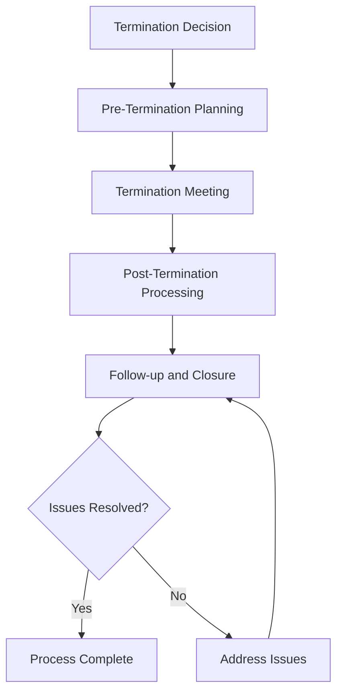

# Team Member Termination and Separation

Handle team member termination and separation procedures to ensure legal compliance, organizational protection, and professional transition while maintaining operational continuity and safety standards.

## Purpose

Establish systematic procedures for managing team member termination and separation that ensure legal compliance, organizational protection, and professional transition while maintaining operational continuity, safety standards, and organizational reputation.

## Roles and Responsibilities

**Business Leader:**

- Approve termination decisions and separation procedures
- Review termination documentation and legal compliance
- Oversee separation process and organizational protection
- Monitor termination outcomes and lessons learned
- Authorize final separation and settlement procedures

**Operations Leader:**

- Oversee operational continuity during termination process
- Monitor safety and operational impact of termination
- Coordinate operational handover and transition procedures
- Ensure operational standards maintained during separation
- Authorize operational modifications during transition

**Safety Officer:**

- Review safety implications of termination and separation
- Verify safety compliance during transition period
- Monitor safety risks during operational handover
- Ensure safety standards maintained throughout process
- Coordinate safety training and certification transfers

**Finance Leader:**

- Oversee financial aspects of termination and separation
- Monitor final compensation and benefits processing
- Coordinate financial settlement and payment procedures
- Review financial impact and cost management
- Authorize financial settlements and final payments

**Client Service Representative:**

- Coordinate client communication during termination process
- Monitor client impact and relationship maintenance
- Manage client transition and service continuity
- Maintain client relationships during organizational changes
- Document client feedback and transition requirements

## Process Steps

### Termination Decision Phase

- **Review performance history** - Assess complete performance record and improvement efforts
- **Document termination reasons** - Record specific reasons and supporting documentation
- **Evaluate legal implications** - Review legal compliance and potential risks
- **Determine termination type** - Classify termination as voluntary, involuntary, or reduction in force

### Pre-Termination Planning Phase

- **Develop transition plan** - Create comprehensive transition and handover procedures
- **Coordinate operational continuity** - Ensure operational standards maintained during transition
- **Prepare termination documentation** - Complete all required termination paperwork
- **Plan communication strategy** - Develop internal and external communication plan

### Termination Meeting Phase

- **Conduct termination meeting** - Hold professional and respectful termination discussion
- **Deliver termination notice** - Provide clear termination information and next steps
- **Collect organizational property** - Retrieve all organizational assets and materials
- **Provide separation information** - Deliver information about benefits, final pay, and next steps

### Post-Termination Processing Phase

- **Process final compensation** - Complete final payroll and benefits processing
- **Handle benefits continuation** - Manage COBRA and other benefits continuation
- **Complete documentation** - Finalize all termination documentation and records
- **Coordinate operational handover** - Ensure smooth operational transition and continuity

### Follow-up and Closure Phase

- **Monitor transition effectiveness** - Track operational continuity and transition success
- **Address post-termination issues** - Handle any remaining issues or concerns
- **Conduct lessons learned review** - Evaluate process effectiveness and identify improvements
- **Complete final documentation** - Finalize all termination records and documentation

## Process Mapping

## Tools and Resources

- **Termination Management System**: Digital termination tracking and documentation capabilities
- **Team Member Database**: Employment history and termination records
- **Termination Templates**: Standardized termination documentation and procedures
- **Legal Counsel**: Attorney specializing in employment law and termination procedures
- **Benefits Administration**: Benefits continuation and final processing procedures
- **Documentation System**: Termination record management and storage

## Success Metrics

- **Completion Time:** Termination process completed within 14 days of termination decision
- **Quality Standard:** 100% of terminations processed with proper legal compliance and documentation
- **Safety Standard:** Zero safety incidents related to termination or separation procedures
- **Client Satisfaction:** 95% client satisfaction maintained during termination and transition process

## Common Issues and Solutions

- **Issue:** Termination documentation incomplete or legally insufficient
- **Solution:** Work with legal counsel to develop comprehensive termination procedures. Ensure proper documentation and legal compliance throughout process.

- **Issue:** Operational continuity disrupted during termination and transition
- **Solution:** Develop detailed transition plans with clear handover procedures. Implement backup arrangements and cross-training for critical positions.

- **Issue:** Client relationships affected by termination and organizational changes
- **Solution:** Implement clear client communication strategies during transition. Ensure service continuity and relationship maintenance throughout process.

- **Issue:** Post-termination disputes or legal challenges affecting organizational reputation
- **Solution:** Maintain professional and respectful termination procedures. Document all actions and maintain proper legal compliance throughout process.

## Safety Considerations

- ⚠️ **WARNING**: Never compromise safety standards during termination or transition procedures
- ⚠️ **WARNING**: Ensure all termination procedures comply with employment laws and regulatory requirements
- ⚡ **CAUTION**: Verify operational continuity and safety compliance during transition period
- ⚡ **CAUTION**: Monitor potential safety risks during operational handover and transition
- ℹ️ **NOTE**: Maintain confidentiality of termination information and team member privacy
- ℹ️ **NOTE**: Conduct regular reviews of termination procedures for effectiveness and compliance
- ✅ **BEST PRACTICE**: Provide professional and respectful termination process with clear communication
- ✅ **BEST PRACTICE**: Implement comprehensive transition planning and operational continuity procedures

## Regulatory References

- **Fair Labor Standards Act (FLSA)** - Final pay and compensation requirements
- **Consolidated Omnibus Budget Reconciliation Act (COBRA)** - Benefits continuation requirements
- **Worker Adjustment and Retraining Notification Act (WARN)** - Mass layoff notification requirements
- **State Employment Laws** - Applicable state termination and separation regulations
- **Aviation Regulations** - FAA requirements for aviation personnel changes

## Aviation Industry Requirements

### Termination Standards
- **Safety Compliance**: Termination procedures maintaining aviation safety standards
- **Operational Continuity**: Termination process ensuring operational excellence
- **Regulatory Compliance**: Termination procedures meeting employment and aviation law requirements
- **Professional Standards**: Termination process maintaining organizational reputation and professionalism

### Separation Requirements
- **Legal Compliance**: Comprehensive compliance with employment and aviation laws
- **Documentation**: Complete documentation of termination process and decisions
- **Operational Handover**: Smooth transition ensuring operational continuity and safety
- **Client Protection**: Termination process protecting client relationships and service quality

