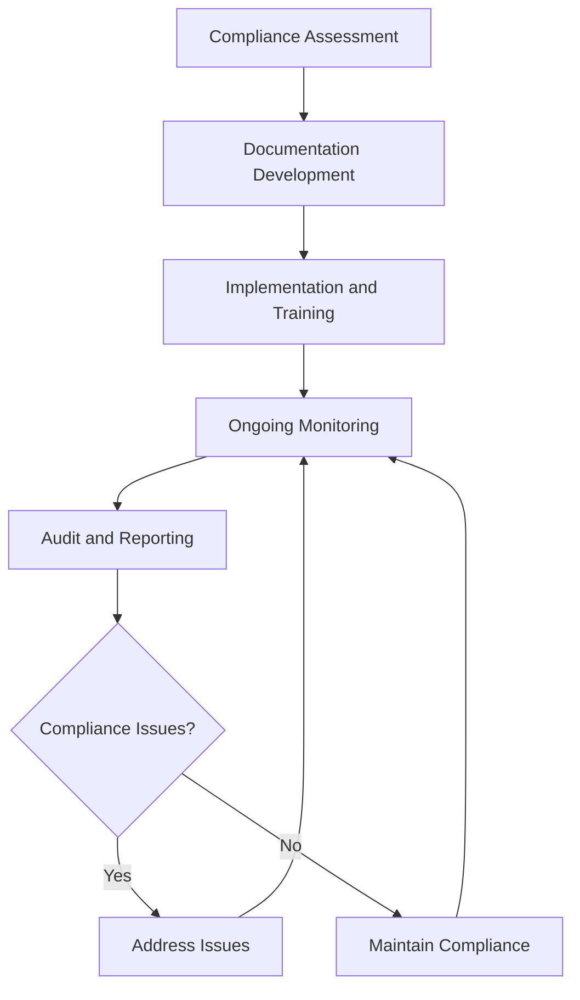

# Regulatory Compliance Documentation

Maintain regulatory compliance documentation and reporting to ensure organizational adherence to aviation regulations, employment laws, and business requirements while supporting operational excellence and legal protection.

## Purpose

Establish systematic procedures for maintaining regulatory compliance documentation and reporting that ensure organizational adherence to FAA regulations, employment laws, environmental standards, and business requirements while supporting operational excellence, legal protection, and regulatory audit readiness.

## Roles and Responsibilities

**Business Leader:**

- Approve compliance documentation policies and procedures
- Review regulatory compliance status and reporting requirements
- Oversee compliance monitoring and audit preparation
- Monitor regulatory changes and compliance updates
- Authorize compliance documentation and reporting procedures

**Operations Leader:**

- Oversee operational compliance documentation and reporting
- Monitor operational procedures for regulatory compliance
- Coordinate compliance documentation with operational activities
- Ensure operational standards meet regulatory requirements
- Authorize operational compliance modifications and updates

**Safety Officer:**

- Review safety compliance documentation and reporting
- Verify safety procedures meet regulatory requirements
- Monitor safety incidents and compliance implications
- Ensure safety documentation supports regulatory compliance
- Coordinate safety training and certification documentation

**Finance Leader:**

- Oversee financial compliance documentation and reporting
- Monitor financial procedures for regulatory compliance
- Coordinate financial reporting with regulatory requirements
- Review financial impact of compliance requirements
- Authorize financial compliance modifications and updates

**Client Service Representative:**

- Coordinate client-related compliance documentation
- Monitor client service procedures for regulatory compliance
- Maintain client records supporting regulatory requirements
- Document client interactions for compliance purposes
- Support compliance documentation and reporting processes

## Process Steps

### Compliance Assessment Phase

- **Identify regulatory requirements** - Determine applicable FAA, employment, and business regulations
- **Assess current compliance status** - Evaluate existing procedures and documentation for compliance
- **Identify compliance gaps** - Recognize areas requiring attention and improvement
- **Prioritize compliance needs** - Determine critical compliance requirements and timelines

### Documentation Development Phase

- **Develop compliance procedures** - Create comprehensive procedures meeting regulatory requirements
- **Create documentation templates** - Develop standardized forms and documentation formats
- **Establish record-keeping procedures** - Implement systematic record management and retention
- **Design reporting systems** - Create automated reporting and monitoring capabilities

### Implementation and Training Phase

- **Implement compliance procedures** - Execute new compliance procedures and documentation
- **Provide team member training** - Deliver comprehensive training on compliance requirements
- **Establish monitoring systems** - Create ongoing compliance monitoring and verification
- **Launch reporting procedures** - Begin regular compliance reporting and documentation

### Ongoing Monitoring Phase

- **Monitor compliance status** - Track ongoing compliance with regulatory requirements
- **Update documentation** - Maintain current and accurate compliance documentation
- **Conduct regular reviews** - Perform periodic compliance assessments and evaluations
- **Address compliance issues** - Identify and resolve compliance deficiencies promptly

### Audit and Reporting Phase

- **Prepare for regulatory audits** - Organize documentation and prepare for regulatory reviews
- **Conduct internal audits** - Perform regular internal compliance audits and assessments
- **Generate compliance reports** - Create comprehensive compliance reporting and documentation
- **Submit regulatory reports** - Complete and submit required regulatory reports and documentation

## Process Mapping

## Tools and Resources

- **Compliance Management System**: Digital compliance tracking and documentation capabilities
- **Regulatory Database**: Current regulatory requirements and updates
- **Documentation Templates**: Standardized compliance documentation formats
- **Reporting Software**: Automated compliance reporting and monitoring tools
- **Legal Counsel**: Attorney specializing in aviation and employment law compliance
- **Regulatory Resources**: FAA, OSHA, and other regulatory agency guidance materials

## Success Metrics

- **Completion Time:** Compliance documentation updated within 30 days of regulatory changes
- **Quality Standard:** 100% of regulatory requirements documented and procedures implemented
- **Safety Standard:** Zero safety incidents related to compliance documentation or procedures
- **Client Satisfaction:** 95% client satisfaction with compliance-related service delivery

## Common Issues and Solutions

- **Issue:** Regulatory requirements not clearly understood or documented
- **Solution:** Work with legal counsel and regulatory experts to develop comprehensive understanding. Create clear documentation and training materials for all team members.

- **Issue:** Compliance documentation not current with regulatory changes
- **Solution:** Implement regular regulatory monitoring and update procedures. Establish automated systems for tracking regulatory changes and updating documentation.

- **Issue:** Team member training insufficient for compliance requirements
- **Solution:** Develop comprehensive training programs covering all compliance requirements. Provide regular updates and refresher training on regulatory changes.

- **Issue:** Compliance reporting not meeting regulatory deadlines or requirements
- **Solution:** Implement automated reporting systems with clear deadlines and responsibilities. Establish backup procedures for critical compliance reporting.

## Safety Considerations

- ⚠️ **WARNING**: Never compromise safety compliance for operational convenience or cost savings
- ⚠️ **WARNING**: Ensure all compliance documentation accurately reflects actual operational procedures
- ⚡ **CAUTION**: Verify regulatory requirements before implementing compliance procedures
- ⚡ **CAUTION**: Monitor compliance procedures for effectiveness and regulatory alignment
- ℹ️ **NOTE**: Maintain current regulatory knowledge and update procedures as requirements change
- ℹ️ **NOTE**: Conduct regular compliance audits to ensure ongoing regulatory adherence
- ✅ **BEST PRACTICE**: Implement comprehensive compliance training and documentation procedures
- ✅ **BEST PRACTICE**: Maintain detailed records of all compliance activities and regulatory interactions

## Regulatory References

- **14 CFR Parts 61, 91, 139** - FAA aviation operations and certification requirements
- **OSHA Standards** - Workplace safety and health requirements
- **Environmental Protection Agency (EPA) Regulations** - Environmental compliance requirements
- **State Aviation Regulations** - Applicable state aviation and business requirements
- **Employment Laws** - Fair Labor Standards Act, Equal Employment Opportunity, and other employment regulations

## Aviation Industry Requirements

### Compliance Documentation Standards
- **FAA Compliance**: Comprehensive documentation meeting FAA regulatory requirements
- **Safety Documentation**: Safety procedures and incident reporting meeting aviation standards
- **Operational Compliance**: Operational procedures meeting aviation industry requirements
- **Employment Compliance**: Employment practices meeting labor law requirements

### Regulatory Requirements
- **Documentation Accuracy**: All compliance documentation accurately reflecting actual procedures
- **Timely Updates**: Regular updates to reflect regulatory changes and operational modifications
- **Audit Readiness**: Documentation organized and accessible for regulatory audits
- **Training Support**: Compliance documentation supporting team member training and understanding

