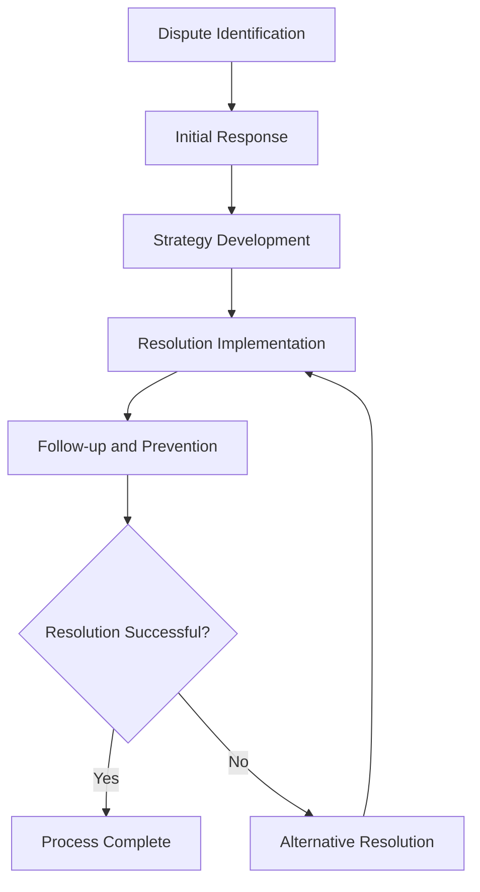

# Legal Dispute Resolution

Handle legal disputes and conflict resolution procedures to ensure organizational protection, client satisfaction, and operational continuity while minimizing legal risks and costs.

## Purpose

Establish systematic procedures for handling legal disputes and conflict resolution that ensure organizational protection, client satisfaction, and operational continuity while minimizing legal risks, costs, and operational disruption through effective dispute prevention and resolution strategies.

## Roles and Responsibilities

**Business Leader:**

- Approve dispute resolution strategies and legal approaches
- Review dispute documentation and legal implications
- Oversee dispute resolution process and organizational protection
- Monitor dispute outcomes and lessons learned
- Authorize settlement agreements and legal actions

**Operations Leader:**

- Oversee operational continuity during dispute resolution
- Monitor operational impact of disputes and resolution efforts
- Coordinate operational modifications during dispute process
- Ensure operational standards maintained during resolution
- Authorize operational adjustments during dispute handling

**Safety Officer:**

- Review safety implications of disputes and resolution
- Verify safety compliance during dispute resolution process
- Monitor safety risks during operational modifications
- Ensure safety standards maintained throughout resolution
- Coordinate safety considerations in dispute resolution

**Finance Leader:**

- Oversee financial aspects of dispute resolution
- Monitor dispute costs and financial implications
- Coordinate financial settlements and payment procedures
- Review financial impact and cost management
- Authorize financial settlements and legal expenses

**Client Service Representative:**

- Coordinate client communication during dispute resolution
- Monitor client impact and relationship maintenance
- Manage client expectations during dispute process
- Maintain client relationships during resolution efforts
- Document client feedback and resolution requirements

## Process Steps

### Dispute Identification Phase

- **Recognize potential disputes** - Identify situations that may lead to legal disputes
- **Assess dispute severity** - Evaluate potential impact and legal implications
- **Document dispute details** - Record comprehensive information about dispute circumstances
- **Determine immediate actions** - Identify immediate steps to prevent escalation

### Initial Response Phase

- **Acknowledge dispute** - Provide timely acknowledgment and initial response
- **Gather information** - Collect all relevant documentation and evidence
- **Assess legal position** - Evaluate organizational legal position and risks
- **Develop response strategy** - Create comprehensive response and resolution strategy

### Resolution Strategy Development Phase

- **Explore resolution options** - Identify potential resolution approaches and alternatives
- **Evaluate legal implications** - Assess legal risks and potential outcomes
- **Develop negotiation strategy** - Create effective negotiation and settlement approach
- **Prepare documentation** - Organize all relevant documentation and evidence

### Resolution Implementation Phase

- **Initiate resolution process** - Begin formal resolution procedures and negotiations
- **Conduct negotiations** - Engage in structured negotiation and settlement discussions
- **Document agreements** - Record all agreements and settlement terms
- **Implement settlements** - Execute settlement agreements and resolution terms

### Follow-up and Prevention Phase

- **Monitor settlement compliance** - Track compliance with settlement terms and agreements
- **Address remaining issues** - Handle any unresolved issues or concerns
- **Conduct lessons learned review** - Evaluate dispute resolution effectiveness
- **Implement prevention measures** - Develop procedures to prevent similar disputes

## Process Mapping

## Tools and Resources

- **Dispute Management System**: Digital dispute tracking and documentation capabilities
- **Legal Documentation**: Comprehensive dispute documentation and evidence management
- **Legal Counsel**: Attorney specializing in aviation law and dispute resolution
- **Mediation Services**: Professional mediation and alternative dispute resolution services
- **Documentation System**: Dispute record management and evidence storage
- **Communication Tools**: Professional communication and negotiation support resources

## Success Metrics

- **Completion Time:** Disputes resolved within 90 days of formal identification
- **Quality Standard:** 100% of disputes handled with proper legal compliance and documentation
- **Safety Standard:** Zero safety incidents related to dispute resolution procedures
- **Client Satisfaction:** 95% client satisfaction with dispute resolution process and outcomes

## Common Issues and Solutions

- **Issue:** Disputes escalating due to delayed or inadequate initial response
- **Solution:** Implement rapid response procedures with clear escalation protocols. Provide comprehensive training on dispute recognition and initial response procedures.

- **Issue:** Legal costs exceeding budget constraints affecting organizational sustainability
- **Solution:** Develop cost-effective dispute resolution strategies including mediation and alternative dispute resolution. Establish clear cost management procedures and approval processes.

- **Issue:** Client relationships damaged during dispute resolution process
- **Solution:** Implement professional dispute resolution procedures with clear client communication. Focus on relationship preservation while addressing dispute issues.

- **Issue:** Dispute resolution not addressing underlying causes leading to repeat issues
- **Solution:** Conduct thorough root cause analysis and implement preventive measures. Develop procedures to address systemic issues and prevent similar disputes.

## Safety Considerations

- ⚠️ **WARNING**: Never compromise safety standards during dispute resolution procedures
- ⚠️ **WARNING**: Ensure all dispute resolution procedures comply with legal and regulatory requirements
- ⚡ **CAUTION**: Verify operational continuity and safety compliance during dispute resolution
- ⚡ **CAUTION**: Monitor potential safety risks during operational modifications
- ℹ️ **NOTE**: Maintain confidentiality of dispute information and legal proceedings
- ℹ️ **NOTE**: Conduct regular reviews of dispute resolution procedures for effectiveness
- ✅ **BEST PRACTICE**: Implement comprehensive dispute prevention and early resolution procedures
- ✅ **BEST PRACTICE**: Maintain detailed records of all dispute resolution activities and outcomes

## Regulatory References

- **Federal Aviation Regulations** - FAA requirements for aviation operations and disputes
- **Alternative Dispute Resolution Act** - Federal requirements for dispute resolution procedures
- **State Dispute Resolution Laws** - Applicable state laws governing dispute resolution
- **Aviation Insurance Requirements** - Insurance coverage and dispute resolution requirements
- **Employment Laws** - Employment-related dispute resolution and legal requirements

## Aviation Industry Requirements

### Dispute Resolution Standards
- **Aviation Compliance**: Dispute resolution procedures meeting aviation industry standards
- **Safety Focus**: Dispute resolution maintaining aviation safety and operational excellence
- **Regulatory Compliance**: Dispute resolution procedures meeting FAA and industry requirements
- **Professional Standards**: Dispute resolution maintaining organizational reputation and professionalism

### Resolution Requirements
- **Legal Compliance**: Comprehensive compliance with aviation and business law requirements
- **Documentation**: Complete documentation of dispute resolution process and outcomes
- **Operational Continuity**: Dispute resolution ensuring operational continuity and safety
- **Client Protection**: Dispute resolution protecting client relationships and service quality

