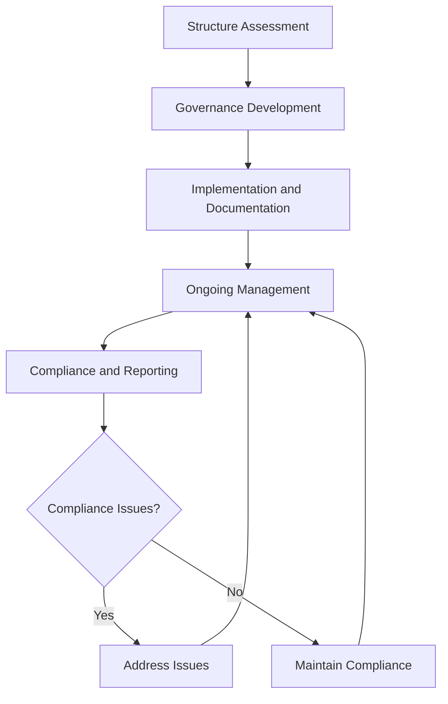

# Business Entity Management

Manage corporate structure and governance procedures to ensure legal compliance, organizational protection, and operational sustainability while supporting business objectives and regulatory requirements.

## Purpose

Establish systematic procedures for managing corporate structure and governance that ensure legal compliance, organizational protection, and operational sustainability while supporting business objectives, regulatory requirements, and long-term organizational success.

## Roles and Responsibilities

**Business Leader:**

- Approve corporate structure and governance policies
- Review corporate compliance and regulatory requirements
- Oversee corporate governance and board responsibilities
- Monitor corporate performance and strategic objectives
- Authorize corporate structure modifications and governance changes

**Operations Leader:**

- Oversee operational alignment with corporate structure
- Monitor operational compliance with corporate governance
- Coordinate operational procedures with corporate requirements
- Ensure operational standards meet corporate objectives
- Authorize operational modifications supporting corporate goals

**Safety Officer:**

- Review safety implications of corporate structure and governance
- Verify safety compliance with corporate policies and procedures
- Monitor safety performance within corporate governance framework
- Ensure safety standards align with corporate objectives
- Coordinate safety considerations in corporate decision-making

**Finance Leader:**

- Oversee financial aspects of corporate structure and governance
- Monitor financial compliance with corporate requirements
- Coordinate financial reporting with corporate governance
- Review financial impact of corporate structure decisions
- Authorize financial modifications supporting corporate objectives

**Client Service Representative:**

- Coordinate client service alignment with corporate structure
- Monitor client service procedures within corporate governance
- Maintain client relationships supporting corporate objectives
- Document client feedback for corporate decision-making
- Support corporate governance through client service excellence

## Process Steps

### Corporate Structure Assessment Phase

- **Review current structure** - Evaluate existing corporate structure and governance framework
- **Assess compliance status** - Determine compliance with legal and regulatory requirements
- **Identify improvement opportunities** - Recognize areas for enhancement and optimization
- **Evaluate strategic alignment** - Assess alignment with business objectives and goals

### Governance Framework Development Phase

- **Develop governance policies** - Create comprehensive corporate governance policies and procedures
- **Establish board structure** - Define board composition, responsibilities, and operating procedures
- **Create compliance procedures** - Develop compliance monitoring and reporting procedures
- **Design decision-making processes** - Establish clear decision-making and approval procedures

### Implementation and Documentation Phase

- **Implement governance framework** - Execute new corporate governance policies and procedures
- **Document corporate structure** - Create comprehensive documentation of corporate structure
- **Establish monitoring systems** - Implement ongoing monitoring and compliance verification
- **Provide training and communication** - Deliver comprehensive training on governance procedures

### Ongoing Management Phase

- **Monitor governance effectiveness** - Track governance performance and compliance status
- **Update corporate documentation** - Maintain current and accurate corporate documentation
- **Conduct regular reviews** - Perform periodic governance assessments and evaluations
- **Address governance issues** - Identify and resolve governance deficiencies promptly

### Compliance and Reporting Phase

- **Maintain regulatory compliance** - Ensure ongoing compliance with corporate and aviation regulations
- **Generate compliance reports** - Create comprehensive compliance reporting and documentation
- **Submit regulatory filings** - Complete and submit required corporate and regulatory filings
- **Conduct governance audits** - Perform regular governance audits and assessments

## Process Mapping

## Tools and Resources

- **Corporate Management System**: Digital corporate governance tracking and documentation capabilities
- **Legal Documentation**: Comprehensive corporate documentation and compliance records
- **Legal Counsel**: Attorney specializing in corporate law and aviation business requirements
- **Governance Software**: Corporate governance and compliance management tools
- **Regulatory Resources**: Corporate and aviation regulatory guidance materials
- **Documentation System**: Corporate record management and storage

## Success Metrics

- **Completion Time:** Corporate structure modifications implemented within 120 days of approval
- **Quality Standard:** 100% of corporate governance procedures meet legal and regulatory requirements
- **Safety Standard:** Zero safety incidents related to corporate structure or governance procedures
- **Client Satisfaction:** 95% client satisfaction with corporate governance and organizational structure

## Common Issues and Solutions

- **Issue:** Corporate structure not aligned with business objectives and operational requirements
- **Solution:** Conduct comprehensive business analysis and align corporate structure with strategic objectives. Implement regular reviews to ensure ongoing alignment.

- **Issue:** Governance procedures not meeting legal or regulatory compliance requirements
- **Solution:** Work with legal counsel to develop compliant governance procedures. Implement regular compliance audits and updates to maintain regulatory adherence.

- **Issue:** Corporate documentation not current or accessible for regulatory requirements
- **Solution:** Implement comprehensive documentation management procedures with regular updates. Establish clear responsibilities for documentation maintenance and accessibility.

- **Issue:** Governance decision-making processes not supporting operational efficiency
- **Solution:** Streamline governance procedures to support operational requirements. Implement clear decision-making frameworks that balance governance needs with operational efficiency.

## Safety Considerations

- ⚠️ **WARNING**: Never compromise safety standards for corporate governance or structural convenience
- ⚠️ **WARNING**: Ensure all corporate governance procedures comply with aviation safety and regulatory requirements
- ⚡ **CAUTION**: Verify corporate structure supports safety and operational excellence objectives
- ⚡ **CAUTION**: Monitor governance procedures for effectiveness and safety compliance
- ℹ️ **NOTE**: Maintain current corporate knowledge and update procedures as requirements change
- ℹ️ **NOTE**: Conduct regular governance reviews to ensure ongoing safety and operational alignment
- ✅ **BEST PRACTICE**: Implement comprehensive corporate governance training and documentation procedures
- ✅ **BEST PRACTICE**: Maintain detailed records of all corporate governance activities and decisions

## Regulatory References

- **State Corporate Laws** - Applicable state laws governing corporate structure and governance
- **Federal Aviation Regulations** - FAA requirements for aviation business operations
- **Securities and Exchange Commission (SEC) Regulations** - Applicable securities and reporting requirements
- **Internal Revenue Service (IRS) Requirements** - Tax compliance and reporting requirements
- **Aviation Business Regulations** - Industry-specific corporate and business requirements

## Aviation Industry Requirements

### Corporate Structure Standards
- **Aviation Compliance**: Corporate structure meeting aviation industry and regulatory requirements
- **Safety Focus**: Corporate governance supporting aviation safety and operational excellence
- **Operational Alignment**: Corporate structure supporting efficient aviation operations
- **Regulatory Compliance**: Corporate governance meeting FAA and industry requirements

### Governance Requirements
- **Legal Compliance**: Comprehensive compliance with corporate and aviation law requirements
- **Documentation**: Complete documentation of corporate structure and governance procedures
- **Operational Support**: Governance procedures supporting operational excellence and safety
- **Strategic Alignment**: Corporate governance supporting long-term business objectives

