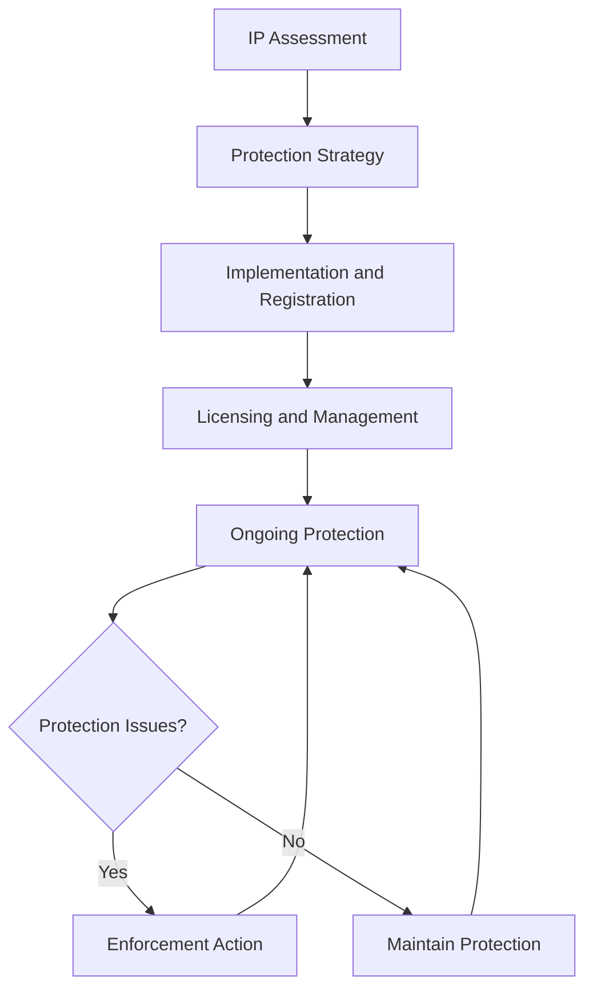

# Intellectual Property Protection

Protect intellectual property and manage licensing agreements to ensure organizational assets, competitive advantages, and legal protection while supporting business growth and innovation.

## Purpose

Establish systematic procedures for protecting intellectual property and managing licensing agreements that ensure organizational assets, competitive advantages, and legal protection while supporting business growth, innovation, and long-term organizational success.

## Roles and Responsibilities

**Business Leader:**

- Approve intellectual property protection strategies and policies
- Review intellectual property portfolio and protection requirements
- Oversee licensing agreements and intellectual property management
- Monitor intellectual property value and competitive advantages
- Authorize intellectual property protection and licensing decisions

**Operations Leader:**

- Oversee operational use of intellectual property and licensing
- Monitor operational compliance with intellectual property requirements
- Coordinate operational procedures with intellectual property protection
- Ensure operational standards support intellectual property objectives
- Authorize operational modifications supporting intellectual property goals

**Safety Officer:**

- Review safety implications of intellectual property and licensing
- Verify safety compliance with intellectual property requirements
- Monitor safety performance within intellectual property framework
- Ensure safety standards align with intellectual property objectives
- Coordinate safety considerations in intellectual property decisions

**Finance Leader:**

- Oversee financial aspects of intellectual property and licensing
- Monitor intellectual property costs and financial implications
- Coordinate financial reporting with intellectual property requirements
- Review financial impact of intellectual property decisions
- Authorize financial modifications supporting intellectual property objectives

**Client Service Representative:**

- Coordinate client service alignment with intellectual property protection
- Monitor client service procedures within intellectual property framework
- Maintain client relationships supporting intellectual property objectives
- Document client feedback for intellectual property decision-making
- Support intellectual property protection through client service excellence

## Process Steps

### Intellectual Property Assessment Phase

- **Identify intellectual property assets** - Recognize and catalog all organizational intellectual property
- **Assess protection requirements** - Determine appropriate protection levels and strategies
- **Evaluate competitive advantages** - Analyze intellectual property value and competitive position
- **Prioritize protection needs** - Determine critical intellectual property requiring immediate protection

### Protection Strategy Development Phase

- **Develop protection strategies** - Create comprehensive intellectual property protection plans
- **Select protection methods** - Choose appropriate protection mechanisms and procedures
- **Create protection procedures** - Develop systematic protection and monitoring procedures
- **Design licensing frameworks** - Establish licensing agreement structures and terms

### Implementation and Registration Phase

- **Implement protection measures** - Execute intellectual property protection strategies
- **Register intellectual property** - Complete formal registration and protection procedures
- **Establish monitoring systems** - Implement ongoing monitoring and protection verification
- **Create documentation procedures** - Develop comprehensive documentation and record-keeping

### Licensing and Management Phase

- **Develop licensing agreements** - Create comprehensive licensing terms and conditions
- **Negotiate licensing arrangements** - Conduct licensing negotiations and agreement execution
- **Monitor licensing compliance** - Track licensing agreement compliance and performance
- **Manage licensing relationships** - Maintain ongoing licensing relationships and communications

### Ongoing Protection and Enforcement Phase

- **Monitor intellectual property status** - Track intellectual property protection and compliance
- **Enforce protection rights** - Take action to protect intellectual property rights when necessary
- **Update protection measures** - Maintain current and effective protection procedures
- **Conduct regular reviews** - Perform periodic intellectual property assessments and evaluations

## Process Mapping

## Tools and Resources

- **Intellectual Property Management System**: Digital IP tracking and protection capabilities
- **Legal Documentation**: Comprehensive IP documentation and protection records
- **Legal Counsel**: Attorney specializing in intellectual property law and aviation business
- **IP Registration Services**: Professional IP registration and protection services
- **Licensing Software**: IP licensing and agreement management tools
- **Documentation System**: IP record management and storage

## Success Metrics

- **Completion Time:** Intellectual property protection implemented within 60 days of identification
- **Quality Standard:** 100% of intellectual property assets properly protected and documented
- **Safety Standard:** Zero safety incidents related to intellectual property protection procedures
- **Client Satisfaction:** 95% client satisfaction with intellectual property protection and licensing

## Common Issues and Solutions

- **Issue:** Intellectual property not properly identified or protected leading to asset loss
- **Solution:** Implement comprehensive IP identification and protection procedures. Conduct regular IP audits and maintain current protection measures.

- **Issue:** Licensing agreements not generating expected value or compliance issues
- **Solution:** Develop comprehensive licensing strategies with clear terms and monitoring procedures. Implement regular licensing performance reviews and optimization.

- **Issue:** Intellectual property infringement not detected or addressed promptly
- **Solution:** Implement proactive IP monitoring and enforcement procedures. Establish clear escalation protocols and legal support for infringement response.

- **Issue:** Intellectual property costs exceeding budget constraints affecting protection effectiveness
- **Solution:** Prioritize IP protection based on value and competitive importance. Implement cost-effective protection strategies and regular cost-benefit analysis.

## Safety Considerations

- ⚠️ **WARNING**: Never compromise safety standards for intellectual property protection or licensing convenience
- ⚠️ **WARNING**: Ensure all intellectual property procedures comply with aviation safety and regulatory requirements
- ⚡ **CAUTION**: Verify intellectual property protection supports safety and operational excellence objectives
- ⚡ **CAUTION**: Monitor intellectual property procedures for effectiveness and safety compliance
- ℹ️ **NOTE**: Maintain current intellectual property knowledge and update procedures as requirements change
- ℹ️ **NOTE**: Conduct regular IP reviews to ensure ongoing safety and operational alignment
- ✅ **BEST PRACTICE**: Implement comprehensive intellectual property training and documentation procedures
- ✅ **BEST PRACTICE**: Maintain detailed records of all intellectual property activities and decisions

## Regulatory References

- **Patent and Trademark Laws** - Federal intellectual property protection requirements
- **Copyright Laws** - Copyright protection and licensing requirements
- **Trade Secret Laws** - Trade secret protection and confidentiality requirements
- **Aviation Intellectual Property Regulations** - Industry-specific IP protection requirements
- **International IP Agreements** - International intellectual property protection requirements

## Aviation Industry Requirements

### Intellectual Property Standards
- **Aviation Compliance**: Intellectual property protection meeting aviation industry requirements
- **Safety Focus**: IP protection supporting aviation safety and operational excellence
- **Operational Alignment**: IP protection supporting efficient aviation operations
- **Regulatory Compliance**: IP protection meeting FAA and industry requirements

### Protection Requirements
- **Legal Compliance**: Comprehensive compliance with intellectual property law requirements
- **Documentation**: Complete documentation of intellectual property protection and licensing procedures
- **Operational Support**: IP protection supporting operational excellence and safety
- **Strategic Alignment**: IP protection supporting long-term business objectives and competitive advantages

