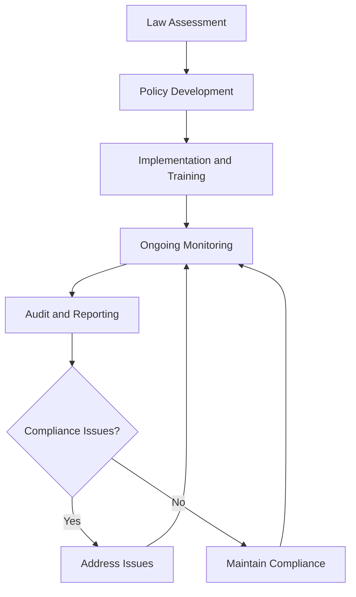

# Employment Law Compliance

Ensure compliance with employment laws and regulations to protect team members, maintain organizational integrity, and support operational excellence while meeting legal requirements and industry standards.

## Purpose

Establish systematic procedures for ensuring compliance with employment laws and regulations that protect team members, maintain organizational integrity, and support operational excellence while meeting legal requirements, industry standards, and aviation-specific employment considerations.

## Roles and Responsibilities

**Business Leader:**

- Approve employment law compliance policies and procedures
- Review employment law compliance status and requirements
- Oversee compliance monitoring and audit preparation
- Monitor employment law changes and compliance updates
- Authorize employment law compliance modifications and updates

**Operations Leader:**

- Oversee operational compliance with employment law requirements
- Monitor operational procedures for employment law compliance
- Coordinate operational procedures with employment law requirements
- Ensure operational standards meet employment law requirements
- Authorize operational modifications supporting employment law compliance

**Safety Officer:**

- Review safety implications of employment law compliance
- Verify safety procedures meet employment law requirements
- Monitor safety incidents and employment law implications
- Ensure safety documentation supports employment law compliance
- Coordinate safety training and employment law requirements

**Finance Leader:**

- Oversee financial aspects of employment law compliance
- Monitor compensation and benefits for employment law compliance
- Coordinate financial reporting with employment law requirements
- Review financial impact of employment law compliance requirements
- Authorize financial modifications supporting employment law compliance

**Client Service Representative:**

- Coordinate client service alignment with employment law compliance
- Monitor client service procedures for employment law compliance
- Maintain client relationships supporting employment law compliance
- Document client interactions for employment law compliance purposes
- Support employment law compliance through client service excellence

## Process Steps

### Employment Law Assessment Phase

- **Identify applicable employment laws** - Determine all applicable federal, state, and local employment laws
- **Assess current compliance status** - Evaluate existing procedures and practices for compliance
- **Identify compliance gaps** - Recognize areas requiring attention and improvement
- **Prioritize compliance needs** - Determine critical compliance requirements and timelines

### Compliance Policy Development Phase

- **Develop compliance policies** - Create comprehensive employment law compliance policies
- **Create compliance procedures** - Develop systematic compliance procedures and practices
- **Establish monitoring systems** - Implement ongoing compliance monitoring and verification
- **Design training programs** - Create comprehensive training on employment law requirements

### Implementation and Training Phase

- **Implement compliance policies** - Execute new employment law compliance policies and procedures
- **Provide team member training** - Deliver comprehensive training on employment law requirements
- **Establish monitoring procedures** - Create ongoing compliance monitoring and verification
- **Launch compliance reporting** - Begin regular compliance reporting and documentation

### Ongoing Monitoring Phase

- **Monitor compliance status** - Track ongoing compliance with employment law requirements
- **Update compliance procedures** - Maintain current and accurate compliance procedures
- **Conduct regular reviews** - Perform periodic compliance assessments and evaluations
- **Address compliance issues** - Identify and resolve compliance deficiencies promptly

### Audit and Reporting Phase

- **Prepare for employment law audits** - Organize documentation and prepare for regulatory reviews
- **Conduct internal audits** - Perform regular internal compliance audits and assessments
- **Generate compliance reports** - Create comprehensive compliance reporting and documentation
- **Submit regulatory reports** - Complete and submit required employment law reports and documentation

## Process Mapping

## Tools and Resources

- **Employment Law Compliance System**: Digital compliance tracking and documentation capabilities
- **Legal Documentation**: Comprehensive employment law documentation and compliance records
- **Legal Counsel**: Attorney specializing in employment law and aviation business requirements
- **Compliance Software**: Employment law compliance and monitoring tools
- **Training Resources**: Employment law training and education materials
- **Documentation System**: Employment law record management and storage

## Success Metrics

- **Completion Time:** Employment law compliance procedures updated within 30 days of law changes
- **Quality Standard:** 100% of employment law requirements documented and procedures implemented
- **Safety Standard:** Zero safety incidents related to employment law compliance procedures
- **Client Satisfaction:** 95% team member satisfaction with employment law compliance and practices

## Common Issues and Solutions

- **Issue:** Employment law requirements not clearly understood or documented
- **Solution:** Work with employment law counsel to develop comprehensive understanding. Create clear documentation and training materials for all team members.

- **Issue:** Employment law compliance not current with regulatory changes
- **Solution:** Implement regular employment law monitoring and update procedures. Establish automated systems for tracking law changes and updating compliance procedures.

- **Issue:** Team member training insufficient for employment law requirements
- **Solution:** Develop comprehensive training programs covering all employment law requirements. Provide regular updates and refresher training on law changes.

- **Issue:** Employment law compliance reporting not meeting regulatory deadlines or requirements
- **Solution:** Implement automated reporting systems with clear deadlines and responsibilities. Establish backup procedures for critical compliance reporting.

## Safety Considerations

- ⚠️ **WARNING**: Never compromise safety standards for employment law compliance convenience
- ⚠️ **WARNING**: Ensure all employment law procedures comply with aviation safety and regulatory requirements
- ⚡ **CAUTION**: Verify employment law compliance supports safety and operational excellence objectives
- ⚡ **CAUTION**: Monitor employment law procedures for effectiveness and safety compliance
- ℹ️ **NOTE**: Maintain current employment law knowledge and update procedures as requirements change
- ℹ️ **NOTE**: Conduct regular employment law reviews to ensure ongoing safety and operational alignment
- ✅ **BEST PRACTICE**: Implement comprehensive employment law training and documentation procedures
- ✅ **BEST PRACTICE**: Maintain detailed records of all employment law compliance activities and decisions

## Regulatory References

- **Fair Labor Standards Act (FLSA)** - Minimum wage, overtime, and employment standards
- **Title VII of Civil Rights Act** - Anti-discrimination and equal employment opportunity
- **Americans with Disabilities Act (ADA)** - Disability accommodation and employment protection
- **Family and Medical Leave Act (FMLA)** - Leave and employment protection requirements
- **State Employment Laws** - Applicable state employment and labor regulations

## Aviation Industry Requirements

### Employment Law Standards
- **Aviation Compliance**: Employment law compliance meeting aviation industry requirements
- **Safety Focus**: Employment law procedures supporting aviation safety and operational excellence
- **Operational Alignment**: Employment law compliance supporting efficient aviation operations
- **Regulatory Compliance**: Employment law procedures meeting FAA and industry requirements

### Compliance Requirements
- **Legal Compliance**: Comprehensive compliance with employment and labor law requirements
- **Documentation**: Complete documentation of employment law compliance procedures
- **Operational Support**: Employment law compliance supporting operational excellence and safety
- **Team Member Protection**: Employment law compliance protecting team member rights and interests

