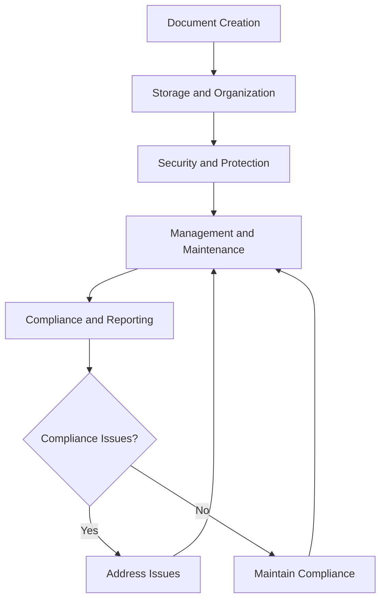

# Legal Document Management

Manage legal document creation, storage, and security to ensure organizational protection, regulatory compliance, and operational efficiency while maintaining document integrity and accessibility.

## Purpose

Establish systematic procedures for managing legal document creation, storage, and security that ensure organizational protection, regulatory compliance, and operational efficiency while maintaining document integrity, accessibility, and long-term organizational success.

## Roles and Responsibilities

**Business Leader:**

- Approve legal document management policies and procedures
- Review legal document security and compliance requirements
- Oversee legal document management and security protocols
- Monitor legal document effectiveness and organizational protection
- Authorize legal document management modifications and updates

**Operations Leader:**

- Oversee operational alignment with legal document requirements
- Monitor operational procedures for legal document compliance
- Coordinate operational procedures with legal document management
- Ensure operational standards meet legal document requirements
- Authorize operational modifications supporting legal document objectives

**Safety Officer:**

- Review safety implications of legal document management
- Verify safety procedures meet legal document requirements
- Monitor safety incidents and legal document implications
- Ensure safety documentation supports legal document compliance
- Coordinate safety training and legal document requirements

**Finance Leader:**

- Oversee financial aspects of legal document management
- Monitor legal document costs and financial implications
- Coordinate financial reporting with legal document requirements
- Review financial impact of legal document management decisions
- Authorize financial modifications supporting legal document objectives

**Client Service Representative:**

- Coordinate client service alignment with legal document management
- Monitor client service procedures for legal document compliance
- Maintain client relationships supporting legal document objectives
- Document client interactions for legal document purposes
- Support legal document management through client service excellence

## Process Steps

### Document Creation Phase

- **Identify document requirements** - Determine legal document needs and specifications
- **Develop document templates** - Create standardized legal document templates and formats
- **Establish creation procedures** - Develop systematic document creation and review procedures
- **Implement quality control** - Create quality assurance procedures for document creation

### Document Storage and Organization Phase

- **Design storage system** - Create comprehensive document storage and organization system
- **Establish filing procedures** - Develop systematic filing and organization procedures
- **Implement access controls** - Create secure access and authorization procedures
- **Establish backup procedures** - Develop comprehensive backup and recovery procedures

### Document Security and Protection Phase

- **Implement security measures** - Create comprehensive document security and protection
- **Establish access protocols** - Develop secure access and authorization protocols
- **Create audit trails** - Implement comprehensive audit and tracking procedures
- **Establish retention policies** - Develop document retention and disposal procedures

### Document Management and Maintenance Phase

- **Monitor document status** - Track document status, updates, and maintenance requirements
- **Update document procedures** - Maintain current and accurate document management procedures
- **Conduct regular reviews** - Perform periodic document assessments and evaluations
- **Address document issues** - Identify and resolve document management deficiencies promptly

### Compliance and Reporting Phase

- **Maintain regulatory compliance** - Ensure ongoing compliance with document management requirements
- **Generate compliance reports** - Create comprehensive compliance reporting and documentation
- **Submit regulatory reports** - Complete and submit required document management reports
- **Conduct compliance audits** - Perform regular compliance audits and assessments

## Process Mapping

## Tools and Resources

- **Legal Document Management System**: Digital document tracking and management capabilities
- **Document Storage System**: Secure document storage and organization platform
- **Legal Documentation**: Comprehensive legal document templates and procedures
- **Legal Counsel**: Attorney specializing in legal document management and compliance
- **Document Security Software**: Legal document security and access control tools
- **Documentation System**: Legal document record management and storage

## Success Metrics

- **Completion Time:** Legal documents created and stored within 48 hours of requirements identification
- **Quality Standard:** 100% of legal documents properly created, stored, and secured
- **Safety Standard:** Zero safety incidents related to legal document management procedures
- **Client Satisfaction:** 95% client satisfaction with legal document management and accessibility

## Common Issues and Solutions

- **Issue:** Legal documents not properly organized or accessible when needed
- **Solution:** Implement comprehensive document organization and indexing procedures. Create clear filing systems and access protocols for efficient document retrieval.

- **Issue:** Legal document security not adequate for sensitive information protection
- **Solution:** Develop comprehensive security procedures with access controls and encryption. Implement regular security audits and updates to maintain protection.

- **Issue:** Legal document retention not meeting regulatory requirements
- **Solution:** Establish clear retention policies based on regulatory requirements. Implement automated retention tracking and disposal procedures.

- **Issue:** Legal document creation not standardized leading to inconsistencies
- **Solution:** Develop comprehensive document templates and creation procedures. Provide training on document creation standards and quality control.

## Safety Considerations

- ⚠️ **WARNING**: Never compromise document security for operational convenience or accessibility
- ⚠️ **WARNING**: Ensure all legal document procedures comply with security and regulatory requirements
- ⚡ **CAUTION**: Verify legal document management supports safety and operational excellence objectives
- ⚡ **CAUTION**: Monitor legal document procedures for effectiveness and security compliance
- ℹ️ **NOTE**: Maintain current legal document knowledge and update procedures as requirements change
- ℹ️ **NOTE**: Conduct regular document reviews to ensure ongoing security and operational alignment
- ✅ **BEST PRACTICE**: Implement comprehensive legal document training and security procedures
- ✅ **BEST PRACTICE**: Maintain detailed records of all legal document activities and access

## Regulatory References

- **Federal Records Management Laws** - Federal requirements for document management and retention
- **State Document Management Laws** - Applicable state requirements for document management
- **Aviation Document Regulations** - Industry-specific document management requirements
- **Security and Privacy Laws** - Document security and privacy protection requirements
- **Electronic Records Laws** - Electronic document management and signature requirements

## Aviation Industry Requirements

### Legal Document Standards
- **Aviation Compliance**: Legal document management meeting aviation industry requirements
- **Safety Focus**: Legal document procedures supporting aviation safety and operational excellence
- **Operational Alignment**: Legal document management supporting efficient aviation operations
- **Regulatory Compliance**: Legal document procedures meeting FAA and industry requirements

### Document Management Requirements
- **Legal Compliance**: Comprehensive compliance with document management law requirements
- **Documentation**: Complete documentation of legal document management procedures
- **Operational Support**: Legal document management supporting operational excellence and safety
- **Security Protection**: Legal document management ensuring document security and integrity

