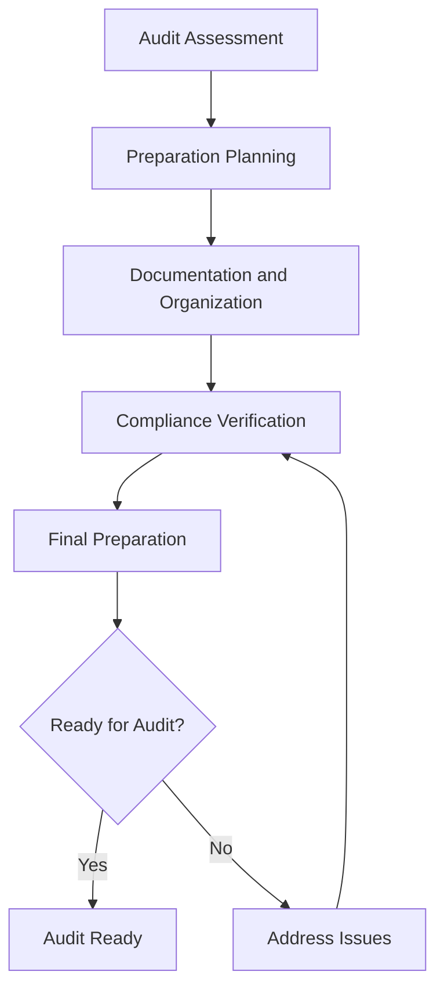

# Legal Audit Preparation

Prepare for legal audits and compliance reviews to ensure organizational readiness, regulatory compliance, and operational excellence while maintaining audit readiness and organizational protection.

## Purpose

Establish systematic procedures for preparing for legal audits and compliance reviews that ensure organizational readiness, regulatory compliance, and operational excellence while maintaining audit readiness, organizational protection, and long-term organizational success.

## Roles and Responsibilities

**Business Leader:**

- Approve legal audit preparation policies and procedures
- Review legal audit requirements and compliance status
- Oversee legal audit preparation and organizational readiness
- Monitor legal audit outcomes and organizational protection
- Authorize legal audit preparation modifications and updates

**Operations Leader:**

- Oversee operational alignment with legal audit requirements
- Monitor operational procedures for legal audit compliance
- Coordinate operational procedures with legal audit preparation
- Ensure operational standards meet legal audit requirements
- Authorize operational modifications supporting legal audit objectives

**Safety Officer:**

- Review safety implications of legal audit preparation
- Verify safety procedures meet legal audit requirements
- Monitor safety incidents and legal audit implications
- Ensure safety documentation supports legal audit compliance
- Coordinate safety training and legal audit requirements

**Finance Leader:**

- Oversee financial aspects of legal audit preparation
- Monitor legal audit costs and financial implications
- Coordinate financial reporting with legal audit requirements
- Review financial impact of legal audit preparation decisions
- Authorize financial modifications supporting legal audit objectives

**Client Service Representative:**

- Coordinate client service alignment with legal audit preparation
- Monitor client service procedures for legal audit compliance
- Maintain client relationships supporting legal audit objectives
- Document client interactions for legal audit purposes
- Support legal audit preparation through client service excellence

## Process Steps

### Audit Assessment Phase

- **Identify audit requirements** - Determine legal audit scope, requirements, and timelines
- **Assess current compliance status** - Evaluate existing procedures and practices for compliance
- **Identify compliance gaps** - Recognize areas requiring attention and improvement
- **Prioritize preparation needs** - Determine critical preparation requirements and timelines

### Preparation Planning Phase

- **Develop preparation strategy** - Create comprehensive legal audit preparation plan
- **Establish preparation procedures** - Develop systematic preparation and review procedures
- **Create documentation procedures** - Develop comprehensive documentation and organization procedures
- **Design review processes** - Establish review and verification procedures

### Documentation and Organization Phase

- **Organize existing documentation** - Compile and organize all relevant legal documentation
- **Create missing documentation** - Develop any missing or incomplete documentation
- **Establish documentation systems** - Create systematic documentation organization and access
- **Implement quality control** - Establish quality assurance procedures for documentation

### Compliance Verification Phase

- **Conduct internal audits** - Perform comprehensive internal compliance audits
- **Verify compliance status** - Confirm compliance with all applicable legal requirements
- **Address compliance issues** - Identify and resolve compliance deficiencies promptly
- **Document compliance status** - Create comprehensive compliance documentation

### Final Preparation Phase

- **Conduct mock audits** - Perform practice audits to identify potential issues
- **Prepare audit team** - Train and prepare team members for audit participation
- **Organize audit materials** - Prepare all materials and documentation for audit
- **Establish communication protocols** - Create clear communication procedures for audit

## Process Mapping

## Tools and Resources

- **Legal Audit Preparation System**: Digital audit preparation tracking and documentation capabilities
- **Compliance Documentation**: Comprehensive legal compliance documentation and records
- **Legal Counsel**: Attorney specializing in legal audit preparation and compliance
- **Audit Preparation Software**: Legal audit preparation and compliance monitoring tools
- **Documentation System**: Legal audit record management and storage
- **Training Resources**: Legal audit preparation and compliance training materials

## Success Metrics

- **Completion Time:** Legal audit preparation completed within 30 days of audit notification
- **Quality Standard:** 100% of legal audit requirements addressed and documented
- **Safety Standard:** Zero safety incidents related to legal audit preparation procedures
- **Client Satisfaction:** 95% client satisfaction with legal audit preparation and outcomes

## Common Issues and Solutions

- **Issue:** Legal audit requirements not clearly understood or documented
- **Solution:** Work with legal counsel to develop comprehensive understanding of audit requirements. Create clear documentation and preparation procedures for all team members.

- **Issue:** Documentation not organized or accessible for audit review
- **Solution:** Implement comprehensive documentation organization and indexing procedures. Create clear filing systems and access protocols for efficient audit review.

- **Issue:** Compliance gaps not identified or addressed before audit
- **Solution:** Conduct thorough internal audits and compliance reviews. Implement systematic gap analysis and corrective action procedures.

- **Issue:** Team members not prepared for audit participation
- **Solution:** Develop comprehensive training programs covering audit requirements and procedures. Provide regular updates and practice sessions for audit preparation.

## Safety Considerations

- ⚠️ **WARNING**: Never compromise safety standards for legal audit preparation convenience
- ⚠️ **WARNING**: Ensure all legal audit procedures comply with aviation safety and regulatory requirements
- ⚡ **CAUTION**: Verify legal audit preparation supports safety and operational excellence objectives
- ⚡ **CAUTION**: Monitor legal audit procedures for effectiveness and safety compliance
- ℹ️ **NOTE**: Maintain current legal audit knowledge and update procedures as requirements change
- ℹ️ **NOTE**: Conduct regular audit preparation reviews to ensure ongoing safety and operational alignment
- ✅ **BEST PRACTICE**: Implement comprehensive legal audit training and preparation procedures
- ✅ **BEST PRACTICE**: Maintain detailed records of all legal audit preparation activities and outcomes

## Regulatory References

- **Federal Audit Requirements** - Federal requirements for legal audits and compliance reviews
- **State Audit Laws** - Applicable state requirements for legal audits and compliance
- **Aviation Audit Regulations** - Industry-specific audit and compliance requirements
- **Compliance Review Standards** - Professional standards for legal audit and compliance reviews
- **Documentation Requirements** - Legal requirements for audit documentation and record-keeping

## Aviation Industry Requirements

### Legal Audit Standards
- **Aviation Compliance**: Legal audit preparation meeting aviation industry requirements
- **Safety Focus**: Legal audit procedures supporting aviation safety and operational excellence
- **Operational Alignment**: Legal audit preparation supporting efficient aviation operations
- **Regulatory Compliance**: Legal audit procedures meeting FAA and industry requirements

### Audit Preparation Requirements
- **Legal Compliance**: Comprehensive compliance with legal audit and review requirements
- **Documentation**: Complete documentation of legal audit preparation procedures
- **Operational Support**: Legal audit preparation supporting operational excellence and safety
- **Organizational Protection**: Legal audit preparation ensuring organizational protection and compliance

