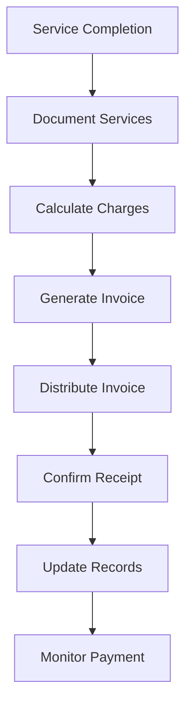

# Client Billing and Invoicing

Manage client billing and invoicing operations to ensure accurate charges and timely payment collection for all services.

## Purpose

Establish a systematic approach to billing and invoicing that ensures accurate service charges, timely payment collection, and transparent financial transactions with all clients while maintaining excellent client relationships.

## Roles and Responsibilities

**Finance Leader:**

- Review and approve billing policies and procedures
- Oversee invoice accuracy and accounts receivable
- Monitor financial performance and budgets
- Ensure compliance with financial regulations
- Coordinate with external accounting services

**Client Service Representative:**

- Manage client communications and service requests
- Process documentation and billing
- Obtain client authorizations and approvals
- Coordinate scheduling and aircraft availability
- Maintain professional client relationships

**Line Service Technician:**

- Provide direct aircraft handling services
- Execute safety protocols during aircraft movements
- Document all services provided accurately
- Coordinate with ground support equipment
- Monitor safety compliance during operations

**Operations Leader:**

- Oversee daily operations and coordinate between departments
- Authorize emergency response procedures and resource allocation
- Monitor safety compliance and operational excellence
- Coordinate scheduling across departments for operational coverage
- Review billing disputes and approve service adjustments
- Ensure regulatory compliance across all operations
## Process Steps

### Service Documentation Phase

- **Capture service details** - Record all services provided including fuel, hangar, maintenance coordination, and additional services
- **Verify service completion** - Confirm all requested services were delivered according to specifications
- **Document special requests** - Note any custom services or client-specific requirements that affect billing
- **Collect supporting documentation** - Gather fuel receipts, maintenance work orders, and service confirmations

### Invoice Preparation Phase

- **Calculate service charges** - Apply current pricing for all services using approved rate schedule
- **Apply applicable discounts** - Process any volume discounts, loyalty program benefits, or negotiated rates
- **Review charge accuracy** - Verify all calculations and service descriptions before invoice generation
- **Add taxes and fees** - Include applicable state and local taxes per regulatory requirements

### Invoice Generation Phase

- **Generate invoice document** - Create professional invoice using standard template and client information
- **Include service breakdown** - Provide detailed line items for transparency and client understanding
- **Attach supporting documents** - Include fuel receipts, work orders, or other relevant documentation
- **Verify client contact information** - Confirm current billing address and preferred delivery method

### Invoice Distribution Phase

- **Distribute invoice promptly** - Send invoice within 24 hours of service completion via client's preferred method
- **Confirm receipt** - Follow up to ensure invoice was received and is accurate
- **File invoice copies** - Maintain organized records for accounting and audit purposes
- **Update account status** - Record invoice in client account and accounts receivable system

## Process Mapping

## Tools and Resources

- **Billing Software**: FBO management system with invoicing capabilities
- **Rate Schedule**: Current pricing for all services and applicable taxes
- **Invoice Templates**: Standardized invoice formats with company branding
- **Client Database**: Contact information and billing preferences
- **Service Documentation Forms**: Fuel tickets, work orders, service confirmations
- **Payment Processing System**: Credit card and ACH payment capabilities

## Success Metrics

**Completion Time:** Invoice generated and distributed within 24 hours of service completion.

**Quality Standard:** 99% invoice accuracy with less than 2% requiring corrections or adjustments.

**Safety Standard:** All fuel quantity documentation verified and reconciled before billing.

**Client Satisfaction:** 95% of clients rate billing process as clear and accurate in quarterly surveys.

## Common Issues and Solutions

**Issue:** Service charges disputed by client due to unclear documentation
**Solution:** Provide detailed service breakdown with timestamps and supporting documentation. Review with client and adjust if warranted.

**Issue:** Delayed invoice generation affecting cash flow
**Solution:** Implement same-day billing for completed services. Use automated invoice generation where possible and establish backup procedures for system downtime.

**Issue:** Incorrect fuel quantities billed due to documentation errors
**Solution:** Require dual verification of fuel quantities by technician and supervisor. Implement digital fuel tracking system with automatic quantity capture.

## Safety Considerations

⚠️ **WARNING:** Ensure fuel billing accuracy to prevent client safety issues from incorrect fuel load calculations

⚡ **CAUTION:** Verify all service charges before invoice generation to maintain client trust and avoid billing disputes

ℹ️ **NOTE:** Maintain confidentiality of client financial information and billing details at all times

✅ **BEST PRACTICE:** Provide detailed service breakdown on all invoices to support transparency and client understanding

## Regulatory References

- **14 CFR Part 91** - General Operating and Flight Rules (fuel requirements)
- **OSHA 29 CFR 1910.106** - Flammable Liquids (fuel handling documentation)
- **State Sales Tax Regulations** - Applicable tax requirements for aviation services
- **Company Financial Policies** - Internal billing and collection procedures
