

# Administrative and Financial

Essential business operations and financial management procedures that support all aspects of FBO operations. These procedures ensure efficient business processes, accurate financial management, and regulatory compliance.

### Procedures in this Section

#### [Client Billing and Invoicing Process](01-client-billing-invoicing.md)

Manage client billing and invoicing operations to ensure accurate charges and timely payment collection for all services.

- Service charge calculation and verification
- Invoice generation and distribution
- Billing accuracy and dispute resolution

#### [Payment Processing and Collections Process](02-payment-processing-collections.md)

Process payments and manage collections to maintain healthy cash flow and minimize outstanding receivables.

- Payment method processing and reconciliation
- Collections procedures and follow-up
- Account status management and reporting

#### [Budget Planning and Monitoring Process](03-budget-planning-monitoring.md)

Develop and monitor budgets to ensure financial planning accuracy and operational cost control.

- Budget development and approval
- Performance monitoring and variance analysis
- Forecasting and adjustment procedures

#### [Expense Tracking and Approval Process](04-expense-tracking-approval.md)

Track and approve expenses to maintain cost control and ensure proper authorization for all expenditures.

- Expense documentation and submission
- Approval workflow and authorization
- Expense reporting and analysis

#### [Payroll Administration for Team Members Process](05-payroll-administration.md)

Administer payroll operations to ensure accurate and timely compensation for all team members.

- Payroll calculation and processing
- Tax withholding and compliance
- Benefits administration and reporting

#### [Vendor and Supplier Contract Management Process](06-vendor-supplier-contracts.md)

Manage vendor and supplier contracts to ensure favorable terms and reliable service delivery.

- Contract negotiation and execution
- Performance monitoring and evaluation
- Renewal and termination procedures

#### [Financial Reporting and Reconciliation Process](07-financial-reporting-reconciliation.md)

Generate financial reports and perform reconciliations to maintain accurate financial records and support decision-making.

- Financial statement preparation and analysis
- Account reconciliation procedures
- Reporting accuracy and compliance verification

#### [Tax Filing and Compliance Process](08-tax-filing-compliance.md)

Manage tax filing and compliance obligations to meet regulatory requirements and minimize tax liability.

- Tax calculation and preparation
- Filing procedures and deadlines
- Compliance monitoring and audit support

#### [Insurance Policy Management Process](09-insurance-policy-management.md)

Manage insurance policies to ensure adequate coverage and cost-effective risk management.

- Coverage assessment and policy selection
- Claims processing and management
- Policy renewal and adjustment procedures

#### [Team Member Scheduling and Timekeeping Process](10-team-member-scheduling-timekeeping.md)

Manage team member scheduling and timekeeping to optimize staffing and ensure accurate payroll processing.

- Schedule development and coordination
- Time tracking and verification
- Attendance monitoring and reporting

#### [Record-Keeping for Regulatory Compliance Process](11-regulatory-record-keeping.md)

Maintain regulatory records to ensure compliance with aviation and business regulations.

- Record retention and organization
- Compliance documentation and verification
- Audit preparation and support

#### [Inventory Management for Fuel and Supplies Process](12-inventory-management.md)

Manage fuel and supply inventory to ensure adequate stock levels while minimizing carrying costs.

- Inventory tracking and control
- Procurement planning and execution
- Stock level optimization and monitoring

#### [Client Account Management in CRM Process](13-client-account-crm.md)

Manage client accounts in CRM system to maintain accurate client information and support relationship management.

- Account setup and maintenance
- Data accuracy and completeness
- Reporting and analysis capabilities

#### [Purchase Order Processing Process](14-purchase-order-processing.md)

Process purchase orders to ensure proper authorization and accurate procurement of goods and services.

- Purchase order creation and approval
- Vendor coordination and delivery tracking
- Receipt verification and payment processing

#### [Audit Preparation and Support Process](15-audit-preparation-support.md)

Prepare for and support audit activities to ensure compliance verification and operational transparency.

- Audit planning and preparation
- Documentation organization and provision
- Audit coordination and follow-up procedures

---

## Client Billing and Invoicing

Manage client billing and invoicing operations to ensure accurate charges and timely payment collection for all services.

### Purpose

Establish a systematic approach to billing and invoicing that ensures accurate service charges, timely payment collection, and transparent financial transactions with all clients while maintaining excellent client relationships.

### Roles and Responsibilities

**Finance Leader:**

- Review and approve billing policies and procedures
- Oversee invoice accuracy and dispute resolution
- Monitor accounts receivable and collection activities

**Client Service Representative:**

- Capture service details and verify charges
- Generate and distribute invoices to clients
- Handle initial billing inquiries and clarifications

**Line Service Technician:**

- Document all services provided accurately
- Verify fuel quantities and service completions
- Report any billing discrepancies immediately

**Operations Leader:**

- Authorize service charge adjustments when appropriate
- Review billing disputes and approve resolutions
- Ensure billing procedures support operational efficiency

### Process Steps

#### Service Documentation Phase

- **Capture service details** - Record all services provided including fuel, hangar, maintenance coordination, and additional services
- **Verify service completion** - Confirm all requested services were delivered according to specifications
- **Document special requests** - Note any custom services or client-specific requirements that affect billing
- **Collect supporting documentation** - Gather fuel receipts, maintenance work orders, and service confirmations

#### Invoice Preparation Phase

- **Calculate service charges** - Apply current pricing for all services using approved rate schedule
- **Apply applicable discounts** - Process any volume discounts, loyalty program benefits, or negotiated rates
- **Review charge accuracy** - Verify all calculations and service descriptions before invoice generation
- **Add taxes and fees** - Include applicable state and local taxes per regulatory requirements

#### Invoice Generation Phase

- **Generate invoice document** - Create professional invoice using standard template and client information
- **Include service breakdown** - Provide detailed line items for transparency and client understanding
- **Attach supporting documents** - Include fuel receipts, work orders, or other relevant documentation
- **Verify client contact information** - Confirm current billing address and preferred delivery method

#### Invoice Distribution Phase

- **Distribute invoice promptly** - Send invoice within 24 hours of service completion via client's preferred method
- **Confirm receipt** - Follow up to ensure invoice was received and is accurate
- **File invoice copies** - Maintain organized records for accounting and audit purposes
- **Update account status** - Record invoice in client account and accounts receivable system

### Process Mapping

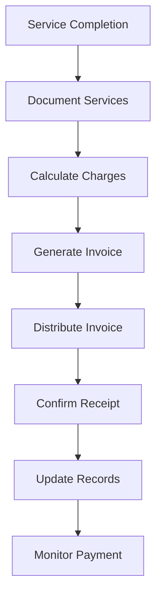

### Tools and Resources

- **Billing Software**: FBO management system with invoicing capabilities
- **Rate Schedule**: Current pricing for all services and applicable taxes
- **Invoice Templates**: Standardized invoice formats with company branding
- **Client Database**: Contact information and billing preferences
- **Service Documentation Forms**: Fuel tickets, work orders, service confirmations
- **Payment Processing System**: Credit card and ACH payment capabilities

### Success Metrics

**Completion Time:** Invoice generated and distributed within 24 hours of service completion.

**Quality Standard:** 99% invoice accuracy with less than 2% requiring corrections or adjustments.

**Safety Standard:** All fuel quantity documentation verified and reconciled before billing.

**Client Satisfaction:** 95% of clients rate billing process as clear and accurate in quarterly surveys.

### Common Issues and Solutions

**Issue:** Service charges disputed by client due to unclear documentation
**Solution:** Provide detailed service breakdown with timestamps and supporting documentation. Review with client and adjust if warranted.

**Issue:** Delayed invoice generation affecting cash flow
**Solution:** Implement same-day billing for completed services. Use automated invoice generation where possible and establish backup procedures for system downtime.

**Issue:** Incorrect fuel quantities billed due to documentation errors
**Solution:** Require dual verification of fuel quantities by technician and supervisor. Implement digital fuel tracking system with automatic quantity capture.

### Safety Considerations

⚠️ **WARNING:** Ensure fuel billing accuracy to prevent client safety issues from incorrect fuel load calculations

⚡ **CAUTION:** Verify all service charges before invoice generation to maintain client trust and avoid billing disputes

ℹ️ **NOTE:** Maintain confidentiality of client financial information and billing details at all times

✅ **BEST PRACTICE:** Provide detailed service breakdown on all invoices to support transparency and client understanding

### Regulatory References

- **14 CFR Part 91** - General Operating and Flight Rules (fuel requirements)
- **OSHA 29 CFR 1910.106** - Flammable Liquids (fuel handling documentation)
- **State Sales Tax Regulations** - Applicable tax requirements for aviation services
- **Company Financial Policies** - Internal billing and collection procedures

---

## Payment Processing and Collections

Process payments and manage collections to maintain healthy cash flow and minimize outstanding receivables.

### Purpose

Establish efficient payment processing and collections procedures that ensure timely payment collection, minimize bad debt, and maintain positive client relationships while supporting operational cash flow requirements.

### Roles and Responsibilities

**Finance Leader:**

- Establish payment terms and collection policies
- Review aged receivables and approve collection actions
- Coordinate with external collection agencies when necessary

**Client Service Representative:**

- Process payments and update account status
- Communicate with clients regarding payment status
- Initiate collection procedures per established timelines

**Business Leader:**

- Approve payment terms for new clients
- Review and authorize write-offs for uncollectable accounts
- Monitor overall collection performance and cash flow

**Operations Leader:**

- Coordinate service holds for delinquent accounts
- Support collection efforts with service documentation
- Ensure collection activities don't compromise safety operations

### Process Steps

#### Payment Processing Phase

- **Accept payment methods** - Process cash, check, credit card, and ACH payments using secure systems
- **Verify payment accuracy** - Confirm payment amount matches invoice total and account balance
- **Apply payments to accounts** - Post payments to correct client accounts and invoice numbers
- **Generate payment receipts** - Provide immediate confirmation of payment with transaction details

#### Account Monitoring Phase

- **Review aging reports** - Monitor accounts receivable aging on weekly basis to identify collection opportunities
- **Identify delinquent accounts** - Flag accounts past due based on established payment terms
- **Assess collection priority** - Evaluate account value and collection probability to prioritize efforts
- **Document collection activities** - Record all collection communications and actions taken

#### Collection Procedures Phase

- **Send payment reminders** - Issue friendly payment reminders at 30 days past due
- **Make collection calls** - Contact clients at 45 days past due to discuss payment arrangements
- **Negotiate payment plans** - Work with clients to establish realistic payment schedules when needed
- **Implement service holds** - Restrict services for accounts 60+ days past due per policy

#### Advanced Collections Phase

- **Send final demand notices** - Issue formal collection letters at 90 days past due
- **Coordinate with legal counsel** - Engage attorney for accounts requiring legal action
- **Process collection agency referrals** - Transfer uncollectable accounts to external agencies
- **Manage account write-offs** - Process bad debt write-offs per established authorization limits

### Process Mapping

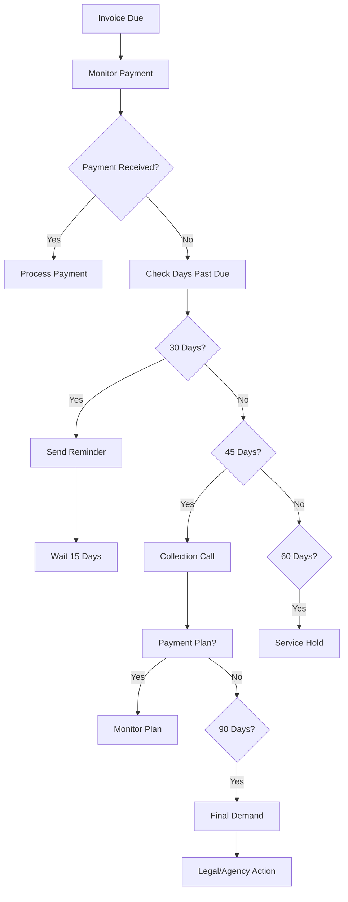

### Tools and Resources

- **Payment Processing System**: Credit card and ACH processing capabilities
- **Accounting Software**: Accounts receivable management and aging reports
- **Collection Letters**: Standardized templates for payment reminders and demands
- **Client Communication Log**: Record of all collection activities and responses
- **Payment Plan Templates**: Structured agreements for extended payment arrangements
- **Legal Counsel Contact**: Attorney specializing in commercial collections

### Success Metrics

**Completion Time:** Payment processing completed within 2 hours of receipt.

**Quality Standard:** 95% of payments processed accurately without requiring corrections.

**Safety Standard:** No service disruptions due to collection activities that compromise flight safety.

**Client Satisfaction:** 90% of clients rate payment process as convenient and professional.

### Common Issues and Solutions

**Issue:** Client disputes invoice accuracy affecting payment timing
**Solution:** Provide detailed service documentation and work with client to resolve discrepancies. Adjust billing if error confirmed and process corrected invoice promptly.

**Issue:** Credit card processing failures causing payment delays
**Solution:** Maintain backup payment processors and alternative payment methods. Contact client immediately to arrange alternative payment when processing fails.

**Issue:** Client financial difficulties preventing timely payment
**Solution:** Work with client to establish realistic payment plan while maintaining service relationship. Consider requiring deposits for future services.

### Safety Considerations

⚠️ **WARNING:** Never deny emergency services due to account status - safety always takes priority over collections

⚡ **CAUTION:** Coordinate service holds with operations to ensure no safety-critical services are affected

ℹ️ **NOTE:** Maintain professional communication during collection activities to preserve client relationships

✅ **BEST PRACTICE:** Document all collection activities thoroughly to support legal action if necessary

### Regulatory References

- **Fair Debt Collection Practices Act (FDCPA)** - Federal collection regulations
- **State Commercial Collection Laws** - Applicable state regulations for business collections
- **14 CFR Part 91** - General Operating Rules (emergency service requirements)
- **Company Credit and Collection Policy** - Internal procedures and authorization limits

---

## Budget Planning and Monitoring

Develop and monitor budgets to ensure financial planning accuracy and operational cost control.

### Purpose

Establish systematic budget planning and monitoring procedures that support strategic decision-making, control operational costs, and ensure financial resources are allocated effectively to support FBO operations and growth objectives.

### Roles and Responsibilities

**Business Leader:**

- Approve annual budgets and major budget revisions
- Review monthly financial performance against budget
- Authorize budget transfers and significant variances

**Finance Leader:**

- Develop budget templates and coordinate planning process
- Monitor budget performance and prepare variance reports
- Provide financial analysis and recommendations for adjustments

**Operations Leader:**

- Provide operational input for budget planning
- Monitor departmental spending against approved budgets
- Justify budget variances and request adjustments when needed

**Department Leaders:**

- Submit departmental budget requests with supporting justification
- Monitor team spending and ensure budget compliance
- Report budget concerns and opportunities promptly

### Process Steps

#### Budget Planning Phase

- **Review previous year performance** - Analyze actual results versus budget to identify trends and improvement opportunities
- **Gather operational input** - Collect budget requests and forecasts from all department leaders
- **Research market conditions** - Review industry trends, fuel prices, and economic factors affecting operations
- **Develop revenue projections** - Forecast income from fuel sales, hangar rentals, maintenance, and flight training

#### Budget Development Phase

- **Create expense budgets** - Develop detailed expense budgets by category including personnel, fuel, maintenance, and overhead
- **Establish capital expenditure plans** - Plan equipment purchases, facility improvements, and major repairs
- **Build contingency reserves** - Allocate funds for unexpected expenses and emergency situations
- **Calculate profitability targets** - Set realistic profit margins and return on investment goals

#### Budget Approval Phase

- **Prepare budget presentation** - Create executive summary with key assumptions and strategic initiatives
- **Conduct budget review meetings** - Present budget to leadership team with supporting analysis
- **Incorporate feedback** - Revise budget based on leadership input and strategic priorities
- **Finalize approved budget** - Document final budget and distribute to department leaders

#### Budget Monitoring Phase

- **Track monthly performance** - Compare actual results to budget on monthly basis
- **Analyze variances** - Investigate significant differences between actual and budgeted amounts
- **Prepare variance reports** - Document explanations for budget deviations and corrective actions
- **Update forecasts** - Revise projections based on actual performance and changing conditions

### Process Mapping

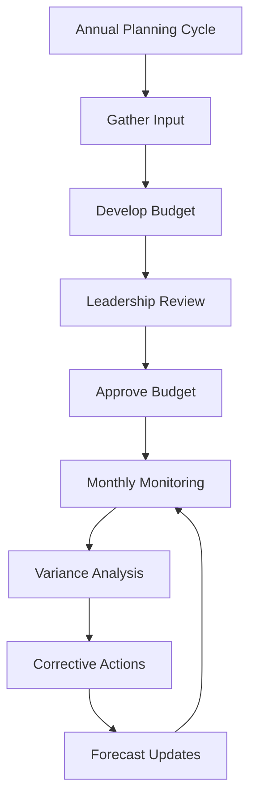

### Tools and Resources

- **Budgeting Software**: Financial planning and analysis tools
- **Historical Financial Data**: Previous year actuals and multi-year trends
- **Industry Benchmarks**: Aviation industry financial performance standards
- **Budget Templates**: Standardized formats for departmental budget submissions
- **Variance Report Templates**: Monthly performance analysis formats
- **Forecasting Models**: Revenue and expense projection tools

### Success Metrics

**Completion Time:** Annual budget completed and approved by December 15th for following year.

**Quality Standard:** Budget variance within 5% of actual results for major expense categories.

**Safety Standard:** Safety and maintenance budgets fully funded with no deferrals affecting airworthiness.

**Client Satisfaction:** Budget supports service quality standards that maintain 95% client satisfaction.

### Common Issues and Solutions

**Issue:** Fuel price volatility causing significant budget variances
**Solution:** Implement quarterly fuel price reviews and establish fuel price hedging strategies. Create fuel surcharge policies for extreme price movements.

**Issue:** Unexpected maintenance expenses exceeding budget allocations
**Solution:** Establish equipment replacement schedules and increase contingency reserves. Implement preventive maintenance programs to reduce unexpected repairs.

**Issue:** Revenue shortfalls due to economic conditions or weather impacts
**Solution:** Develop multiple revenue scenarios and cost reduction plans. Monitor leading indicators and implement contingency plans early.

### Safety Considerations

⚠️ **WARNING:** Never compromise safety expenditures to meet budget targets - safety investments protect lives and prevent larger costs

⚡ **CAUTION:** Ensure maintenance and equipment budgets support regulatory compliance and operational safety

ℹ️ **NOTE:** Budget planning should include adequate reserves for emergency situations and regulatory compliance

✅ **BEST PRACTICE:** Involve operational leaders in budget planning to ensure realistic assumptions and operational support

### Regulatory References

- **14 CFR Part 91** - General Operating Rules (maintenance requirements affecting budgets)
- **OSHA 29 CFR 1910** - Occupational Safety Standards (safety equipment and training budgets)
- **Generally Accepted Accounting Principles (GAAP)** - Financial reporting and budgeting standards
- **Company Financial Policies** - Internal budget approval and monitoring procedures

---

## Expense Tracking and Approval

Track and approve expenses to maintain cost control and ensure proper authorization for all expenditures.

### Purpose

Establish systematic expense tracking and approval procedures that ensure proper authorization, accurate documentation, and effective cost control while supporting operational needs and maintaining audit compliance.

### Roles and Responsibilities

**Business Leader:**

- Approve capital expenditures over $10,000
- Review monthly expense reports and budget variances
- Establish expense policies and authorization limits

**Finance Leader:**

- Process expense reports and verify supporting documentation
- Monitor expense compliance with budget and policies
- Coordinate with department leaders on expense planning

**Department Leaders:**

- Approve departmental expenses within authorization limits
- Review team member expense reports for accuracy and compliance
- Monitor departmental spending against approved budgets

**Team Members:**

- Submit expense reports with complete documentation
- Follow expense policies and obtain proper approvals
- Maintain receipts and supporting documentation

### Process Steps

#### Expense Documentation Phase

- **Collect expense receipts** - Maintain all receipts and supporting documentation for business expenses
- **Complete expense reports** - Use standardized forms with detailed descriptions and business purposes
- **Verify expense accuracy** - Ensure all amounts and descriptions are correct before submission
- **Attach supporting documentation** - Include receipts, contracts, and any required approvals

#### Approval Workflow Phase

- **Submit for initial approval** - Route expense reports to immediate supervisor for review
- **Verify budget availability** - Confirm sufficient budget allocation for requested expenses
- **Obtain required authorizations** - Secure additional approvals for expenses exceeding limits
- **Document approval decisions** - Record approval status and any conditions or restrictions

#### Processing Phase

- **Review expense compliance** - Verify expenses meet company policies and regulatory requirements
- **Process approved payments** - Generate payments to vendors or reimburse team members
- **Update accounting records** - Post expenses to appropriate accounts and cost centers
- **Reconcile expense accounts** - Verify expense posting accuracy and resolve discrepancies

#### Monitoring Phase

- **Track spending patterns** - Monitor departmental and category spending trends
- **Analyze budget variances** - Compare actual expenses to budgeted amounts and investigate significant differences
- **Generate expense reports** - Prepare monthly expense summaries for leadership review
- **Identify cost optimization opportunities** - Review spending patterns for potential savings

### Process Mapping

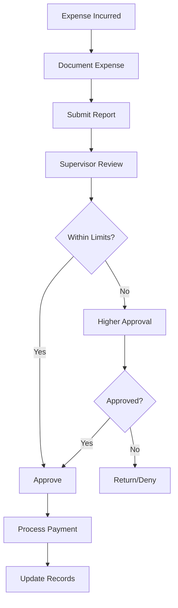

### Tools and Resources

- **Expense Management System**: Digital expense reporting and approval workflow
- **Expense Report Templates**: Standardized forms for different expense types
- **Authorization Matrix**: Approval limits by position and expense category
- **Vendor Payment System**: Accounts payable processing and payment capabilities
- **Budget Tracking Software**: Real-time budget monitoring and variance reporting
- **Receipt Management App**: Mobile receipt capture and documentation tools

### Success Metrics

**Completion Time:** Expense reports processed and paid within 5 business days of approval.

**Quality Standard:** 98% of expense reports submitted with complete documentation requiring no additional information.

**Safety Standard:** All safety-related expenses approved immediately without delays affecting operations.

**Client Satisfaction:** Vendor payments processed timely to maintain service quality and vendor relationships.

### Common Issues and Solutions

**Issue:** Missing receipts or incomplete documentation delaying expense processing
**Solution:** Implement digital receipt capture system and provide training on documentation requirements. Establish procedures for handling lost receipts with supervisor attestation.

**Issue:** Expenses exceeding budget allocations requiring additional approvals
**Solution:** Provide real-time budget monitoring tools to department leaders. Establish quarterly budget reviews to identify and address spending trends early.

**Issue:** Delayed expense approvals affecting vendor relationships and operations
**Solution:** Implement automated approval routing with escalation procedures. Establish emergency approval processes for time-sensitive operational expenses.

### Safety Considerations

⚠️ **WARNING:** Prioritize safety-related expenses to prevent delays that could compromise operational safety

⚡ **CAUTION:** Ensure fuel and maintenance expenses are processed promptly to maintain operational readiness

ℹ️ **NOTE:** Maintain separation of duties between expense approval and payment processing for internal control

✅ **BEST PRACTICE:** Use digital expense management systems to improve accuracy and reduce processing time

### Regulatory References

- **Internal Revenue Service (IRS) Publication 463** - Travel, Entertainment, Gift, and Car Expenses
- **OSHA 29 CFR 1910** - Occupational Safety Standards (safety equipment expenses)
- **14 CFR Part 145** - Repair Station Operating Rules (maintenance expense documentation)
- **Sarbanes-Oxley Act** - Internal controls over financial reporting

---

## Payroll Administration for Team Members

Administer payroll operations to ensure accurate and timely compensation for all team members.

### Purpose

Establish systematic payroll administration procedures that ensure accurate calculation, timely payment, and regulatory compliance for all team member compensation while maintaining confidentiality and supporting operational staffing needs.

### Roles and Responsibilities

**Finance Leader:**

- Oversee payroll processing and ensure accuracy
- Manage tax withholdings and regulatory compliance
- Coordinate with external payroll service providers

**Business Leader:**

- Approve payroll policies and compensation changes
- Review payroll reports and budget compliance
- Authorize overtime and special compensation arrangements

**Operations Leader:**

- Submit timekeeping records and schedule changes
- Verify hours worked and approve overtime requests
- Coordinate with finance on payroll-related operational needs

**Department Leaders:**

- Review and approve team member timesheets
- Report schedule changes and time-off requests
- Ensure accurate recording of hours worked and leave taken

### Process Steps

#### Timekeeping Collection Phase

- **Collect timesheet data** - Gather hours worked from all team members using approved timekeeping systems
- **Verify hours accuracy** - Review submitted hours against schedules and actual work performed
- **Process time-off requests** - Apply approved vacation, sick leave, and other time-off benefits
- **Calculate overtime hours** - Identify and calculate overtime compensation per labor regulations

#### Payroll Calculation Phase

- **Calculate gross wages** - Compute regular and overtime pay based on approved rates and hours
- **Apply pre-tax deductions** - Process health insurance, retirement contributions, and other pre-tax benefits
- **Calculate tax withholdings** - Determine federal, state, and local tax obligations per current regulations
- **Process post-tax deductions** - Apply garnishments, union dues, and other post-tax deductions

#### Payroll Processing Phase

- **Generate payroll registers** - Create detailed payroll reports for review and approval
- **Obtain payroll approval** - Secure authorization from Business Leader before processing payments
- **Process direct deposits** - Submit electronic payments to team member bank accounts
- **Generate pay statements** - Create detailed pay stubs showing earnings, deductions, and year-to-date totals

#### Compliance and Reporting Phase

- **File tax deposits** - Submit payroll tax payments to appropriate agencies on required schedules
- **Prepare quarterly reports** - Complete Form 941 and state quarterly payroll tax returns
- **Maintain payroll records** - Organize and store payroll documentation per retention requirements
- **Update year-end reporting** - Prepare W-2 forms and annual payroll tax reconciliations

### Process Mapping

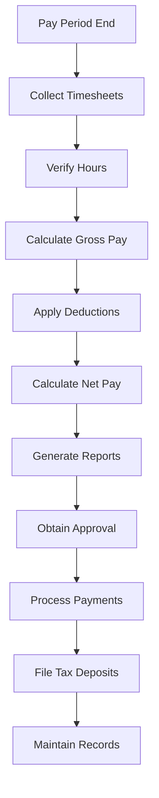

### Tools and Resources

- **Payroll Software**: Automated payroll processing and tax calculation system
- **Timekeeping System**: Electronic time tracking with approval workflows
- **Tax Rate Tables**: Current federal, state, and local tax withholding rates
- **Benefits Administration System**: Health insurance and retirement plan management
- **Banking System**: Direct deposit processing and payment distribution
- **Payroll Records Storage**: Secure document management for payroll documentation

### Success Metrics

**Completion Time:** Payroll processed and payments distributed within 2 business days of pay period end.

**Quality Standard:** 99.5% payroll accuracy with less than 0.5% requiring corrections or adjustments.

**Safety Standard:** No payroll delays affecting team member availability for safety-critical operations.

**Client Satisfaction:** Team member satisfaction with payroll accuracy and timeliness maintains 98% positive rating.

### Common Issues and Solutions

**Issue:** Timekeeping errors causing payroll inaccuracies and team member concerns
**Solution:** Implement digital timekeeping systems with supervisor approval workflows. Provide training on proper time recording and establish correction procedures for errors.

**Issue:** Tax regulation changes affecting withholding calculations
**Solution:** Subscribe to payroll tax update services and maintain current tax tables. Work with payroll service provider to ensure compliance with new regulations.

**Issue:** Direct deposit failures causing payment delays
**Solution:** Maintain backup payment methods including paper checks. Verify banking information regularly and provide immediate notification of payment issues.

### Safety Considerations

⚠️ **WARNING:** Ensure payroll processing never delays critical staffing for safety operations

⚡ **CAUTION:** Protect confidential payroll information and maintain secure access controls

ℹ️ **NOTE:** Coordinate payroll schedules with operational needs to ensure adequate staffing coverage

✅ **BEST PRACTICE:** Use automated payroll systems to reduce errors and improve processing efficiency

### Regulatory References

- **Fair Labor Standards Act (FLSA)** - Federal wage and hour regulations
- **Internal Revenue Code** - Federal tax withholding and reporting requirements
- **State Labor Laws** - Applicable state wage and hour regulations
- **Employee Retirement Income Security Act (ERISA)** - Benefits administration requirements

---

## Vendor and Supplier Contract Management

Manage vendor and supplier contracts to ensure favorable terms and reliable service delivery.

### Purpose

Establish systematic contract management procedures that secure favorable vendor terms, ensure reliable service delivery, and maintain compliance with procurement policies while supporting operational needs and cost optimization.

### Roles and Responsibilities

**Business Leader:**

- Negotiate major contracts and approve contract terms
- Review vendor performance and authorize contract renewals
- Establish procurement policies and vendor selection criteria

**Operations Leader:**

- Identify operational needs and vendor requirements
- Evaluate vendor performance and service quality
- Coordinate with vendors on service delivery and issues

**Finance Leader:**

- Review contract financial terms and payment obligations
- Monitor contract compliance and payment schedules
- Analyze vendor costs and negotiate pricing improvements

**Department Leaders:**

- Specify departmental vendor requirements and service levels
- Monitor vendor performance within their areas
- Report vendor issues and recommend contract modifications

### Process Steps

#### Vendor Selection Phase

- **Identify service requirements** - Define specific needs, service levels, and performance expectations
- **Research potential vendors** - Evaluate vendor capabilities, references, and industry reputation
- **Request proposals** - Solicit competitive bids with detailed specifications and evaluation criteria
- **Evaluate vendor proposals** - Compare pricing, capabilities, and terms using standardized scoring matrix

#### Contract Negotiation Phase

- **Review contract terms** - Analyze proposed terms for pricing, service levels, and liability provisions
- **Negotiate improvements** - Secure favorable pricing, payment terms, and performance guarantees
- **Include aviation requirements** - Ensure contracts address airport access, security, and safety requirements
- **Obtain legal review** - Have attorney review contracts for liability and compliance issues

#### Contract Execution Phase

- **Finalize contract documents** - Complete all contract paperwork with proper signatures and dates
- **Establish vendor accounts** - Set up vendor in accounting system with payment terms and contacts
- **Communicate contract terms** - Brief relevant team members on vendor capabilities and procedures
- **Schedule performance reviews** - Establish regular vendor evaluation meetings and metrics

#### Contract Administration Phase

- **Monitor vendor performance** - Track service delivery against contract specifications and service levels
- **Process vendor payments** - Ensure timely payment per contract terms and resolve billing issues
- **Manage contract modifications** - Process change orders and contract amendments as needed
- **Prepare renewal evaluations** - Assess vendor performance and market conditions for renewal decisions

### Process Mapping

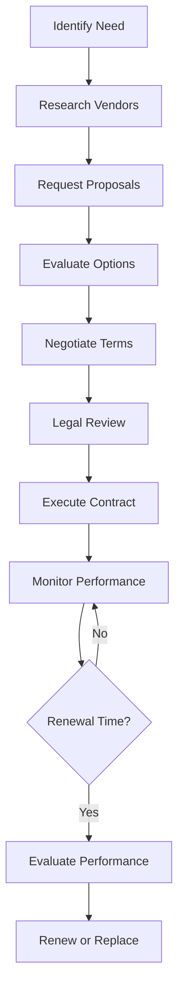

### Tools and Resources

- **Contract Management System**: Digital contract storage and tracking capabilities
- **Vendor Database**: Contact information and performance history
- **Proposal Evaluation Matrix**: Standardized vendor comparison tools
- **Legal Counsel**: Attorney specializing in commercial contracts
- **Performance Metrics Templates**: Vendor evaluation and scorecard formats
- **Procurement Policies**: Company guidelines for vendor selection and contracting

### Success Metrics

**Completion Time:** Contract negotiations completed within 45 days of vendor selection.

**Quality Standard:** 95% of contracts include appropriate aviation-specific terms and liability protections.

**Safety Standard:** All safety-critical vendor contracts include emergency response and backup service provisions.

**Client Satisfaction:** Vendor services support 98% client satisfaction with FBO operations.

### Common Issues and Solutions

**Issue:** Vendor service quality declining after contract execution
**Solution:** Implement regular performance reviews with measurable service level agreements. Include performance improvement requirements and contract termination provisions for persistent issues.

**Issue:** Contract terms not addressing aviation-specific requirements
**Solution:** Develop aviation contract templates with standard airport access, security clearance, and insurance requirements. Require legal review for all aviation service contracts.

**Issue:** Vendor payment disputes affecting service relationships
**Solution:** Establish clear invoice review procedures and payment schedules. Maintain open communication with vendors and resolve disputes promptly to preserve service quality.

### Safety Considerations

⚠️ **WARNING:** Ensure all vendor contracts include appropriate insurance coverage and liability protection for airport operations

⚡ **CAUTION:** Verify vendor personnel have required airport security clearances and safety training

ℹ️ **NOTE:** Include emergency contact procedures and backup service provisions in all critical vendor contracts

✅ **BEST PRACTICE:** Maintain multiple vendors for critical services to ensure operational continuity

### Regulatory References

- **14 CFR Part 139** - Airport Operating Certificate (vendor requirements for airport operations)
- **Transportation Security Administration (TSA) Regulations** - Airport security requirements for vendors
- **Uniform Commercial Code (UCC)** - Commercial contract law and requirements
- **Company Procurement Policies** - Internal vendor selection and contract approval procedures

---

## Financial Reporting and Reconciliation

Generate financial reports and perform reconciliations to maintain accurate financial records and support decision-making.

### Purpose

Establish systematic financial reporting and reconciliation procedures that ensure accurate financial records, provide timely management information, and support regulatory compliance while enabling informed business decision-making.

### Roles and Responsibilities

**Finance Leader:**

- Prepare monthly financial statements and management reports
- Perform account reconciliations and resolve discrepancies
- Ensure compliance with accounting standards and regulations

**Business Leader:**

- Review financial reports and analyze performance trends
- Use financial information for strategic planning and decision-making
- Approve accounting policy changes and significant adjustments

**Operations Leader:**

- Provide operational data for financial analysis
- Explain operational factors affecting financial performance
- Use financial reports to monitor departmental performance

**Department Leaders:**

- Review departmental financial reports and explain variances
- Provide input for budget planning and forecasting
- Monitor departmental costs and revenue performance

### Process Steps

#### Monthly Closing Phase

- **Complete transaction recording** - Ensure all monthly transactions are recorded in accounting system
- **Process accruals and deferrals** - Record month-end adjustments for proper period matching
- **Reconcile bank accounts** - Match bank statements to accounting records and resolve differences
- **Reconcile accounts receivable** - Verify client account balances and aging accuracy

#### Financial Statement Preparation Phase

- **Generate trial balance** - Produce preliminary financial position for review and adjustment
- **Prepare income statement** - Summarize revenue and expenses for the reporting period
- **Create balance sheet** - Present assets, liabilities, and equity at period end
- **Develop cash flow statement** - Show cash receipts and disbursements by operating, investing, and financing activities

#### Analysis and Reporting Phase

- **Calculate key financial ratios** - Compute profitability, liquidity, and efficiency metrics
- **Prepare variance analysis** - Compare actual results to budget and prior periods
- **Create management dashboard** - Summarize key performance indicators for leadership review
- **Generate departmental reports** - Provide detailed financial information by operational area

#### Review and Distribution Phase

- **Review financial accuracy** - Verify report accuracy and resolve any discrepancies
- **Obtain management approval** - Present reports to leadership team for review and approval
- **Distribute reports** - Provide financial information to authorized recipients per distribution schedule
- **Archive financial records** - Store completed reports and supporting documentation securely

### Process Mapping

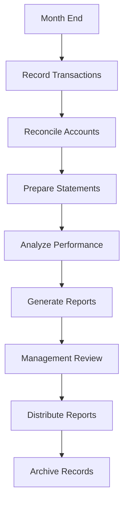

### Tools and Resources

- **Accounting Software**: General ledger and financial reporting system
- **Bank Reconciliation Tools**: Automated matching and exception reporting
- **Financial Analysis Templates**: Ratio calculations and variance analysis formats
- **Report Distribution System**: Secure report delivery and access controls
- **Document Management System**: Financial record storage and retrieval
- **External Accountant**: CPA firm for complex accounting issues and annual reviews

### Success Metrics

**Completion Time:** Monthly financial reports completed and distributed within 10 business days of month end.

**Quality Standard:** 99% accuracy in financial reports with less than 1% requiring restatements.

**Safety Standard:** Financial reporting supports safety budget monitoring and compliance verification.

**Client Satisfaction:** Financial transparency supports client confidence and relationship management.

### Common Issues and Solutions

**Issue:** Bank reconciliation discrepancies delaying month-end closing
**Solution:** Implement daily cash management procedures and automated bank feeds. Investigate and resolve discrepancies immediately rather than accumulating them.

**Issue:** Missing transaction documentation affecting report accuracy
**Solution:** Establish daily transaction review procedures and require supporting documentation for all entries. Implement digital document capture and approval workflows.

**Issue:** Complex aviation transactions requiring specialized accounting treatment
**Solution:** Develop aviation-specific chart of accounts and work with CPA specializing in aviation industry. Create procedures for common aviation transactions.

### Safety Considerations

⚠️ **WARNING:** Ensure financial reporting accurately reflects safety and maintenance expenditures for regulatory compliance

⚡ **CAUTION:** Protect confidential financial information and maintain appropriate access controls

ℹ️ **NOTE:** Financial reports should support safety decision-making and regulatory compliance monitoring

✅ **BEST PRACTICE:** Use automated reconciliation tools to improve accuracy and reduce manual errors

### Regulatory References

- **Generally Accepted Accounting Principles (GAAP)** - Financial reporting standards
- **Internal Revenue Code** - Tax reporting and compliance requirements
- **14 CFR Part 91** - General Operating Rules (financial record requirements)
- **Sarbanes-Oxley Act** - Internal controls over financial reporting

---

## Tax Filing and Compliance

Manage tax filing and compliance obligations to meet regulatory requirements and minimize tax liability.

### Purpose

Establish systematic tax filing and compliance procedures that ensure timely and accurate tax returns, maintain regulatory compliance, and optimize tax efficiency while minimizing audit risk and penalties.

### Roles and Responsibilities

**Finance Leader:**

- Coordinate tax preparation and filing activities
- Maintain tax records and supporting documentation
- Monitor compliance with tax regulations and deadlines

**Business Leader:**

- Review and approve tax returns before filing
- Make strategic tax planning decisions
- Authorize tax professional services and representation

**External CPA:**

- Prepare complex tax returns and provide tax planning advice
- Represent company in tax audits and examinations
- Provide updates on tax law changes affecting aviation businesses

**Operations Leader:**

- Provide operational data supporting tax calculations
- Ensure tax considerations are included in operational decisions
- Coordinate with finance on tax-related operational requirements

### Process Steps

#### Tax Planning Phase

- **Review tax law changes** - Monitor federal, state, and local tax regulation updates affecting aviation businesses
- **Plan tax strategies** - Identify opportunities for tax optimization and compliance improvements
- **Organize supporting documentation** - Collect and organize records needed for tax preparation
- **Schedule tax preparation activities** - Coordinate timing with CPA and establish filing deadlines

#### Tax Preparation Phase

- **Compile financial data** - Gather income statements, balance sheets, and detailed transaction records
- **Calculate taxable income** - Determine federal and state taxable income with appropriate adjustments
- **Prepare tax returns** - Complete all required federal, state, and local tax forms
- **Review return accuracy** - Verify calculations and supporting documentation before filing

#### Filing and Payment Phase

- **Submit tax returns** - File returns by required deadlines using electronic filing when available
- **Process tax payments** - Make required tax payments and estimated tax deposits
- **Obtain filing confirmations** - Verify successful filing and maintain confirmation records
- **Update tax calendars** - Schedule future filing deadlines and payment requirements

#### Compliance Monitoring Phase

- **Track filing deadlines** - Monitor all upcoming tax obligations and payment due dates
- **Maintain tax records** - Organize and store tax returns and supporting documentation per retention requirements
- **Respond to tax notices** - Address any correspondence from tax authorities promptly and accurately
- **Prepare for potential audits** - Maintain audit-ready documentation and establish audit response procedures

### Process Mapping

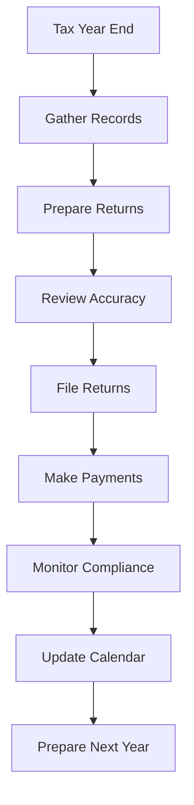

### Tools and Resources

- **Tax Preparation Software**: Professional tax software for complex business returns
- **Tax Calendar System**: Deadline tracking and reminder system
- **Document Management**: Secure storage for tax returns and supporting documentation
- **CPA Firm**: External tax professionals specializing in aviation businesses
- **Tax Research Resources**: Access to current tax regulations and interpretations
- **Banking System**: Electronic tax payment and deposit capabilities

### Success Metrics

**Completion Time:** All tax returns filed by required deadlines with no late filing penalties.

**Quality Standard:** 100% accuracy in tax filings with no errors requiring amended returns.

**Safety Standard:** Tax compliance supports continued operating certificates and regulatory approvals.

**Client Satisfaction:** Tax efficiency supports competitive pricing and service quality for clients.

### Common Issues and Solutions

**Issue:** Complex aviation transactions requiring specialized tax treatment
**Solution:** Work with CPA specializing in aviation industry tax issues. Develop procedures for common aviation transactions like aircraft sales, leases, and maintenance reserves.

**Issue:** Multiple state tax obligations due to aircraft operations across state lines
**Solution:** Implement state tax tracking system and work with multi-state tax specialist. Monitor aircraft movements and establish nexus tracking procedures.

**Issue:** Tax law changes affecting aviation fuel taxes and exemptions
**Solution:** Subscribe to aviation tax update services and maintain current exemption certificates. Review fuel tax obligations quarterly and adjust procedures as needed.

### Safety Considerations

⚠️ **WARNING:** Ensure tax compliance doesn't compromise safety expenditures or regulatory compliance

⚡ **CAUTION:** Maintain confidentiality of tax information and limit access to authorized personnel

ℹ️ **NOTE:** Tax planning should consider aviation industry cycles and seasonal operational patterns

✅ **BEST PRACTICE:** Use qualified aviation tax professionals to ensure compliance with industry-specific regulations

### Regulatory References

- **Internal Revenue Code** - Federal tax obligations and compliance requirements
- **State Tax Codes** - Applicable state income and sales tax regulations
- **Aviation Fuel Tax Regulations** - Federal and state fuel tax requirements and exemptions
- **14 CFR Part 91** - General Operating Rules (record-keeping requirements supporting tax filings)

---

## Insurance Policy Management

Manage insurance policies to ensure adequate coverage and cost-effective risk management.

### Purpose

Establish systematic insurance policy management procedures that ensure adequate coverage for all operational risks, maintain cost-effective premiums, and provide prompt claims processing while supporting regulatory compliance and operational continuity.

### Roles and Responsibilities

**Business Leader:**

- Review insurance coverage requirements and approve policy changes
- Coordinate with insurance broker on coverage needs and claims
- Make strategic decisions on risk retention and coverage levels

**Operations Leader:**

- Identify operational risks requiring insurance coverage
- Report incidents and potential claims promptly
- Ensure operational activities comply with insurance requirements

**Finance Leader:**

- Monitor insurance costs and budget compliance
- Process insurance payments and maintain policy records
- Coordinate insurance requirements with vendor contracts

**Safety Officer:**

- Assess safety risks and recommend appropriate coverage
- Support claims investigations with incident documentation
- Monitor safety performance affecting insurance rates

### Process Steps

#### Coverage Assessment Phase

- **Evaluate operational risks** - Identify all potential liability exposures from FBO operations
- **Review regulatory requirements** - Ensure coverage meets FAA, airport authority, and lender requirements
- **Assess coverage adequacy** - Compare current coverage to operational needs and industry standards
- **Identify coverage gaps** - Determine areas where additional insurance protection may be needed

#### Policy Procurement Phase

- **Request insurance quotes** - Solicit competitive proposals from qualified aviation insurance providers
- **Compare coverage options** - Evaluate policy terms, limits, deductibles, and exclusions
- **Negotiate policy terms** - Secure favorable rates and coverage provisions with insurance carriers
- **Finalize policy selection** - Choose optimal coverage balancing protection and cost considerations

#### Policy Administration Phase

- **Maintain policy documentation** - Organize insurance certificates and policy documents for easy access
- **Monitor policy compliance** - Ensure operational activities comply with policy terms and conditions
- **Process policy changes** - Handle coverage modifications, endorsements, and certificate requests
- **Coordinate renewal activities** - Plan renewal process and gather information for underwriting review

#### Claims Management Phase

- **Report incidents promptly** - Notify insurance carriers of potential claims within required timeframes
- **Document claim details** - Provide thorough incident documentation and supporting evidence
- **Coordinate claim investigations** - Work with adjusters and provide access to facilities and records
- **Monitor claim resolution** - Track claim status and ensure prompt settlement of valid claims

### Process Mapping

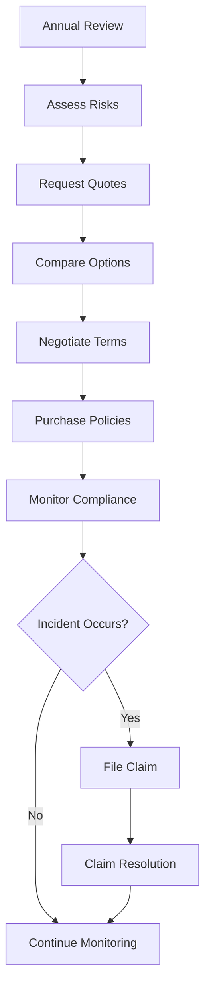

### Tools and Resources

- **Insurance Broker**: Aviation insurance specialist with FBO experience
- **Policy Management System**: Digital storage and tracking of insurance documents
- **Risk Assessment Tools**: Checklists and evaluation criteria for operational risks
- **Claims Reporting System**: Procedures and forms for incident reporting
- **Certificate Tracking**: System for monitoring insurance certificate requirements
- **Legal Counsel**: Attorney specializing in aviation insurance and liability issues

### Success Metrics

**Completion Time:** Policy renewals completed 30 days before expiration with no coverage gaps.

**Quality Standard:** 100% of required insurance certificates current and meeting all regulatory requirements.

**Safety Standard:** Insurance coverage supports all safety operations without restrictions affecting compliance.

**Client Satisfaction:** Insurance coverage enables full service delivery without operational limitations.

### Common Issues and Solutions

**Issue:** Insurance rates increasing significantly at renewal due to claims history
**Solution:** Implement enhanced safety programs and risk management initiatives. Work with broker to find alternative markets and consider higher deductibles to reduce premiums.

**Issue:** Policy exclusions limiting coverage for specific FBO operations
**Solution:** Work with aviation insurance specialist to find carriers offering broader coverage. Consider separate policies for excluded activities if operationally necessary.

**Issue:** Claims processing delays affecting vendor relationships and operations
**Solution:** Maintain strong relationships with insurance carriers and adjusters. Provide prompt documentation and follow up regularly on claim status.

### Safety Considerations

⚠️ **WARNING:** Ensure insurance coverage includes all aviation operations to prevent gaps that could result in uninsured losses

⚡ **CAUTION:** Review policy terms regularly to ensure operational changes don't create coverage exclusions

ℹ️ **NOTE:** Maintain current certificates of insurance for all parties requiring proof of coverage

✅ **BEST PRACTICE:** Work with insurance brokers specializing in aviation to ensure appropriate coverage and competitive rates

### Regulatory References

- **14 CFR Part 91** - General Operating Rules (insurance requirements for aircraft operations)
- **Airport Operating Agreements** - Insurance requirements specified by airport authority
- **State Insurance Regulations** - Applicable state requirements for commercial insurance
- **Lender Requirements** - Insurance coverage required by financing agreements

---

## Team Member Scheduling and Timekeeping

Manage team member scheduling and timekeeping to optimize staffing and ensure accurate payroll processing.

### Purpose

Establish systematic scheduling and timekeeping procedures that ensure adequate staffing for all operational needs, maintain accurate time records for payroll processing, and support team member work-life balance while meeting client service requirements.

### Roles and Responsibilities

**Operations Leader:**

- Develop master schedules and approve schedule changes
- Monitor staffing levels and authorize overtime when needed
- Coordinate scheduling across departments for operational coverage

**Department Leaders:**

- Create departmental schedules and manage team member assignments
- Approve time-off requests and coordinate coverage
- Monitor attendance and address scheduling issues

**Finance Leader:**

- Review timekeeping records for payroll accuracy
- Monitor overtime costs and budget compliance
- Process time-off accruals and benefit calculations

**Team Members:**

- Submit accurate timekeeping records and schedule requests
- Coordinate schedule changes with supervisors and team members
- Maintain reliable attendance and punctuality standards

### Process Steps

#### Schedule Planning Phase

- **Assess staffing requirements** - Determine minimum staffing needs by department and shift
- **Review historical patterns** - Analyze seasonal trends and operational demands affecting staffing
- **Coordinate department needs** - Balance staffing across line service, maintenance, flight training, and administration
- **Plan for special events** - Adjust schedules for air shows, training events, and peak operational periods

#### Schedule Creation Phase

- **Develop master schedule** - Create monthly schedules ensuring adequate coverage for all operations
- **Assign specific shifts** - Match team member qualifications and availability to operational needs
- **Build in flexibility** - Include provisions for schedule adjustments and emergency coverage
- **Communicate schedules** - Distribute schedules to team members with adequate advance notice

#### Timekeeping Management Phase

- **Record time worked** - Capture accurate start and end times for all team members
- **Track break periods** - Monitor meal breaks and rest periods per labor regulations
- **Document overtime hours** - Record and approve overtime work with proper authorization
- **Process time-off requests** - Handle vacation, sick leave, and personal time requests

#### Schedule Adjustment Phase

- **Handle schedule changes** - Process requests for schedule modifications and coverage arrangements
- **Manage call-outs** - Coordinate emergency coverage for unexpected absences
- **Monitor attendance patterns** - Track attendance trends and address chronic issues
- **Update schedule records** - Maintain accurate records of all schedule changes and adjustments

### Process Mapping

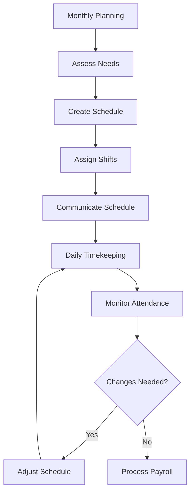

### Tools and Resources

- **Scheduling Software**: Digital scheduling system with mobile access
- **Timekeeping System**: Electronic time clocks or mobile time tracking
- **Staffing Matrix**: Minimum staffing requirements by department and time period
- **Time-Off Tracking**: Vacation and sick leave accrual and usage tracking
- **Overtime Authorization Forms**: Approval documentation for overtime work
- **Schedule Templates**: Standard shift patterns and coverage models

### Success Metrics

**Completion Time:** Monthly schedules published 2 weeks before start of month.

**Quality Standard:** 98% schedule adherence with minimal last-minute changes or coverage gaps.

**Safety Standard:** Minimum staffing maintained for all safety-critical operations without exception.

**Client Satisfaction:** Adequate staffing supports 95% client satisfaction with service availability and response times.

### Common Issues and Solutions

**Issue:** Difficulty finding coverage for unexpected absences affecting service delivery
**Solution:** Maintain on-call list of qualified team members and cross-train personnel for multiple roles. Establish clear call-out procedures and response expectations.

**Issue:** Overtime costs exceeding budget due to scheduling inefficiencies
**Solution:** Analyze overtime patterns and adjust base schedules to reduce regular overtime needs. Implement scheduling software to optimize shift assignments and minimize gaps.

**Issue:** Timekeeping errors causing payroll inaccuracies and team member concerns
**Solution:** Implement digital timekeeping systems with supervisor approval workflows. Provide training on proper time recording and establish error correction procedures.

### Safety Considerations

⚠️ **WARNING:** Ensure minimum staffing levels are maintained for all safety-critical operations including fuel handling and aircraft marshalling

⚡ **CAUTION:** Monitor team member fatigue and ensure adequate rest periods between shifts per aviation safety standards

ℹ️ **NOTE:** Schedule coordination is essential for maintaining safety coverage during shift changes and breaks

✅ **BEST PRACTICE:** Use scheduling software to optimize coverage while controlling labor costs and supporting team member preferences

### Regulatory References

- **Fair Labor Standards Act (FLSA)** - Federal wage and hour regulations including overtime requirements
- **OSHA 29 CFR 1910** - Occupational Safety Standards (work hour limitations and rest requirements)
- **14 CFR Part 91** - General Operating Rules (crew duty time limitations for flight operations)
- **State Labor Laws** - Applicable state regulations for work schedules and time-off benefits

---

## Record-Keeping for Regulatory Compliance

Maintain regulatory records to ensure compliance with aviation and business regulations.

### Purpose

Establish systematic record-keeping procedures that ensure compliance with all applicable regulations, support audit activities, and maintain organized documentation for operational and legal requirements while protecting confidential information.

### Roles and Responsibilities

**Compliance Leader:**

- Establish record retention policies and procedures
- Monitor compliance with regulatory record-keeping requirements
- Coordinate audit activities and regulatory inspections

**Operations Leader:**

- Ensure operational records meet regulatory standards
- Coordinate with compliance on record-keeping requirements
- Provide operational context for regulatory documentation

**Finance Leader:**

- Maintain financial records per regulatory requirements
- Coordinate with external auditors and tax authorities
- Ensure record security and access controls

**Department Leaders:**

- Maintain departmental records according to established procedures
- Train team members on proper record-keeping practices
- Report record-keeping issues and compliance concerns

### Process Steps

#### Record Classification Phase

- **Identify regulatory requirements** - Determine record-keeping obligations for aviation, safety, environmental, and business regulations
- **Classify record types** - Categorize records by regulatory requirement and retention period
- **Establish retention schedules** - Define how long each record type must be maintained
- **Create filing systems** - Organize records for easy retrieval and audit support

#### Document Management Phase

- **Capture records accurately** - Ensure all required information is recorded completely and legibly
- **Verify record completeness** - Review documents for accuracy and required signatures or approvals
- **Store records securely** - Maintain physical and digital records with appropriate access controls
- **Index records systematically** - Create searchable indexes for efficient record retrieval

#### Compliance Monitoring Phase

- **Review retention compliance** - Monitor records against retention schedules and dispose of expired documents
- **Audit record quality** - Regularly review record-keeping practices for compliance and completeness
- **Update procedures** - Revise record-keeping procedures based on regulatory changes and audit findings
- **Train team members** - Provide ongoing training on proper record-keeping practices and requirements

#### Audit Support Phase

- **Prepare audit documentation** - Organize records for regulatory inspections and external audits
- **Coordinate with auditors** - Provide requested documentation and support audit activities
- **Address audit findings** - Implement corrective actions for record-keeping deficiencies
- **Update procedures** - Revise record-keeping practices based on audit recommendations

### Process Mapping

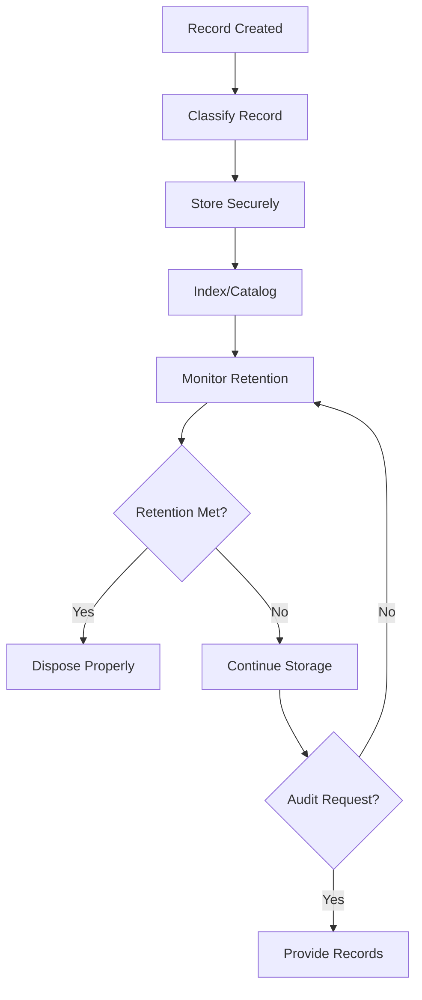

### Tools and Resources

- **Document Management System**: Digital record storage and retrieval capabilities
- **Record Retention Schedule**: Detailed requirements for each record type
- **Filing Systems**: Physical and digital organization methods
- **Access Control System**: Security measures for confidential records
- **Audit Tracking Tools**: Systems for managing audit requests and responses
- **Regulatory Update Services**: Notifications of changes affecting record-keeping requirements

### Success Metrics

**Completion Time:** All regulatory records filed and indexed within 24 hours of creation.

**Quality Standard:** 100% of required records maintained with complete documentation and proper retention.

**Safety Standard:** Safety and maintenance records support regulatory compliance and audit requirements.

**Client Satisfaction:** Record-keeping supports efficient service delivery and client information protection.

### Common Issues and Solutions

**Issue:** Missing or incomplete records discovered during audits or inspections
**Solution:** Implement daily record review procedures and establish backup documentation processes. Create checklists for required documentation and conduct regular internal audits.

**Issue:** Records stored in multiple locations making retrieval difficult
**Solution:** Centralize record storage using document management system with consistent indexing. Establish single source of truth for each record type and eliminate duplicate storage.

**Issue:** Team members not following proper record-keeping procedures
**Solution:** Provide regular training on record-keeping requirements and consequences of non-compliance. Implement supervisor review procedures and establish accountability measures.

### Safety Considerations

⚠️ **WARNING:** Ensure safety and maintenance records are maintained per FAA requirements to support continued airworthiness

⚡ **CAUTION:** Protect confidential client and team member information with appropriate access controls and security measures

ℹ️ **NOTE:** Record retention requirements vary by regulation - ensure compliance with longest applicable retention period

✅ **BEST PRACTICE:** Use digital document management systems to improve record security, accessibility, and disaster recovery

### Regulatory References

- **14 CFR Part 91** - General Operating Rules (aircraft and maintenance record requirements)
- **14 CFR Part 61** - Certification: Pilots, Flight Instructors, and Ground Instructors (training records)
- **OSHA 29 CFR 1910.1020** - Access to Employee Exposure and Medical Records
- **Fair Labor Standards Act (FLSA)** - Team member record-keeping requirements

---

## Inventory Management for Fuel and Supplies

Manage fuel and supply inventory to ensure adequate stock levels while minimizing carrying costs.

### Purpose

Establish systematic inventory management procedures that ensure adequate fuel and supply availability for all operations, minimize carrying costs and waste, and maintain accurate inventory records while supporting operational efficiency and client service requirements.

### Roles and Responsibilities

**Operations Leader:**

- Establish inventory level requirements and reorder points
- Monitor inventory usage patterns and operational needs
- Coordinate with suppliers on delivery schedules and emergency orders

**Line Service Technician:**

- Monitor fuel levels and report consumption patterns
- Conduct daily inventory checks and record usage
- Identify supply needs and report inventory shortages

**Finance Leader:**

- Monitor inventory costs and budget compliance
- Process purchase orders and vendor payments
- Analyze inventory turnover and carrying costs

**Fuel System Operator:**

- Maintain fuel quality and conduct required testing
- Monitor fuel deliveries and verify quantities received
- Ensure fuel storage compliance with safety regulations

### Process Steps

#### Inventory Monitoring Phase

- **Conduct daily inventory checks** - Record fuel levels, supply quantities, and usage patterns
- **Monitor consumption rates** - Track fuel sales and supply usage to predict future needs
- **Identify reorder points** - Establish minimum stock levels triggering procurement actions
- **Check inventory quality** - Verify fuel quality and inspect supplies for damage or expiration

#### Procurement Planning Phase

- **Calculate order quantities** - Determine optimal order sizes balancing availability and carrying costs
- **Schedule deliveries** - Coordinate fuel deliveries and supply shipments with operational needs
- **Evaluate vendor options** - Compare pricing, delivery terms, and service quality from multiple suppliers
- **Process purchase orders** - Generate and approve purchase orders for fuel and supplies

#### Receiving and Storage Phase

- **Verify deliveries** - Confirm quantities received match purchase orders and delivery documents
- **Conduct quality inspections** - Test fuel quality and inspect supplies for damage or defects
- **Update inventory records** - Record received quantities and update stock levels immediately
- **Store items properly** - Place inventory in appropriate storage areas following safety and security procedures

#### Inventory Control Phase

- **Track inventory movement** - Record all fuel sales and supply usage with accurate documentation
- **Conduct periodic counts** - Perform monthly physical inventory counts to verify record accuracy
- **Investigate discrepancies** - Research and resolve differences between physical counts and records
- **Optimize inventory levels** - Adjust reorder points and quantities based on usage patterns and costs

### Process Mapping

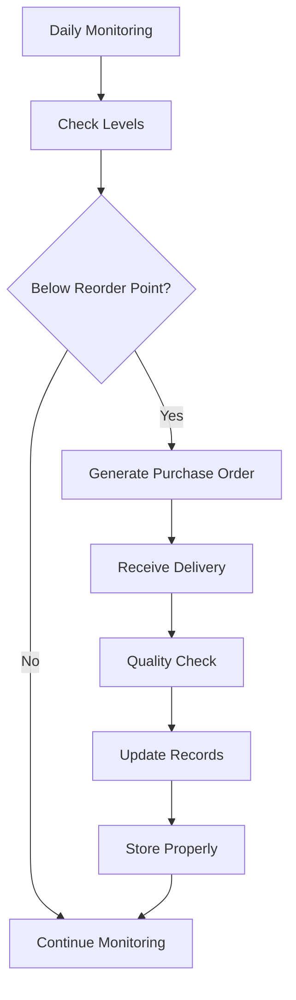

### Tools and Resources

- **Inventory Management System**: Digital tracking of fuel and supply levels
- **Fuel Monitoring Equipment**: Tank level sensors and fuel quality testing equipment
- **Purchase Order System**: Procurement workflow and vendor coordination tools
- **Quality Testing Equipment**: Fuel testing kits and supply inspection tools
- **Storage Areas**: Secure, organized storage for supplies and equipment
- **Vendor Contacts**: Supplier information and emergency ordering procedures

### Success Metrics

**Completion Time:** Inventory replenishment completed within 24 hours of reaching reorder points.

**Quality Standard:** 99% inventory accuracy with less than 1% variance between physical counts and records.

**Safety Standard:** Fuel quality testing completed per regulations with no compromised fuel delivered to aircraft.

**Client Satisfaction:** 100% fuel and supply availability supporting uninterrupted client service.

### Common Issues and Solutions

**Issue:** Fuel contamination discovered during quality testing requiring tank cleaning
**Solution:** Implement enhanced fuel testing protocols and maintain relationships with fuel cleaning specialists. Establish backup fuel sources for emergency supply during tank maintenance.

**Issue:** Supply shortages affecting operational capabilities and client service
**Solution:** Establish safety stock levels for critical supplies and maintain relationships with multiple suppliers. Implement automated reorder systems for high-usage items.

**Issue:** Inventory shrinkage due to theft, damage, or unrecorded usage
**Solution:** Implement security measures for valuable inventory and establish usage tracking procedures. Conduct regular cycle counts and investigate variances immediately.

### Safety Considerations

⚠️ **WARNING:** Ensure fuel quality testing meets regulatory requirements to prevent contaminated fuel from reaching aircraft

⚡ **CAUTION:** Store hazardous materials per OSHA and EPA requirements with proper labeling and safety equipment

ℹ️ **NOTE:** Maintain adequate inventory levels to support emergency operations and unexpected demand

✅ **BEST PRACTICE:** Use automated inventory management systems to improve accuracy and reduce manual tracking errors

### Regulatory References

- **14 CFR Part 91** - General Operating Rules (fuel quality requirements)
- **OSHA 29 CFR 1910.106** - Flammable Liquids (fuel storage and handling requirements)
- **EPA 40 CFR Part 280** - Underground Storage Tank regulations
- **ASTM D1655** - Standard Specification for Aviation Turbine Fuels (Jet A quality standards)

---

## Client Account Management in CRM

Manage client accounts in CRM system to maintain accurate client information and support relationship management.

### Purpose

Establish systematic client account management procedures that ensure accurate client information, support relationship building, and enable effective communication while providing insights for business development and service improvement initiatives.

### Roles and Responsibilities

**Client Service Leader:**

- Oversee CRM system administration and data quality
- Establish client communication standards and follow-up procedures
- Monitor client satisfaction and relationship health metrics

**Client Service Representative:**

- Maintain accurate client account information and service history
- Record client interactions and preferences in CRM system
- Coordinate follow-up communications and service requests

**Business Leader:**

- Review client relationship reports and growth opportunities
- Approve client communication strategies and retention initiatives
- Use CRM data for strategic planning and business development

**Operations Leader:**

- Provide operational data for client service analysis
- Support client relationship management with service delivery excellence
- Coordinate operational changes based on client feedback

### Process Steps

#### Account Setup Phase

- **Create client profiles** - Establish new client accounts with complete contact and aircraft information
- **Verify client information** - Confirm accuracy of contact details, aircraft data, and service preferences
- **Set communication preferences** - Record preferred contact methods and communication frequency
- **Establish service history** - Document initial services and create baseline for future interactions

#### Information Maintenance Phase

- **Update contact information** - Maintain current addresses, phone numbers, and email contacts
- **Record aircraft changes** - Update aircraft ownership, registration, and specification changes
- **Track service preferences** - Document client preferences for fuel, hangar, catering, and other services
- **Maintain billing information** - Keep current billing addresses and payment method preferences

#### Interaction Documentation Phase

- **Record service interactions** - Document all client contacts including services provided and issues resolved
- **Log communication history** - Maintain record of phone calls, emails, and in-person meetings
- **Track client feedback** - Record compliments, complaints, and suggestions for service improvement
- **Note special requirements** - Document any unique client needs or accommodation requests

#### Relationship Analysis Phase

- **Monitor client activity** - Track service frequency and spending patterns for relationship health
- **Identify growth opportunities** - Analyze client needs for additional services or expanded relationships
- **Generate client reports** - Create summaries of client activity and relationship status
- **Plan follow-up activities** - Schedule proactive communications and relationship-building initiatives

### Process Mapping

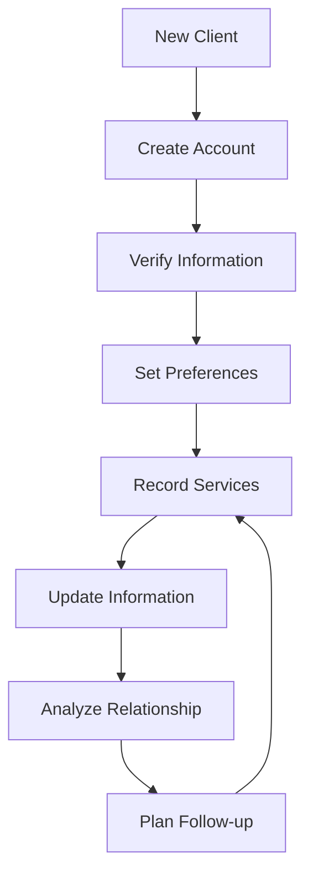

### Tools and Resources

- **CRM Software**: Client relationship management system with aviation-specific features
- **Client Database**: Centralized repository for all client information and history
- **Communication Templates**: Standardized formats for client correspondence
- **Service History Reports**: Detailed records of all services provided to each client
- **Analytics Dashboard**: Client relationship metrics and performance indicators
- **Mobile CRM Access**: Field access to client information for line service team

### Success Metrics

**Completion Time:** Client account updates completed within 24 hours of service delivery or information changes.

**Quality Standard:** 98% accuracy in client contact information with less than 2% returned communications.

**Safety Standard:** Aircraft information accuracy supports proper service delivery and safety compliance.

**Client Satisfaction:** CRM data supports personalized service resulting in 95% client satisfaction ratings.

### Common Issues and Solutions

**Issue:** Incomplete or outdated client information affecting service delivery and communication
**Solution:** Implement regular client information verification procedures and establish annual client data review process. Train team members to update information during each client interaction.

**Issue:** Multiple team members updating same client records causing data conflicts
**Solution:** Establish clear data ownership rules and implement CRM system with conflict resolution capabilities. Train users on proper update procedures and coordination requirements.

**Issue:** Client privacy concerns about information storage and usage
**Solution:** Develop clear privacy policies and obtain client consent for information usage. Implement data security measures and provide clients with access to their information.

### Safety Considerations

⚠️ **WARNING:** Ensure aircraft information accuracy in CRM to prevent service errors that could affect flight safety

⚡ **CAUTION:** Protect confidential client information with appropriate access controls and security measures

ℹ️ **NOTE:** Maintain accurate emergency contact information for all clients to support incident response

✅ **BEST PRACTICE:** Use CRM data to anticipate client needs and provide proactive service excellence

### Regulatory References

- **14 CFR Part 91** - General Operating Rules (aircraft identification and service requirements)
- **Privacy Act** - Protection of personal information and data security requirements
- **State Privacy Laws** - Applicable state regulations for client information protection
- **Company Privacy Policy** - Internal procedures for client information handling and protection

---

## Purchase Order Processing

Process purchase orders to ensure proper authorization and accurate procurement of goods and services.

### Purpose

Establish systematic purchase order processing procedures that ensure proper authorization, accurate procurement, and effective cost control while supporting operational needs and maintaining vendor relationships through efficient purchasing processes.

### Roles and Responsibilities

**Finance Leader:**

- Review and approve purchase orders within authorization limits
- Monitor purchase order compliance with budget and policies
- Coordinate with vendors on payment terms and delivery schedules

**Operations Leader:**

- Identify operational needs and specify purchase requirements
- Approve purchase orders for operational supplies and services
- Coordinate with vendors on delivery timing and service requirements

**Department Leaders:**

- Submit purchase requests with detailed specifications
- Approve departmental purchases within established limits
- Monitor deliveries and verify receipt of ordered items

**Purchasing Coordinator:**

- Process purchase orders and coordinate with vendors
- Verify vendor information and maintain supplier database
- Track order status and delivery schedules

### Process Steps

#### Purchase Request Phase

- **Identify procurement needs** - Determine specific requirements for goods or services needed
- **Specify detailed requirements** - Create detailed specifications including quantities, quality standards, and delivery requirements
- **Research vendor options** - Identify qualified suppliers and compare pricing and capabilities
- **Obtain budget approval** - Verify sufficient budget allocation for requested purchases

#### Purchase Order Creation Phase

- **Generate purchase order** - Create formal purchase order with complete specifications and terms
- **Include delivery requirements** - Specify delivery location, timing, and any special handling requirements
- **Add payment terms** - Include approved payment terms and billing instructions
- **Obtain required approvals** - Secure authorization from appropriate leaders per approval matrix

#### Vendor Coordination Phase

- **Submit purchase order** - Send approved purchase order to selected vendor with confirmation request
- **Confirm order acceptance** - Verify vendor acceptance and delivery commitment
- **Track order status** - Monitor order progress and coordinate on any delivery changes
- **Communicate delivery requirements** - Ensure vendor understands airport access and delivery procedures

#### Receipt and Processing Phase

- **Verify deliveries** - Confirm received items match purchase order specifications and quantities
- **Inspect quality** - Check delivered goods for damage, defects, or quality issues
- **Process vendor invoices** - Match invoices to purchase orders and delivery receipts
- **Update inventory records** - Record received items in inventory management system

### Process Mapping

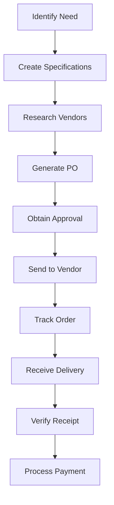

### Tools and Resources

- **Purchase Order System**: Digital procurement workflow and approval system
- **Vendor Database**: Supplier contact information and performance history
- **Approval Matrix**: Authorization limits by position and purchase category
- **Receiving Documentation**: Forms and procedures for delivery verification
- **Budget Tracking System**: Real-time budget monitoring and purchase impact analysis
- **Inventory Management System**: Integration with inventory tracking and control

### Success Metrics

**Completion Time:** Purchase orders processed and sent to vendors within 2 business days of approval.

**Quality Standard:** 95% of deliveries received match purchase order specifications without requiring returns or exchanges.

**Safety Standard:** All safety-critical supplies ordered and received within required timeframes to maintain operational safety.

**Client Satisfaction:** Procurement efficiency supports uninterrupted service delivery and operational excellence.

### Common Issues and Solutions

**Issue:** Vendor delivery delays affecting operational capabilities and client service
**Solution:** Maintain relationships with multiple suppliers for critical items and establish emergency procurement procedures. Monitor vendor performance and address delivery issues promptly.

**Issue:** Purchase orders exceeding budget allocations requiring additional approvals
**Solution:** Implement real-time budget checking in purchase order system and provide budget visibility to requestors. Establish emergency purchase procedures for safety-critical items.

**Issue:** Received goods not matching purchase order specifications
**Solution:** Establish detailed receiving procedures with quality inspection requirements. Train receiving personnel on specification verification and return procedures for non-conforming items.

### Safety Considerations

⚠️ **WARNING:** Prioritize safety-critical purchases to prevent delays that could compromise operational safety or regulatory compliance

⚡ **CAUTION:** Ensure aviation-specific supplies meet regulatory requirements and quality standards

ℹ️ **NOTE:** Coordinate deliveries with airport security requirements and operational schedules

✅ **BEST PRACTICE:** Use electronic purchase order systems to improve accuracy and reduce processing time

### Regulatory References

- **14 CFR Part 91** - General Operating Rules (equipment and supply requirements)
- **OSHA 29 CFR 1910** - Occupational Safety Standards (safety equipment procurement requirements)
- **Uniform Commercial Code (UCC)** - Commercial purchase and sales law
- **Company Procurement Policies** - Internal purchasing authorization and procedures

---

## Audit Preparation and Support

Prepare for and support audit activities to ensure compliance verification and operational transparency.

### Purpose

Establish systematic audit preparation and support procedures that ensure efficient audit processes, demonstrate regulatory compliance, and provide transparent access to operational documentation while minimizing business disruption and audit costs.

### Roles and Responsibilities

**Business Leader:**

- Coordinate with external auditors and regulatory inspectors
- Review audit findings and approve corrective action plans
- Ensure adequate resources are allocated for audit support

**Compliance Leader:**

- Organize audit documentation and coordinate internal preparations
- Serve as primary contact for auditors and inspectors
- Monitor corrective action implementation and compliance verification

**Finance Leader:**

- Prepare financial records and support financial audits
- Coordinate with external CPA firms on audit requirements
- Ensure accounting records are audit-ready and properly documented

**Department Leaders:**

- Provide departmental records and operational documentation
- Support auditor interviews and facility tours
- Implement corrective actions within their areas of responsibility

### Process Steps

#### Pre-Audit Preparation Phase

- **Review audit scope** - Understand audit objectives, timeline, and documentation requirements
- **Organize required documentation** - Gather all records specified in audit request or regulatory requirements
- **Conduct internal review** - Perform preliminary review to identify potential issues or documentation gaps
- **Prepare audit workspace** - Establish dedicated area for auditor use with necessary equipment and access

#### Documentation Organization Phase

- **Compile regulatory records** - Organize all required compliance documentation by category and date
- **Prepare financial records** - Ensure accounting records are complete and properly supported
- **Gather operational documentation** - Collect maintenance logs, training records, and operational procedures
- **Create document index** - Develop organized listing of all available documentation for auditor reference

#### Audit Support Phase

- **Coordinate auditor access** - Provide facility access and coordinate with airport security for auditor clearance
- **Support information requests** - Respond promptly to auditor questions and additional documentation requests
- **Facilitate interviews** - Schedule and coordinate auditor meetings with relevant team members
- **Monitor audit progress** - Track audit activities and address any issues or concerns promptly

#### Post-Audit Activities Phase

- **Review audit findings** - Analyze audit results and recommendations for accuracy and completeness
- **Develop corrective action plans** - Create specific plans to address any audit findings or recommendations
- **Implement improvements** - Execute corrective actions and process improvements identified during audit
- **Follow up on compliance** - Monitor implementation of corrective actions and verify effectiveness

### Process Mapping

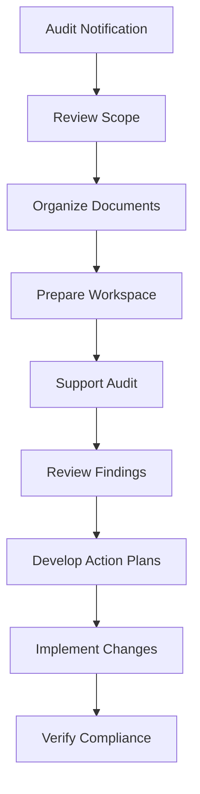

### Tools and Resources

- **Document Management System**: Organized storage and retrieval of audit documentation
- **Audit Checklist**: Comprehensive list of required documentation by audit type
- **Conference Facilities**: Meeting rooms and equipment for auditor use
- **External CPA Firm**: Professional audit support and representation
- **Legal Counsel**: Attorney specializing in regulatory compliance and audit issues
- **Corrective Action Tracking**: System for monitoring implementation of audit recommendations

### Success Metrics

**Completion Time:** Audit documentation prepared and organized within 5 business days of audit notification.

**Quality Standard:** 100% of requested documentation provided to auditors without delays or missing records.

**Safety Standard:** Audit processes don't disrupt safety-critical operations or compromise regulatory compliance.

**Client Satisfaction:** Audit activities conducted with minimal impact on client service delivery.

### Common Issues and Solutions

**Issue:** Missing or incomplete documentation discovered during audit preparation
**Solution:** Implement regular internal audit procedures to identify documentation gaps before external audits. Establish backup documentation procedures and maintain duplicate records for critical items.

**Issue:** Auditor requests exceeding scope or requiring excessive resources
**Solution:** Clarify audit scope and objectives with audit leader. Coordinate with legal counsel if requests appear unreasonable or outside audit authority.

**Issue:** Audit findings requiring significant operational changes
**Solution:** Develop phased implementation plans for major changes and coordinate with operations to minimize service disruption. Prioritize safety-critical findings for immediate implementation.

### Safety Considerations

⚠️ **WARNING:** Ensure audit activities don't compromise safety operations or create security vulnerabilities

⚡ **CAUTION:** Coordinate auditor facility access with airport security requirements and operational schedules

ℹ️ **NOTE:** Maintain confidentiality of client information during audit activities and limit auditor access to necessary records only

✅ **BEST PRACTICE:** Use audit activities as opportunities to improve procedures and demonstrate operational excellence

### Regulatory References

- **14 CFR Part 91** - General Operating Rules (record-keeping requirements supporting audits)
- **14 CFR Part 139** - Airport Operating Certificate (audit and inspection requirements)
- **OSHA 29 CFR 1910** - Occupational Safety Standards (audit and inspection procedures)
- **Generally Accepted Auditing Standards (GAAS)** - Professional audit standards and procedures