

# Legal and Business

## Chapter Overview

Legal and business operations provide the essential legal framework and business governance that protects our organization, team members, and clients while ensuring regulatory compliance and operational sustainability. These procedures establish clear legal boundaries, risk management protocols, and business governance practices that support our aviation operations while maintaining legal integrity and protecting organizational interests.

This chapter contains **15 comprehensive procedures** covering all aspects of legal and business management from aircraft rental contracts through human resources administration and employment law compliance. Each procedure is designed to protect organizational interests, ensure regulatory compliance, and maintain clear legal relationships with clients, team members, and business partners while supporting sustainable aviation operations.

### Legal Framework Management

Our legal and business operations support organizational protection through:

**Contract Management:**

- Aircraft rental and lease agreement administration
- Client service agreement development and execution
- Vendor and partner contract oversight
- Employment agreement and policy management

**Risk Management:**

- Liability assessment and mitigation strategies
- Insurance coverage analysis and optimization
- Legal dispute prevention and resolution
- Regulatory compliance monitoring and reporting

**Business Governance:**

- Corporate entity management and compliance
- Intellectual property protection and licensing
- Employment law compliance and policy development
- Legal documentation and record-keeping

### Contract Administration Excellence

**Aircraft Rental and Leasing:**

- Comprehensive rental agreement development and execution
- Aircraft lease contract negotiation and administration
- Rental fleet management and utilization optimization
- Client qualification and credit assessment procedures

**Client Service Agreements:**

- Service agreement development and customization
- Terms and conditions standardization and enforcement
- Client relationship legal framework establishment
- Dispute resolution and conflict management

**Vendor and Partner Contracts:**

- Strategic partnership agreement development
- Vendor contract legal review and optimization
- Performance guarantee and liability protection
- Contract renewal and termination procedures

### Risk Management and Liability Protection

**Liability Assessment:**

- Operational risk identification and evaluation
- Client and third-party liability exposure analysis
- Insurance coverage adequacy assessment
- Risk mitigation strategy development and implementation

**Legal Dispute Management:**

- Dispute prevention through clear communication
- Alternative dispute resolution procedures
- Legal representation coordination and management
- Settlement negotiation and documentation

**Regulatory Compliance:**

- FAA regulatory compliance monitoring and reporting
- State and local aviation law compliance
- Employment law compliance and policy development
- Environmental regulation adherence and reporting

### Business Entity and Governance Management

**Corporate Structure:**

- Business entity formation and maintenance
- Corporate governance policy development
- Board and leadership legal responsibilities
- Regulatory filing and compliance management

**Intellectual Property Protection:**

- Trademark and service mark registration and maintenance
- Trade secret protection and confidentiality agreements
- Licensing agreement development and administration
- Intellectual property infringement monitoring and response

**Employment Law Compliance:**

- Employment agreement development and administration
- Workplace policy development and enforcement
- Labor law compliance and reporting
- Team member rights protection and advocacy

### Human Resources Management

**Recruitment and Hiring:**

- Job description development and position posting
- Candidate screening and interview procedures
- Background check and reference verification
- Employment offer and onboarding administration

**Performance Management:**

- Performance evaluation and goal setting procedures
- Disciplinary action and progressive discipline
- Team member development and training coordination
- Performance improvement plan administration

**Benefits and Compensation:**

- Benefits package administration and enrollment
- Compensation structure and payroll coordination
- Workers' compensation and safety compliance
- Leave management and time-off administration

**Compliance and Legal:**

- Equal employment opportunity compliance
- Anti-discrimination and harassment prevention
- Team member termination and separation procedures
- Legal documentation and record-keeping requirements

### Legal Documentation and Record-Keeping

**Document Management:**

- Legal document creation and standardization
- Contract template development and maintenance
- Legal record retention and organization
- Electronic document management and security

**Compliance Reporting:**

- Regulatory compliance documentation and reporting
- Legal audit preparation and coordination
- Compliance monitoring and verification procedures
- Corrective action documentation and tracking

**Legal Communication:**

- Client legal communication and documentation
- Team member legal notification and training
- Regulatory authority communication and reporting
- Legal counsel coordination and consultation

### Technology and Automation

**Legal System Integration:**

- Contract management system implementation and optimization
- Legal document automation and template management
- Compliance monitoring and reporting automation
- Legal record digital storage and retrieval systems

**Data Security and Privacy:**

- Legal document security and access control
- Client data protection and privacy compliance
- Electronic signature and authentication procedures
- Legal record backup and disaster recovery

### Performance Measurement and Analysis

**Legal Performance Metrics:**

- Contract compliance and performance tracking
- Legal dispute resolution time and cost analysis
- Regulatory compliance audit results and improvement
- Legal risk exposure assessment and mitigation

**Business Impact Analysis:**

- Legal cost analysis and optimization
- Contract value and performance evaluation
- Legal risk impact on business operations
- Compliance cost-benefit analysis and optimization

### Training and Professional Development

**Legal Awareness Training:**

- Team member legal compliance training and certification
- Contract administration and management training
- Regulatory compliance and reporting procedures
- Legal risk awareness and prevention training

**Professional Development:**

- Legal counsel relationship management and coordination
- Industry legal trend monitoring and adaptation
- Legal best practice implementation and optimization
- Continuous legal education and professional development

This chapter establishes the framework for maintaining legal integrity, protecting organizational interests, and ensuring regulatory compliance while supporting sustainable aviation operations through excellent legal and business management practices.

## Aircraft Rental Contract Management

Manage aircraft rental contracts to ensure proper client qualification, clear terms, and comprehensive liability protection while supporting safe and compliant aircraft operations.

### Purpose

Establish systematic aircraft rental contract management procedures that ensure proper client qualification, clear operational terms, comprehensive liability protection, and regulatory compliance while supporting safe aircraft operations and protecting organizational interests.

### Roles and Responsibilities

**Business Leader:**

- Approve rental contract terms and pricing structures
- Review client qualification criteria and credit requirements
- Oversee rental fleet utilization and revenue optimization
- Monitor competitive positioning and market analysis
- Authorize contract modifications and special arrangements

**Operations Leader:**

- Oversee aircraft availability and scheduling coordination
- Monitor aircraft maintenance status and airworthiness
- Coordinate with maintenance team for aircraft readiness
- Ensure operational compliance with rental agreements
- Authorize aircraft releases and return procedures

**Safety Officer:**

- Review client pilot qualifications and currency requirements
- Verify aircraft airworthiness and maintenance compliance
- Monitor safety incidents and operational concerns
- Ensure regulatory compliance for rental operations
- Coordinate safety training and certification requirements

**Client Service Representative:**

- Process rental applications and client qualification
- Coordinate contract execution and documentation
- Manage client communications and service delivery
- Process billing and payment for rental services
- Maintain client relationship and satisfaction

### Process Steps

#### Client Qualification Phase

- **Review rental application** - Assess client pilot qualifications, experience, and currency requirements
- **Verify pilot credentials** - Confirm current medical certificate, flight review, and aircraft type ratings
- **Conduct background check** - Review client history, credit standing, and previous rental experience
- **Assess insurance coverage** - Verify client aircraft insurance coverage meets minimum requirements

#### Contract Development Phase

- **Prepare rental agreement** - Create comprehensive contract with clear terms, conditions, and liability provisions
- **Define operational parameters** - Establish aircraft use limitations, geographic restrictions, and operational requirements
- **Set pricing structure** - Determine hourly rates, minimum charges, and additional service fees
- **Include safety requirements** - Specify preflight inspection, weather minimums, and operational procedures

#### Contract Execution Phase

- **Review contract terms** - Ensure client understands all terms, conditions, and operational requirements
- **Obtain required signatures** - Complete contract execution with proper authorization and witness signatures
- **Collect security deposit** - Process required deposit payment and establish billing account
- **Provide orientation briefing** - Conduct aircraft familiarization and operational procedures review

#### Operational Management Phase

- **Monitor aircraft utilization** - Track rental hours, fuel consumption, and maintenance requirements
- **Coordinate scheduling** - Manage aircraft availability and client reservation requirements
- **Process billing** - Generate accurate invoices for rental time and additional services
- **Maintain communication** - Provide regular updates on aircraft status and operational requirements

#### Contract Administration Phase

- **Track contract compliance** - Monitor adherence to terms, conditions, and operational requirements
- **Process contract modifications** - Handle changes to rental terms, pricing, or operational parameters
- **Manage renewals** - Coordinate contract renewal process and terms renegotiation
- **Handle terminations** - Process contract termination and final settlement procedures

### Process Mapping

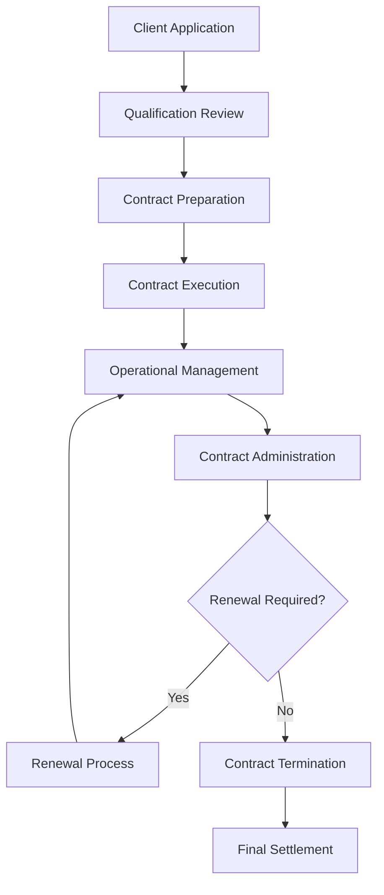

### Tools and Resources

- **Rental Management System**: Digital contract storage and tracking capabilities
- **Client Database**: Pilot qualification and rental history tracking
- **Contract Templates**: Standardized rental agreement templates with aviation-specific terms
- **Insurance Verification System**: Client insurance coverage validation procedures
- **Billing System**: Automated rental billing and payment processing
- **Legal Counsel**: Attorney specializing in aviation contracts and liability issues

### Success Metrics

- **Completion Time:** Rental contracts processed and executed within 48 hours of client qualification approval
- **Quality Standard:** 100% of rental contracts include comprehensive liability protection and regulatory compliance terms
- **Safety Standard:** Zero safety incidents related to rental contract terms or client qualification procedures
- **Client Satisfaction:** 95% client satisfaction with rental contract terms and administrative procedures

### Common Issues and Solutions

- **Issue:** Client pilot qualifications not meeting aircraft type requirements
- **Solution:** Implement comprehensive qualification review process with clear minimum requirements. Provide training options for clients needing additional qualifications.

- **Issue:** Insurance coverage disputes affecting aircraft availability
- **Solution:** Establish clear insurance requirements and verification procedures. Work with aviation insurance specialists to resolve coverage issues promptly.

- **Issue:** Contract terms not addressing specific operational requirements
- **Solution:** Develop aircraft-specific contract templates with detailed operational parameters. Include clear weather minimums, geographic restrictions, and maintenance requirements.

- **Issue:** Billing disputes affecting client relationships and revenue
- **Solution:** Implement transparent billing procedures with detailed time tracking and fuel consumption documentation. Provide clear billing statements and dispute resolution procedures.

### Safety Considerations

- ⚠️ **WARNING**: Never release aircraft for rental without verifying current airworthiness and maintenance compliance
- ⚠️ **WARNING**: Ensure all rental clients meet minimum pilot qualification and currency requirements before contract execution
- ⚡ **CAUTION**: Verify client insurance coverage meets minimum liability requirements for aircraft operations
- ⚡ **CAUTION**: Monitor weather conditions and operational restrictions during rental periods
- ℹ️ **NOTE**: Maintain current aircraft documentation and logbook entries for all rental operations
- ℹ️ **NOTE**: Conduct regular contract reviews to ensure terms remain current with regulatory requirements
- ✅ **BEST PRACTICE**: Implement comprehensive client orientation program for new rental clients
- ✅ **BEST PRACTICE**: Maintain detailed records of all rental operations and client communications

### Regulatory References

- **14 CFR Part 91** - General Operating and Flight Rules (rental aircraft operations)
- **14 CFR Part 61** - Certification: Pilots, Flight Instructors, and Ground Instructors (pilot qualification requirements)
- **FAA Advisory Circular 91-57** - Model Aircraft Operating Standards (operational requirements)
- **State Aviation Regulations** - Applicable state requirements for aircraft rental operations
- **Insurance Requirements** - Minimum liability coverage requirements for aircraft operations

### Aviation Industry Requirements

#### Aircraft Rental Standards
- **Pilot Qualification**: Current medical certificate, flight review, and aircraft type ratings
- **Insurance Coverage**: Minimum liability coverage as specified by aircraft value and operations
- **Operational Limitations**: Weather minimums, geographic restrictions, and aircraft-specific requirements
- **Maintenance Compliance**: Current airworthiness and maintenance status verification

#### Contract Requirements
- **Liability Protection**: Comprehensive liability provisions protecting both client and organization
- **Operational Terms**: Clear definition of authorized use, limitations, and requirements
- **Financial Terms**: Pricing structure, payment terms, and security deposit requirements
- **Regulatory Compliance**: Terms ensuring compliance with FAA and state aviation regulations

---

## Team Member Hiring and Onboarding

Manage team member recruitment, hiring, and onboarding processes to ensure qualified candidates, legal compliance, and successful integration into aviation operations.

### Purpose

Establish systematic team member hiring and onboarding procedures that ensure qualified candidate selection, legal compliance with employment regulations, comprehensive orientation, and successful integration into aviation operations while protecting organizational interests and maintaining operational excellence.

### Roles and Responsibilities

**Business Leader:**

- Approve hiring budgets and compensation structures
- Review candidate qualifications and selection criteria
- Oversee recruitment strategies and market positioning
- Monitor hiring metrics and organizational growth
- Authorize employment offers and compensation packages

**Operations Leader:**

- Define position requirements and operational needs
- Participate in candidate interviews and evaluation
- Coordinate onboarding with operational departments
- Ensure new team members meet operational standards
- Monitor integration and performance during probation period

**Safety Officer:**

- Review safety-related position requirements and qualifications
- Verify safety training and certification requirements
- Ensure compliance with safety regulations and procedures
- Coordinate safety orientation and training programs
- Monitor safety performance during probation period

**Client Service Representative:**

- Manage recruitment process and candidate communications
- Coordinate interviews and candidate evaluation procedures
- Process employment documentation and legal compliance
- Manage onboarding program and orientation activities
- Maintain employment records and compliance documentation

### Process Steps

#### Position Planning Phase

- **Define position requirements** - Develop detailed job description with qualifications, responsibilities, and operational requirements
- **Establish compensation structure** - Determine salary range, benefits package, and performance incentives
- **Plan recruitment strategy** - Identify recruitment sources, advertising methods, and candidate screening criteria
- **Prepare hiring documentation** - Develop application forms, interview guides, and evaluation criteria

#### Recruitment Phase

- **Post position openings** - Advertise positions through appropriate channels and aviation industry networks
- **Screen initial applications** - Review resumes and applications against minimum qualification requirements
- **Conduct preliminary interviews** - Assess candidate qualifications, experience, and cultural fit
- **Verify candidate credentials** - Confirm education, certifications, and employment history

#### Selection Phase

- **Conduct comprehensive interviews** - Evaluate technical skills, operational knowledge, and interpersonal abilities
- **Administer skill assessments** - Test aviation-specific skills, safety knowledge, and operational procedures
- **Check references and background** - Verify employment history, professional references, and background information
- **Evaluate candidate fit** - Assess alignment with organizational values, safety culture, and operational requirements

#### Employment Offer Phase

- **Prepare employment offer** - Create comprehensive offer letter with terms, conditions, and benefits
- **Negotiate employment terms** - Discuss compensation, benefits, and employment conditions
- **Obtain required approvals** - Secure leadership approval for employment offer and compensation package
- **Execute employment agreement** - Complete employment documentation and legal compliance requirements

#### Onboarding Phase

- **Complete employment documentation** - Process all required employment forms, tax documents, and benefit enrollments
- **Conduct orientation program** - Provide comprehensive introduction to organization, policies, and procedures
- **Coordinate department integration** - Arrange introductions and training with operational departments
- **Implement training program** - Provide job-specific training, safety orientation, and operational procedures

#### Integration Phase

- **Monitor performance progress** - Track new team member performance and integration during probation period
- **Provide support and feedback** - Offer regular feedback, support, and guidance during initial employment period
- **Conduct probation evaluation** - Assess performance and determine permanent employment status
- **Complete integration process** - Finalize employment status and transition to regular team member procedures

### Process Mapping

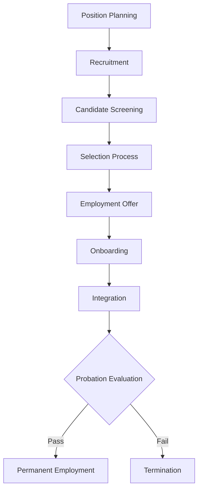

### Tools and Resources

- **Recruitment Management System**: Digital application tracking and candidate management
- **Job Description Templates**: Standardized templates for aviation positions
- **Interview Guides**: Structured interview questions and evaluation criteria
- **Background Check Services**: Professional background verification and reference checking
- **Onboarding Program**: Comprehensive orientation and training materials
- **Employment Documentation**: Standardized employment forms and legal compliance documents

### Success Metrics

- **Completion Time:** Hiring process completed within 30 days from position posting to employment start date
- **Quality Standard:** 90% of new team members successfully complete probation period and achieve permanent employment
- **Safety Standard:** 100% of new team members complete required safety training and certification before operational duties
- **Client Satisfaction:** New team members achieve operational proficiency within 90 days of employment start date

### Common Issues and Solutions

- **Issue:** Limited qualified candidates for specialized aviation positions
- **Solution:** Expand recruitment networks, develop internal training programs, and consider relocation assistance for qualified candidates.

- **Issue:** Background check delays affecting hiring timeline
- **Solution:** Establish relationships with multiple background check providers and implement conditional employment offers with background verification requirements.

- **Issue:** New team members not meeting operational performance standards
- **Solution:** Enhance onboarding program with comprehensive training, mentoring, and performance monitoring during probation period.

- **Issue:** Employment documentation compliance issues
- **Solution:** Implement standardized employment documentation procedures with legal review and regular compliance audits.

### Safety Considerations

- ⚠️ **WARNING**: Never allow new team members to perform safety-critical duties without completing required training and certification
- ⚠️ **WARNING**: Ensure all team members complete safety orientation and emergency procedures training before operational duties
- ⚡ **CAUTION**: Verify all required certifications and qualifications before employment offer and operational duties
- ⚡ **CAUTION**: Monitor new team member performance closely during probation period to ensure safety compliance
- ℹ️ **NOTE**: Provide comprehensive safety training and emergency procedures orientation during onboarding
- ℹ️ **NOTE**: Maintain detailed records of all training, certifications, and performance evaluations
- ✅ **BEST PRACTICE**: Implement mentoring program pairing new team members with experienced personnel
- ✅ **BEST PRACTICE**: Conduct regular performance reviews and provide constructive feedback during probation period

### Regulatory References

- **Title VII of Civil Rights Act** - Equal employment opportunity and anti-discrimination requirements
- **Americans with Disabilities Act (ADA)** - Disability accommodation and non-discrimination requirements
- **Fair Labor Standards Act (FLSA)** - Minimum wage, overtime, and employment classification requirements
- **Immigration Reform and Control Act (IRCA)** - Employment eligibility verification requirements
- **State Employment Laws** - Applicable state requirements for employment practices and documentation

### Aviation Industry Requirements

#### Employment Standards
- **Aviation Qualifications**: Required certifications, ratings, and experience for aviation positions
- **Safety Training**: Mandatory safety orientation and emergency procedures training
- **Regulatory Compliance**: Understanding of FAA regulations and operational requirements
- **Operational Procedures**: Knowledge of aviation operations and safety protocols

#### Legal Compliance
- **Equal Employment Opportunity**: Non-discrimination in hiring and employment practices
- **Background Verification**: Comprehensive background checks for aviation positions
- **Documentation Requirements**: Complete employment documentation and legal compliance
- **Training Requirements**: Mandatory training and certification for aviation operations

---

## Liability and Risk Management

Manage liability exposure and risk mitigation strategies to protect organizational interests, team members, and clients while ensuring regulatory compliance and operational sustainability.

### Purpose

Establish systematic liability and risk management procedures that identify operational risks, implement mitigation strategies, ensure adequate insurance coverage, and protect organizational interests while maintaining regulatory compliance and supporting safe aviation operations.

### Roles and Responsibilities

**Business Leader:**

- Approve risk management strategies and insurance coverage levels
- Review liability exposure assessments and mitigation plans
- Oversee insurance policy procurement and renewal processes
- Monitor risk management performance and cost optimization
- Authorize risk mitigation investments and safety improvements

**Operations Leader:**

- Oversee operational risk identification and assessment procedures
- Coordinate risk mitigation implementation across departments
- Monitor safety compliance and incident prevention programs
- Ensure regulatory compliance for risk management activities
- Authorize emergency response and incident management procedures

**Safety Officer:**

- Conduct operational risk assessments and safety evaluations
- Monitor safety incidents and near-miss reporting
- Coordinate safety training and risk awareness programs
- Ensure compliance with safety regulations and procedures
- Investigate incidents and recommend corrective actions

**Finance Leader:**

- Review insurance coverage adequacy and cost optimization
- Monitor liability exposure and financial risk assessment
- Coordinate insurance claims processing and settlement
- Ensure compliance with financial regulations and reporting
- Manage risk management budget and cost allocation

### Process Steps

#### Risk Assessment Phase

- **Identify operational risks** - Conduct comprehensive review of all operational activities and potential liability exposures
- **Evaluate risk severity** - Assess probability and potential impact of identified risks on operations and financial stability
- **Analyze regulatory requirements** - Review applicable FAA, OSHA, and state regulations for compliance requirements
- **Document risk inventory** - Create detailed risk register with assessment criteria and mitigation strategies

#### Risk Mitigation Planning Phase

- **Develop mitigation strategies** - Create specific action plans to reduce or eliminate identified risks
- **Prioritize risk responses** - Rank risks by severity and allocate resources for mitigation implementation
- **Establish monitoring procedures** - Define ongoing risk monitoring and assessment protocols
- **Create contingency plans** - Develop response procedures for high-impact risk scenarios

#### Insurance Coverage Management Phase

- **Assess coverage requirements** - Review current insurance policies and identify coverage gaps
- **Evaluate policy options** - Compare insurance products and coverage levels for optimal protection
- **Negotiate policy terms** - Work with insurance providers to secure favorable coverage and rates
- **Monitor policy compliance** - Ensure operational activities comply with insurance policy requirements

#### Implementation and Monitoring Phase

- **Implement mitigation strategies** - Execute risk reduction measures across operational departments
- **Monitor risk indicators** - Track key risk indicators and performance metrics
- **Conduct regular assessments** - Perform periodic risk reviews and update mitigation strategies
- **Update risk documentation** - Maintain current risk register and mitigation plan documentation

#### Incident Response and Claims Management Phase

- **Respond to incidents** - Implement immediate response procedures for safety incidents and liability events
- **Document incident details** - Create comprehensive incident reports with supporting evidence
- **Coordinate claims processing** - Work with insurance carriers and legal counsel on claims handling
- **Implement corrective actions** - Apply lessons learned to prevent future incidents

### Process Mapping

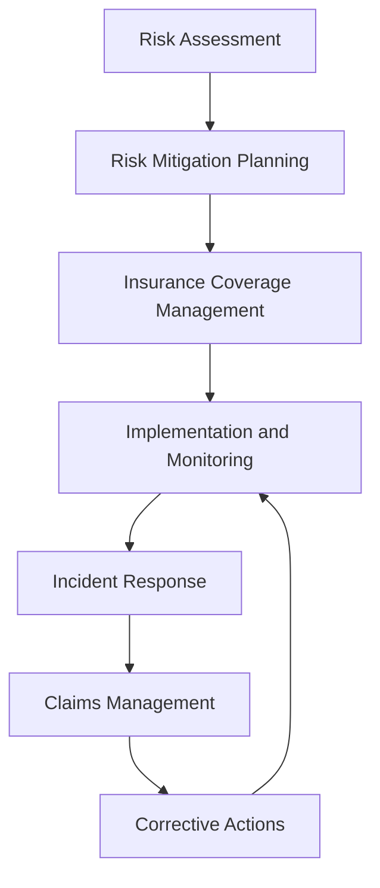

### Tools and Resources

- **Risk Management System**: Digital risk assessment and tracking capabilities
- **Insurance Broker**: Aviation insurance specialist with FBO experience
- **Legal Counsel**: Attorney specializing in aviation liability and risk management
- **Safety Management System**: Comprehensive safety program and incident reporting
- **Claims Management System**: Digital claims tracking and processing procedures
- **Risk Assessment Templates**: Standardized risk evaluation and documentation tools

### Success Metrics

- **Completion Time:** Risk assessments completed within 30 days and mitigation strategies implemented within 90 days
- **Quality Standard:** 100% of identified risks have documented mitigation strategies and monitoring procedures
- **Safety Standard:** Zero preventable incidents resulting from unaddressed risk exposures
- **Client Satisfaction:** Risk management procedures support 95% client confidence in operational safety

### Common Issues and Solutions

- **Issue:** Insurance coverage gaps identified during risk assessment
- **Solution:** Work with aviation insurance specialists to secure additional coverage or policy endorsements. Consider self-insurance options for specific risks.

- **Issue:** Risk mitigation strategies not effectively implemented across departments
- **Solution:** Establish clear implementation timelines and accountability measures. Provide training and resources to support mitigation strategy execution.

- **Issue:** Incident response procedures not coordinated with insurance requirements
- **Solution:** Develop integrated incident response protocols that address both operational and insurance notification requirements. Train team members on proper incident reporting procedures.

- **Issue:** Risk assessment not capturing emerging aviation industry risks
- **Solution:** Establish regular risk review cycles and industry monitoring procedures. Participate in aviation industry risk management forums and training programs.

### Safety Considerations

- ⚠️ **WARNING**: Never operate without adequate insurance coverage for all aviation activities and liability exposures
- ⚠️ **WARNING**: Ensure all team members understand and follow safety procedures to prevent liability incidents
- ⚡ **CAUTION**: Monitor regulatory changes that may affect liability exposure and insurance requirements
- ⚡ **CAUTION**: Verify all contractors and vendors maintain adequate insurance coverage for aviation operations
- ℹ️ **NOTE**: Maintain current documentation of all risk assessments, mitigation strategies, and insurance policies
- ℹ️ **NOTE**: Conduct regular training on risk awareness and incident prevention procedures
- ✅ **BEST PRACTICE**: Implement proactive risk management culture with regular safety briefings and training
- ✅ **BEST PRACTICE**: Establish relationships with aviation insurance specialists and legal counsel for expert guidance

### Regulatory References

- **14 CFR Part 91** - General Operating and Flight Rules (operational risk management)
- **14 CFR Part 139** - Airport Operating Certificate (airport liability requirements)
- **OSHA 29 CFR 1910** - Occupational Safety and Health Standards (workplace safety)
- **State Aviation Regulations** - Applicable state requirements for aviation operations
- **Insurance Requirements** - Minimum liability coverage requirements for aviation operations

### Aviation Industry Requirements

#### Risk Management Standards
- **Operational Risk Assessment**: Comprehensive evaluation of all aviation operational risks
- **Safety Management System**: Integrated safety program with risk management components
- **Insurance Coverage**: Adequate liability coverage for all aviation operations and exposures
- **Regulatory Compliance**: Compliance with FAA, OSHA, and state aviation regulations

#### Liability Protection
- **Comprehensive Coverage**: Protection for aircraft operations, ground handling, and client services
- **Claims Management**: Efficient claims processing and settlement procedures
- **Legal Defense**: Access to legal counsel for liability defense and regulatory compliance
- **Risk Transfer**: Effective use of insurance and contractual risk transfer mechanisms

---

## Client Service Agreements

Develop and manage comprehensive client service agreements that establish clear terms, conditions, and expectations for FBO services while protecting organizational interests and ensuring regulatory compliance.

### Purpose

Establish systematic procedures for developing, executing, and managing client service agreements that define service scope, pricing, liability protection, and operational requirements while ensuring clear client expectations and organizational protection.

### Roles and Responsibilities

**Business Leader:**

- Approve service agreement terms and pricing structures
- Review client qualification criteria and service requirements
- Oversee agreement negotiation and client relationship management
- Monitor service delivery performance and client satisfaction
- Authorize agreement modifications and special arrangements

**Operations Leader:**

- Oversee service delivery coordination and quality assurance
- Monitor operational compliance with agreement terms
- Coordinate with service teams for delivery requirements
- Ensure service standards meet agreement specifications
- Authorize service modifications and special requests

**Safety Officer:**

- Review safety requirements and compliance standards
- Verify operational procedures meet safety regulations
- Monitor safety incidents and operational concerns
- Ensure regulatory compliance for service operations
- Coordinate safety training and certification requirements

**Finance Leader:**

- Review pricing structures and financial terms
- Monitor billing accuracy and payment compliance
- Oversee financial risk assessment and mitigation
- Coordinate with accounting for revenue recognition
- Authorize financial modifications and payment terms

**Client Service Representative:**

- Process service requests and client qualification
- Coordinate agreement execution and documentation
- Manage client communications and service delivery
- Process billing and payment for services
- Maintain client relationship and satisfaction

### Process Steps

#### Client Assessment Phase

- **Review service requirements** - Assess client needs, service scope, and operational requirements
- **Evaluate client qualification** - Verify client eligibility, credit standing, and service history
- **Assess operational capacity** - Determine ability to meet client service requirements
- **Review safety considerations** - Evaluate safety implications and regulatory compliance needs

#### Agreement Development Phase

- **Prepare service agreement** - Create comprehensive contract with clear terms, conditions, and service specifications
- **Define service scope** - Establish detailed service descriptions, limitations, and operational parameters
- **Set pricing structure** - Determine service rates, minimum charges, and additional service fees
- **Include liability provisions** - Specify liability protection, insurance requirements, and risk allocation

#### Agreement Execution Phase

- **Review agreement terms** - Ensure client understands all terms, conditions, and service requirements
- **Obtain required signatures** - Complete agreement execution with proper authorization and witness signatures
- **Establish billing account** - Set up client account and payment processing procedures
- **Provide service orientation** - Conduct service delivery procedures and client communication protocols

#### Service Delivery Management Phase

- **Coordinate service delivery** - Manage service scheduling and resource allocation
- **Monitor service quality** - Track service delivery performance and client satisfaction
- **Process billing** - Generate accurate invoices for services and additional charges
- **Maintain communication** - Provide regular updates on service status and operational requirements

#### Agreement Administration Phase

- **Track agreement compliance** - Monitor adherence to terms, conditions, and service requirements
- **Process agreement modifications** - Handle changes to service terms, pricing, or operational parameters
- **Manage renewals** - Coordinate agreement renewal process and terms renegotiation
- **Handle terminations** - Process agreement termination and final settlement procedures

### Process Mapping

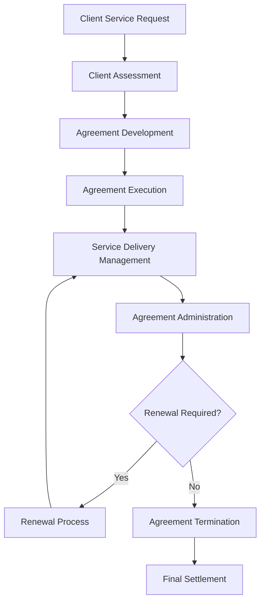

### Tools and Resources

- **Service Management System**: Digital agreement storage and tracking capabilities
- **Client Database**: Service history and agreement tracking
- **Agreement Templates**: Standardized service agreement templates with aviation-specific terms
- **Billing System**: Automated service billing and payment processing
- **Legal Counsel**: Attorney specializing in aviation service contracts and liability issues
- **Service Documentation**: Standard operating procedures and quality assurance protocols

### Success Metrics

- **Completion Time:** Service agreements processed and executed within 72 hours of client qualification approval
- **Quality Standard:** 100% of service agreements include comprehensive liability protection and regulatory compliance terms
- **Safety Standard:** Zero safety incidents related to service agreement terms or delivery procedures
- **Client Satisfaction:** 95% client satisfaction with service agreement terms and delivery procedures

### Common Issues and Solutions

- **Issue:** Service scope not clearly defined leading to client expectations mismatch
- **Solution:** Develop detailed service specifications with clear limitations and operational parameters. Include comprehensive service descriptions and quality standards.

- **Issue:** Pricing disputes affecting client relationships and revenue
- **Solution:** Implement transparent pricing structures with detailed service breakdowns. Provide clear billing statements and dispute resolution procedures.

- **Issue:** Service delivery not meeting agreement specifications
- **Solution:** Establish quality assurance procedures with regular monitoring and client feedback. Implement corrective action protocols for service deficiencies.

- **Issue:** Liability protection inadequate for aviation operations
- **Solution:** Work with aviation legal counsel to develop comprehensive liability provisions. Include appropriate insurance requirements and risk allocation terms.

### Safety Considerations

- ⚠️ **WARNING**: Never provide services without verifying client qualification and safety compliance requirements
- ⚠️ **WARNING**: Ensure all service delivery meets aviation safety standards and regulatory requirements
- ⚡ **CAUTION**: Verify service scope and limitations are clearly communicated to prevent operational conflicts
- ⚡ **CAUTION**: Monitor service delivery quality and safety compliance throughout agreement term
- ℹ️ **NOTE**: Maintain current service documentation and quality assurance records for all operations
- ℹ️ **NOTE**: Conduct regular agreement reviews to ensure terms remain current with regulatory requirements
- ✅ **BEST PRACTICE**: Implement comprehensive client orientation program for new service agreements
- ✅ **BEST PRACTICE**: Maintain detailed records of all service delivery and client communications

### Regulatory References

- **14 CFR Part 91** - General Operating and Flight Rules (aviation service operations)
- **14 CFR Part 139** - Certification of Airports (airport service requirements)
- **FAA Advisory Circulars** - Applicable guidance for aviation service operations
- **State Aviation Regulations** - Applicable state requirements for aviation services
- **OSHA Standards** - Workplace safety requirements for service operations

### Aviation Industry Requirements

#### Service Agreement Standards
- **Service Scope**: Clear definition of services, limitations, and operational parameters
- **Quality Standards**: Specific quality requirements and performance expectations
- **Safety Compliance**: Aviation safety standards and regulatory compliance requirements
- **Liability Protection**: Comprehensive liability provisions protecting both client and organization

#### Contract Requirements
- **Service Specifications**: Detailed service descriptions with quality and performance standards
- **Operational Terms**: Clear definition of service delivery, scheduling, and coordination requirements
- **Financial Terms**: Pricing structure, payment terms, and billing procedures
- **Regulatory Compliance**: Terms ensuring compliance with FAA and state aviation regulations

---

## Vendor Partnership Contracts

Oversee vendor and partnership contract administration to ensure reliable service delivery, quality standards, and organizational protection while maintaining strategic business relationships.

### Purpose

Establish systematic procedures for developing, executing, and managing vendor and partnership contracts that ensure reliable service delivery, quality standards, and organizational protection while supporting operational excellence and strategic business objectives.

### Roles and Responsibilities

**Business Leader:**

- Approve vendor partnership terms and strategic objectives
- Review vendor qualification criteria and performance requirements
- Oversee contract negotiation and relationship management
- Monitor vendor performance and service quality standards
- Authorize contract modifications and strategic partnerships

**Operations Leader:**

- Oversee vendor service delivery coordination and quality assurance
- Monitor operational compliance with contract terms
- Coordinate with vendors for service requirements and scheduling
- Ensure service standards meet contract specifications
- Authorize service modifications and operational requirements

**Safety Officer:**

- Review vendor safety requirements and compliance standards
- Verify vendor operational procedures meet safety regulations
- Monitor vendor safety performance and incident reporting
- Ensure regulatory compliance for vendor operations
- Coordinate vendor safety training and certification requirements

**Finance Leader:**

- Review contract pricing structures and financial terms
- Monitor vendor billing accuracy and payment compliance
- Oversee financial risk assessment and vendor performance
- Coordinate with accounting for vendor payment processing
- Authorize financial modifications and payment terms

**Client Service Representative:**

- Coordinate vendor service delivery and client satisfaction
- Process vendor service requests and quality monitoring
- Manage vendor communications and service coordination
- Monitor client feedback on vendor service quality
- Maintain vendor relationship and performance tracking

### Process Steps

#### Vendor Assessment Phase

- **Review vendor qualifications** - Assess vendor capabilities, experience, and financial stability
- **Evaluate service requirements** - Determine specific service needs and quality standards
- **Conduct vendor research** - Review vendor history, references, and industry reputation
- **Assess risk factors** - Evaluate potential risks and liability exposure

#### Contract Development Phase

- **Prepare partnership agreement** - Create comprehensive contract with clear terms, conditions, and service specifications
- **Define service scope** - Establish detailed service descriptions, quality standards, and performance expectations
- **Set pricing structure** - Determine service rates, payment terms, and performance incentives
- **Include liability provisions** - Specify liability protection, insurance requirements, and risk allocation

#### Contract Execution Phase

- **Review contract terms** - Ensure vendor understands all terms, conditions, and service requirements
- **Obtain required signatures** - Complete contract execution with proper authorization and witness signatures
- **Establish vendor account** - Set up vendor account and payment processing procedures
- **Provide orientation briefing** - Conduct service delivery procedures and communication protocols

#### Service Delivery Management Phase

- **Coordinate service delivery** - Manage vendor scheduling and resource allocation
- **Monitor service quality** - Track vendor performance and service delivery standards
- **Process vendor billing** - Review and approve vendor invoices for services
- **Maintain communication** - Provide regular updates on service requirements and performance expectations

#### Contract Administration Phase

- **Track contract compliance** - Monitor adherence to terms, conditions, and service requirements
- **Process contract modifications** - Handle changes to service terms, pricing, or operational parameters
- **Manage renewals** - Coordinate contract renewal process and terms renegotiation
- **Handle terminations** - Process contract termination and final settlement procedures

### Process Mapping

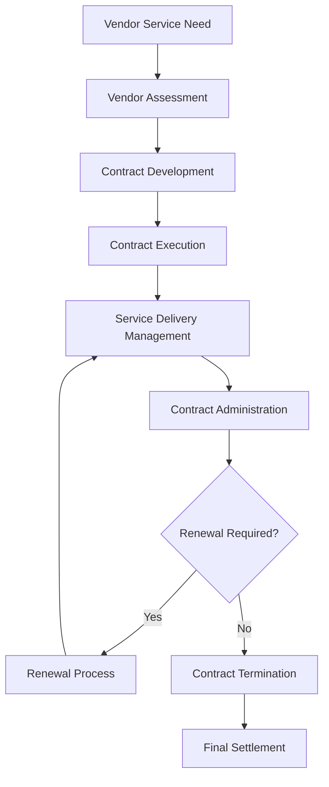

### Tools and Resources

- **Vendor Management System**: Digital contract storage and vendor tracking capabilities
- **Vendor Database**: Service history and performance tracking
- **Contract Templates**: Standardized vendor agreement templates with aviation-specific terms
- **Billing System**: Automated vendor billing and payment processing
- **Legal Counsel**: Attorney specializing in vendor contracts and liability issues
- **Quality Assurance System**: Vendor performance monitoring and evaluation procedures

### Success Metrics

- **Completion Time:** Vendor contracts processed and executed within 96 hours of vendor qualification approval
- **Quality Standard:** 100% of vendor contracts include comprehensive liability protection and quality assurance terms
- **Safety Standard:** Zero safety incidents related to vendor contract terms or service delivery procedures
- **Client Satisfaction:** 95% client satisfaction with vendor service quality and delivery performance

### Common Issues and Solutions

- **Issue:** Vendor service quality not meeting contract specifications
- **Solution:** Implement comprehensive quality assurance procedures with regular monitoring and performance evaluation. Establish corrective action protocols for quality deficiencies.

- **Issue:** Vendor pricing disputes affecting service delivery and relationships
- **Solution:** Implement transparent pricing structures with detailed service breakdowns. Provide clear billing procedures and dispute resolution protocols.

- **Issue:** Vendor scheduling conflicts affecting operational requirements
- **Solution:** Establish clear scheduling procedures with advance notice requirements. Implement backup vendor arrangements for critical services.

- **Issue:** Vendor liability protection inadequate for aviation operations
- **Solution:** Work with aviation legal counsel to develop comprehensive liability provisions. Include appropriate insurance requirements and risk allocation terms.

### Safety Considerations

- ⚠️ **WARNING**: Never engage vendors without verifying safety compliance and regulatory requirements
- ⚠️ **WARNING**: Ensure all vendor services meet aviation safety standards and operational requirements
- ⚡ **CAUTION**: Verify vendor qualifications and safety records before contract execution
- ⚡ **CAUTION**: Monitor vendor safety performance and compliance throughout contract term
- ℹ️ **NOTE**: Maintain current vendor documentation and safety compliance records for all operations
- ℹ️ **NOTE**: Conduct regular contract reviews to ensure terms remain current with regulatory requirements
- ✅ **BEST PRACTICE**: Implement comprehensive vendor orientation program for new partnerships
- ✅ **BEST PRACTICE**: Maintain detailed records of all vendor service delivery and performance evaluations

### Regulatory References

- **14 CFR Part 91** - General Operating and Flight Rules (aviation service operations)
- **14 CFR Part 139** - Certification of Airports (airport service requirements)
- **FAA Advisory Circulars** - Applicable guidance for aviation service operations
- **OSHA Standards** - Workplace safety requirements for vendor operations
- **State Aviation Regulations** - Applicable state requirements for aviation services

### Aviation Industry Requirements

#### Vendor Contract Standards
- **Service Scope**: Clear definition of services, quality standards, and performance expectations
- **Safety Compliance**: Aviation safety standards and regulatory compliance requirements
- **Liability Protection**: Comprehensive liability provisions protecting both vendor and organization
- **Quality Assurance**: Specific quality requirements and performance monitoring procedures

#### Contract Requirements
- **Service Specifications**: Detailed service descriptions with quality and performance standards
- **Operational Terms**: Clear definition of service delivery, scheduling, and coordination requirements
- **Financial Terms**: Pricing structure, payment terms, and billing procedures
- **Regulatory Compliance**: Terms ensuring compliance with FAA and state aviation regulations

---

## Performance Management and Discipline

Administer performance management and disciplinary procedures to ensure team member excellence, operational standards, and organizational compliance while maintaining fair and consistent practices.

### Purpose

Establish systematic procedures for managing team member performance, addressing performance issues, and administering disciplinary actions that ensure operational excellence, regulatory compliance, and organizational protection while maintaining fair and consistent practices.

### Roles and Responsibilities

**Business Leader:**

- Approve performance management policies and disciplinary procedures
- Review performance standards and evaluation criteria
- Oversee disciplinary action decisions and appeals
- Monitor performance management effectiveness and outcomes
- Authorize termination decisions and separation procedures

**Operations Leader:**

- Oversee performance evaluation and goal setting procedures
- Monitor operational performance standards and compliance
- Coordinate performance improvement plans and training
- Ensure disciplinary actions support operational objectives
- Authorize performance-related operational decisions

**Safety Officer:**

- Review safety-related performance issues and concerns
- Verify safety compliance and training requirements
- Monitor safety incidents and performance implications
- Ensure disciplinary actions address safety concerns
- Coordinate safety training and certification requirements

**Finance Leader:**

- Review performance-related compensation and benefits
- Monitor performance impact on organizational costs
- Oversee financial implications of disciplinary actions
- Coordinate with payroll for performance-related changes
- Authorize performance-based financial modifications

**Client Service Representative:**

- Provide feedback on client-facing performance issues
- Coordinate client communication during performance matters
- Monitor client satisfaction and performance impact
- Maintain client relationships during performance issues
- Document client feedback for performance evaluations

### Process Steps

#### Performance Evaluation Phase

- **Conduct regular evaluations** - Perform scheduled performance reviews and assessments
- **Set performance goals** - Establish clear objectives and performance expectations
- **Document performance** - Maintain detailed records of performance observations and feedback
- **Provide feedback** - Deliver constructive feedback and development guidance

#### Performance Issue Identification Phase

- **Identify performance concerns** - Recognize performance issues and areas for improvement
- **Document performance problems** - Record specific performance deficiencies and concerns
- **Assess performance impact** - Evaluate impact on operations, safety, and client satisfaction
- **Determine improvement needs** - Identify specific areas requiring attention and development

#### Performance Improvement Phase

- **Develop improvement plan** - Create structured plan for performance enhancement
- **Provide training support** - Offer additional training and development opportunities
- **Monitor improvement progress** - Track performance improvement and development efforts
- **Provide ongoing feedback** - Deliver regular feedback on improvement progress

#### Disciplinary Action Phase

- **Review performance history** - Assess complete performance record and improvement efforts
- **Determine disciplinary level** - Select appropriate disciplinary action based on circumstances
- **Document disciplinary action** - Record disciplinary decision and supporting documentation
- **Implement disciplinary measures** - Execute disciplinary action and monitor compliance

#### Follow-up and Monitoring Phase

- **Monitor performance improvement** - Track post-disciplinary performance and compliance
- **Provide support and guidance** - Offer ongoing support for performance improvement
- **Evaluate disciplinary effectiveness** - Assess impact of disciplinary action on performance
- **Document outcomes** - Record final outcomes and lessons learned

### Process Mapping

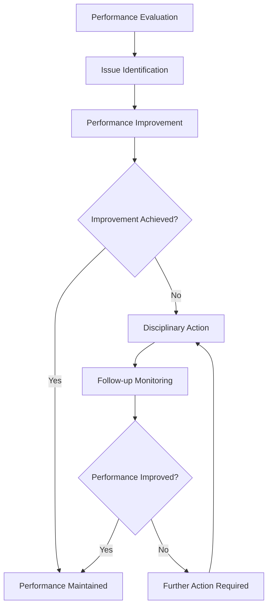

### Tools and Resources

- **Performance Management System**: Digital performance tracking and evaluation capabilities
- **Team Member Database**: Performance history and evaluation records
- **Evaluation Templates**: Standardized performance evaluation forms and procedures
- **Training Resources**: Performance improvement and development materials
- **Legal Counsel**: Attorney specializing in employment law and disciplinary procedures
- **Documentation System**: Performance and disciplinary record management

### Success Metrics

- **Completion Time:** Performance evaluations completed within 30 days of scheduled review dates
- **Quality Standard:** 100% of performance issues addressed through appropriate improvement or disciplinary procedures
- **Safety Standard:** Zero safety incidents related to performance management or disciplinary procedures
- **Client Satisfaction:** 95% client satisfaction with team member performance and service delivery

### Common Issues and Solutions

- **Issue:** Performance standards not clearly defined leading to inconsistent evaluations
- **Solution:** Develop comprehensive performance standards with specific, measurable criteria. Provide training on evaluation procedures and standards application.

- **Issue:** Disciplinary actions not consistently applied across team members
- **Solution:** Implement standardized disciplinary procedures with clear guidelines and documentation requirements. Ensure consistent application through training and oversight.

- **Issue:** Performance improvement plans not effectively addressing root causes
- **Solution:** Conduct thorough performance analysis to identify underlying issues. Develop targeted improvement plans with specific goals and timelines.

- **Issue:** Legal risks from improper disciplinary procedures or documentation
- **Solution:** Work with employment legal counsel to develop compliant procedures. Ensure proper documentation and consistent application of disciplinary measures.

### Safety Considerations

- ⚠️ **WARNING**: Never ignore safety-related performance issues that could compromise operational safety
- ⚠️ **WARNING**: Ensure all disciplinary actions comply with employment laws and regulatory requirements
- ⚡ **CAUTION**: Verify performance documentation is accurate and complete before taking disciplinary action
- ⚡ **CAUTION**: Monitor performance improvement efforts to ensure safety standards are maintained
- ℹ️ **NOTE**: Maintain confidentiality of performance and disciplinary information
- ℹ️ **NOTE**: Conduct regular reviews of performance management procedures for effectiveness
- ✅ **BEST PRACTICE**: Provide regular performance feedback and development opportunities
- ✅ **BEST PRACTICE**: Document all performance discussions and disciplinary actions thoroughly

### Regulatory References

- **Fair Labor Standards Act (FLSA)** - Employment standards and compensation requirements
- **Title VII of Civil Rights Act** - Anti-discrimination and equal employment opportunity
- **Americans with Disabilities Act (ADA)** - Disability accommodation requirements
- **Family and Medical Leave Act (FMLA)** - Leave and employment protection requirements
- **State Employment Laws** - Applicable state employment and labor regulations

### Aviation Industry Requirements

#### Performance Management Standards
- **Safety Compliance**: Aviation safety standards and regulatory compliance requirements
- **Operational Excellence**: Performance standards supporting safe and efficient operations
- **Client Service**: Performance requirements ensuring excellent client experience
- **Regulatory Compliance**: Performance standards meeting FAA and industry requirements

#### Disciplinary Requirements
- **Consistent Application**: Fair and consistent application of disciplinary procedures
- **Documentation**: Comprehensive documentation of performance issues and disciplinary actions
- **Legal Compliance**: Compliance with employment laws and regulatory requirements
- **Safety Focus**: Disciplinary procedures that prioritize safety and operational excellence

---

## Benefits and Compensation Administration

Manage benefits and compensation programs to ensure competitive team member packages, regulatory compliance, and organizational sustainability while supporting team member retention and satisfaction.

### Purpose

Establish systematic procedures for administering team member benefits and compensation programs that ensure competitive packages, regulatory compliance, and organizational sustainability while supporting team member retention, satisfaction, and operational excellence.

### Roles and Responsibilities

**Business Leader:**

- Approve compensation structures and benefits packages
- Review market competitiveness and organizational affordability
- Oversee benefits program design and vendor relationships
- Monitor compensation and benefits effectiveness and costs
- Authorize compensation modifications and benefits changes

**Operations Leader:**

- Oversee compensation alignment with operational requirements
- Monitor performance-based compensation and incentives
- Coordinate compensation with operational performance standards
- Ensure compensation supports operational objectives
- Authorize operational compensation adjustments

**Safety Officer:**

- Review safety-related compensation and benefits
- Verify safety incentive programs and compliance requirements
- Monitor safety performance impact on compensation
- Ensure benefits support safety and wellness objectives
- Coordinate safety training and certification benefits

**Finance Leader:**

- Oversee compensation and benefits budget management
- Monitor compensation costs and benefits expenses
- Coordinate payroll processing and benefits administration
- Review financial impact of compensation and benefits changes
- Authorize financial modifications and budget adjustments

**Client Service Representative:**

- Provide feedback on compensation impact on client service
- Coordinate client communication during compensation matters
- Monitor client satisfaction and compensation relationships
- Maintain client relationships during compensation issues
- Document client feedback for compensation considerations

### Process Steps

#### Compensation Planning Phase

- **Conduct market analysis** - Research competitive compensation levels and industry standards
- **Review organizational budget** - Assess financial capacity for compensation and benefits
- **Develop compensation structure** - Create competitive and equitable compensation framework
- **Establish performance criteria** - Define performance-based compensation and incentive programs

#### Benefits Program Design Phase

- **Design benefits package** - Develop comprehensive benefits program meeting team member needs
- **Select benefits vendors** - Choose reliable vendors for health, retirement, and other benefits
- **Establish eligibility criteria** - Define team member eligibility for various benefits
- **Create enrollment procedures** - Develop clear enrollment and administration procedures

#### Implementation and Administration Phase

- **Implement compensation structure** - Execute new compensation programs and structures
- **Launch benefits programs** - Begin benefits enrollment and administration
- **Provide team member communication** - Deliver clear information about compensation and benefits
- **Establish administration procedures** - Create ongoing administration and management procedures

#### Ongoing Management Phase

- **Monitor compensation effectiveness** - Track compensation competitiveness and team member satisfaction
- **Administer benefits programs** - Manage ongoing benefits administration and vendor relationships
- **Process compensation changes** - Handle compensation adjustments and modifications
- **Maintain compliance** - Ensure regulatory compliance for compensation and benefits

#### Review and Optimization Phase

- **Conduct annual reviews** - Perform comprehensive compensation and benefits reviews
- **Assess program effectiveness** - Evaluate program success and team member satisfaction
- **Identify improvement opportunities** - Recognize areas for enhancement and optimization
- **Implement program updates** - Execute improvements and modifications as needed

### Process Mapping

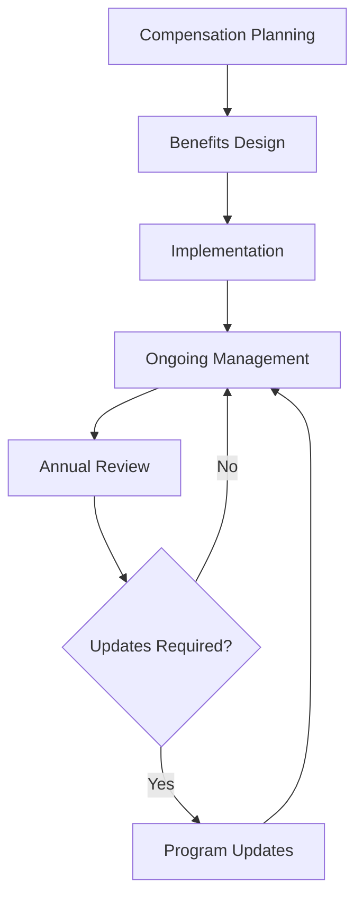

### Tools and Resources

- **Compensation Management System**: Digital compensation tracking and administration capabilities
- **Benefits Administration Platform**: Benefits enrollment and management system
- **Payroll System**: Integrated payroll and benefits processing
- **Market Research Tools**: Compensation benchmarking and analysis resources
- **Legal Counsel**: Attorney specializing in employment law and benefits compliance
- **Benefits Vendors**: Health, retirement, and other benefits providers

### Success Metrics

- **Completion Time:** Compensation and benefits programs implemented within 90 days of approval
- **Quality Standard:** 100% of compensation and benefits programs meet regulatory compliance requirements
- **Safety Standard:** Zero safety incidents related to compensation or benefits administration
- **Client Satisfaction:** 95% team member satisfaction with compensation and benefits programs

### Common Issues and Solutions

- **Issue:** Compensation not competitive with market standards affecting team member retention
- **Solution:** Conduct regular market analysis and adjust compensation to maintain competitiveness. Implement performance-based incentives to enhance total compensation.

- **Issue:** Benefits costs exceeding budget constraints affecting organizational sustainability
- **Solution:** Review benefits design and vendor relationships for cost optimization. Consider alternative benefits structures and cost-sharing arrangements.

- **Issue:** Benefits enrollment and administration complexity affecting team member satisfaction
- **Solution:** Simplify enrollment procedures and provide comprehensive team member communication. Implement user-friendly administration systems and support.

- **Issue:** Regulatory compliance issues with compensation or benefits programs
- **Solution:** Work with legal counsel to ensure compliance with employment and benefits laws. Conduct regular compliance audits and updates.

### Safety Considerations

- ⚠️ **WARNING**: Never implement compensation or benefits changes without proper legal review and compliance verification
- ⚠️ **WARNING**: Ensure all compensation and benefits programs comply with employment laws and regulatory requirements
- ⚡ **CAUTION**: Verify compensation accuracy and benefits eligibility before implementation
- ⚡ **CAUTION**: Monitor compensation and benefits impact on operational performance and safety
- ℹ️ **NOTE**: Maintain confidentiality of team member compensation and benefits information
- ℹ️ **NOTE**: Conduct regular reviews of compensation and benefits programs for effectiveness
- ✅ **BEST PRACTICE**: Provide clear communication about compensation and benefits programs
- ✅ **BEST PRACTICE**: Implement comprehensive team member education and support programs

### Regulatory References

- **Fair Labor Standards Act (FLSA)** - Minimum wage and overtime requirements
- **Equal Pay Act** - Gender-based pay discrimination prohibitions
- **Employee Retirement Income Security Act (ERISA)** - Retirement and benefits plan requirements
- **Affordable Care Act (ACA)** - Health insurance and benefits requirements
- **State Employment Laws** - Applicable state compensation and benefits regulations

### Aviation Industry Requirements

#### Compensation Standards
- **Market Competitiveness**: Compensation levels competitive with aviation industry standards
- **Performance Alignment**: Compensation structures supporting operational excellence
- **Safety Incentives**: Compensation programs encouraging safety and compliance
- **Regulatory Compliance**: Compensation practices meeting employment law requirements

#### Benefits Requirements
- **Comprehensive Coverage**: Benefits packages meeting team member needs and expectations
- **Safety Focus**: Benefits supporting safety, wellness, and operational excellence
- **Regulatory Compliance**: Benefits programs complying with employment and benefits laws
- **Cost Management**: Benefits programs supporting organizational sustainability

---

## Team Member Termination and Separation

Handle team member termination and separation procedures to ensure legal compliance, organizational protection, and professional transition while maintaining operational continuity and safety standards.

### Purpose

Establish systematic procedures for managing team member termination and separation that ensure legal compliance, organizational protection, and professional transition while maintaining operational continuity, safety standards, and organizational reputation.

### Roles and Responsibilities

**Business Leader:**

- Approve termination decisions and separation procedures
- Review termination documentation and legal compliance
- Oversee separation process and organizational protection
- Monitor termination outcomes and lessons learned
- Authorize final separation and settlement procedures

**Operations Leader:**

- Oversee operational continuity during termination process
- Monitor safety and operational impact of termination
- Coordinate operational handover and transition procedures
- Ensure operational standards maintained during separation
- Authorize operational modifications during transition

**Safety Officer:**

- Review safety implications of termination and separation
- Verify safety compliance during transition period
- Monitor safety risks during operational handover
- Ensure safety standards maintained throughout process
- Coordinate safety training and certification transfers

**Finance Leader:**

- Oversee financial aspects of termination and separation
- Monitor final compensation and benefits processing
- Coordinate financial settlement and payment procedures
- Review financial impact and cost management
- Authorize financial settlements and final payments

**Client Service Representative:**

- Coordinate client communication during termination process
- Monitor client impact and relationship maintenance
- Manage client transition and service continuity
- Maintain client relationships during organizational changes
- Document client feedback and transition requirements

### Process Steps

#### Termination Decision Phase

- **Review performance history** - Assess complete performance record and improvement efforts
- **Document termination reasons** - Record specific reasons and supporting documentation
- **Evaluate legal implications** - Review legal compliance and potential risks
- **Determine termination type** - Classify termination as voluntary, involuntary, or reduction in force

#### Pre-Termination Planning Phase

- **Develop transition plan** - Create comprehensive transition and handover procedures
- **Coordinate operational continuity** - Ensure operational standards maintained during transition
- **Prepare termination documentation** - Complete all required termination paperwork
- **Plan communication strategy** - Develop internal and external communication plan

#### Termination Meeting Phase

- **Conduct termination meeting** - Hold professional and respectful termination discussion
- **Deliver termination notice** - Provide clear termination information and next steps
- **Collect organizational property** - Retrieve all organizational assets and materials
- **Provide separation information** - Deliver information about benefits, final pay, and next steps

#### Post-Termination Processing Phase

- **Process final compensation** - Complete final payroll and benefits processing
- **Handle benefits continuation** - Manage COBRA and other benefits continuation
- **Complete documentation** - Finalize all termination documentation and records
- **Coordinate operational handover** - Ensure smooth operational transition and continuity

#### Follow-up and Closure Phase

- **Monitor transition effectiveness** - Track operational continuity and transition success
- **Address post-termination issues** - Handle any remaining issues or concerns
- **Conduct lessons learned review** - Evaluate process effectiveness and identify improvements
- **Complete final documentation** - Finalize all termination records and documentation

### Process Mapping

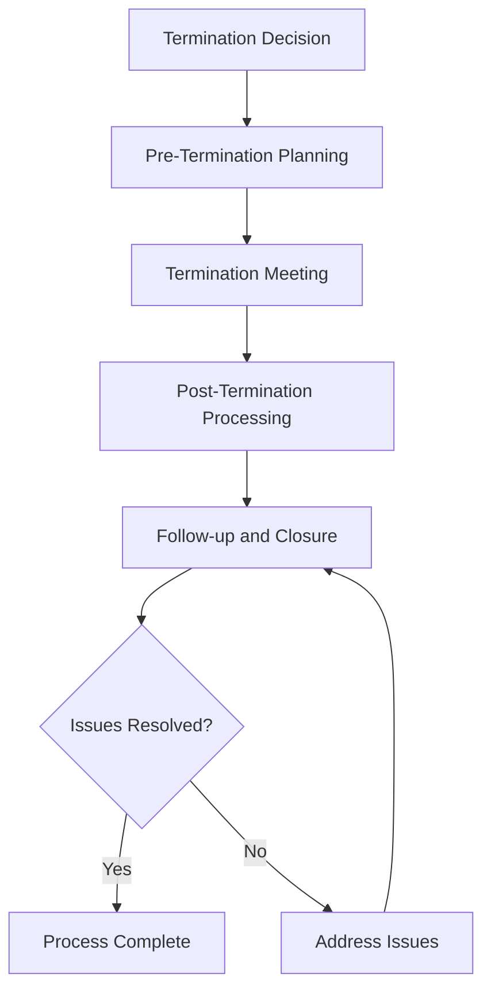

### Tools and Resources

- **Termination Management System**: Digital termination tracking and documentation capabilities
- **Team Member Database**: Employment history and termination records
- **Termination Templates**: Standardized termination documentation and procedures
- **Legal Counsel**: Attorney specializing in employment law and termination procedures
- **Benefits Administration**: Benefits continuation and final processing procedures
- **Documentation System**: Termination record management and storage

### Success Metrics

- **Completion Time:** Termination process completed within 14 days of termination decision
- **Quality Standard:** 100% of terminations processed with proper legal compliance and documentation
- **Safety Standard:** Zero safety incidents related to termination or separation procedures
- **Client Satisfaction:** 95% client satisfaction maintained during termination and transition process

### Common Issues and Solutions

- **Issue:** Termination documentation incomplete or legally insufficient
- **Solution:** Work with legal counsel to develop comprehensive termination procedures. Ensure proper documentation and legal compliance throughout process.

- **Issue:** Operational continuity disrupted during termination and transition
- **Solution:** Develop detailed transition plans with clear handover procedures. Implement backup arrangements and cross-training for critical positions.

- **Issue:** Client relationships affected by termination and organizational changes
- **Solution:** Implement clear client communication strategies during transition. Ensure service continuity and relationship maintenance throughout process.

- **Issue:** Post-termination disputes or legal challenges affecting organizational reputation
- **Solution:** Maintain professional and respectful termination procedures. Document all actions and maintain proper legal compliance throughout process.

### Safety Considerations

- ⚠️ **WARNING**: Never compromise safety standards during termination or transition procedures
- ⚠️ **WARNING**: Ensure all termination procedures comply with employment laws and regulatory requirements
- ⚡ **CAUTION**: Verify operational continuity and safety compliance during transition period
- ⚡ **CAUTION**: Monitor potential safety risks during operational handover and transition
- ℹ️ **NOTE**: Maintain confidentiality of termination information and team member privacy
- ℹ️ **NOTE**: Conduct regular reviews of termination procedures for effectiveness and compliance
- ✅ **BEST PRACTICE**: Provide professional and respectful termination process with clear communication
- ✅ **BEST PRACTICE**: Implement comprehensive transition planning and operational continuity procedures

### Regulatory References

- **Fair Labor Standards Act (FLSA)** - Final pay and compensation requirements
- **Consolidated Omnibus Budget Reconciliation Act (COBRA)** - Benefits continuation requirements
- **Worker Adjustment and Retraining Notification Act (WARN)** - Mass layoff notification requirements
- **State Employment Laws** - Applicable state termination and separation regulations
- **Aviation Regulations** - FAA requirements for aviation personnel changes

### Aviation Industry Requirements

#### Termination Standards
- **Safety Compliance**: Termination procedures maintaining aviation safety standards
- **Operational Continuity**: Termination process ensuring operational excellence
- **Regulatory Compliance**: Termination procedures meeting employment and aviation law requirements
- **Professional Standards**: Termination process maintaining organizational reputation and professionalism

#### Separation Requirements
- **Legal Compliance**: Comprehensive compliance with employment and aviation laws
- **Documentation**: Complete documentation of termination process and decisions
- **Operational Handover**: Smooth transition ensuring operational continuity and safety
- **Client Protection**: Termination process protecting client relationships and service quality

---

## Regulatory Compliance Documentation

Maintain regulatory compliance documentation and reporting to ensure organizational adherence to aviation regulations, employment laws, and business requirements while supporting operational excellence and legal protection.

### Purpose

Establish systematic procedures for maintaining regulatory compliance documentation and reporting that ensure organizational adherence to FAA regulations, employment laws, environmental standards, and business requirements while supporting operational excellence, legal protection, and regulatory audit readiness.

### Roles and Responsibilities

**Business Leader:**

- Approve compliance documentation policies and procedures
- Review regulatory compliance status and reporting requirements
- Oversee compliance monitoring and audit preparation
- Monitor regulatory changes and compliance updates
- Authorize compliance documentation and reporting procedures

**Operations Leader:**

- Oversee operational compliance documentation and reporting
- Monitor operational procedures for regulatory compliance
- Coordinate compliance documentation with operational activities
- Ensure operational standards meet regulatory requirements
- Authorize operational compliance modifications and updates

**Safety Officer:**

- Review safety compliance documentation and reporting
- Verify safety procedures meet regulatory requirements
- Monitor safety incidents and compliance implications
- Ensure safety documentation supports regulatory compliance
- Coordinate safety training and certification documentation

**Finance Leader:**

- Oversee financial compliance documentation and reporting
- Monitor financial procedures for regulatory compliance
- Coordinate financial reporting with regulatory requirements
- Review financial impact of compliance requirements
- Authorize financial compliance modifications and updates

**Client Service Representative:**

- Coordinate client-related compliance documentation
- Monitor client service procedures for regulatory compliance
- Maintain client records supporting regulatory requirements
- Document client interactions for compliance purposes
- Support compliance documentation and reporting processes

### Process Steps

#### Compliance Assessment Phase

- **Identify regulatory requirements** - Determine applicable FAA, employment, and business regulations
- **Assess current compliance status** - Evaluate existing procedures and documentation for compliance
- **Identify compliance gaps** - Recognize areas requiring attention and improvement
- **Prioritize compliance needs** - Determine critical compliance requirements and timelines

#### Documentation Development Phase

- **Develop compliance procedures** - Create comprehensive procedures meeting regulatory requirements
- **Create documentation templates** - Develop standardized forms and documentation formats
- **Establish record-keeping procedures** - Implement systematic record management and retention
- **Design reporting systems** - Create automated reporting and monitoring capabilities

#### Implementation and Training Phase

- **Implement compliance procedures** - Execute new compliance procedures and documentation
- **Provide team member training** - Deliver comprehensive training on compliance requirements
- **Establish monitoring systems** - Create ongoing compliance monitoring and verification
- **Launch reporting procedures** - Begin regular compliance reporting and documentation

#### Ongoing Monitoring Phase

- **Monitor compliance status** - Track ongoing compliance with regulatory requirements
- **Update documentation** - Maintain current and accurate compliance documentation
- **Conduct regular reviews** - Perform periodic compliance assessments and evaluations
- **Address compliance issues** - Identify and resolve compliance deficiencies promptly

#### Audit and Reporting Phase

- **Prepare for regulatory audits** - Organize documentation and prepare for regulatory reviews
- **Conduct internal audits** - Perform regular internal compliance audits and assessments
- **Generate compliance reports** - Create comprehensive compliance reporting and documentation
- **Submit regulatory reports** - Complete and submit required regulatory reports and documentation

### Process Mapping

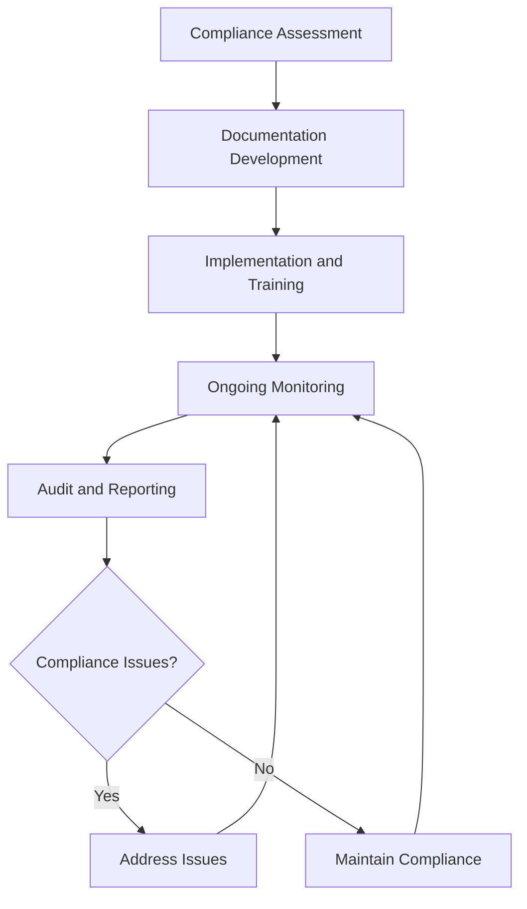

### Tools and Resources

- **Compliance Management System**: Digital compliance tracking and documentation capabilities
- **Regulatory Database**: Current regulatory requirements and updates
- **Documentation Templates**: Standardized compliance documentation formats
- **Reporting Software**: Automated compliance reporting and monitoring tools
- **Legal Counsel**: Attorney specializing in aviation and employment law compliance
- **Regulatory Resources**: FAA, OSHA, and other regulatory agency guidance materials

### Success Metrics

- **Completion Time:** Compliance documentation updated within 30 days of regulatory changes
- **Quality Standard:** 100% of regulatory requirements documented and procedures implemented
- **Safety Standard:** Zero safety incidents related to compliance documentation or procedures
- **Client Satisfaction:** 95% client satisfaction with compliance-related service delivery

### Common Issues and Solutions

- **Issue:** Regulatory requirements not clearly understood or documented
- **Solution:** Work with legal counsel and regulatory experts to develop comprehensive understanding. Create clear documentation and training materials for all team members.

- **Issue:** Compliance documentation not current with regulatory changes
- **Solution:** Implement regular regulatory monitoring and update procedures. Establish automated systems for tracking regulatory changes and updating documentation.

- **Issue:** Team member training insufficient for compliance requirements
- **Solution:** Develop comprehensive training programs covering all compliance requirements. Provide regular updates and refresher training on regulatory changes.

- **Issue:** Compliance reporting not meeting regulatory deadlines or requirements
- **Solution:** Implement automated reporting systems with clear deadlines and responsibilities. Establish backup procedures for critical compliance reporting.

### Safety Considerations

- ⚠️ **WARNING**: Never compromise safety compliance for operational convenience or cost savings
- ⚠️ **WARNING**: Ensure all compliance documentation accurately reflects actual operational procedures
- ⚡ **CAUTION**: Verify regulatory requirements before implementing compliance procedures
- ⚡ **CAUTION**: Monitor compliance procedures for effectiveness and regulatory alignment
- ℹ️ **NOTE**: Maintain current regulatory knowledge and update procedures as requirements change
- ℹ️ **NOTE**: Conduct regular compliance audits to ensure ongoing regulatory adherence
- ✅ **BEST PRACTICE**: Implement comprehensive compliance training and documentation procedures
- ✅ **BEST PRACTICE**: Maintain detailed records of all compliance activities and regulatory interactions

### Regulatory References

- **14 CFR Parts 61, 91, 139** - FAA aviation operations and certification requirements
- **OSHA Standards** - Workplace safety and health requirements
- **Environmental Protection Agency (EPA) Regulations** - Environmental compliance requirements
- **State Aviation Regulations** - Applicable state aviation and business requirements
- **Employment Laws** - Fair Labor Standards Act, Equal Employment Opportunity, and other employment regulations

### Aviation Industry Requirements

#### Compliance Documentation Standards
- **FAA Compliance**: Comprehensive documentation meeting FAA regulatory requirements
- **Safety Documentation**: Safety procedures and incident reporting meeting aviation standards
- **Operational Compliance**: Operational procedures meeting aviation industry requirements
- **Employment Compliance**: Employment practices meeting labor law requirements

#### Regulatory Requirements
- **Documentation Accuracy**: All compliance documentation accurately reflecting actual procedures
- **Timely Updates**: Regular updates to reflect regulatory changes and operational modifications
- **Audit Readiness**: Documentation organized and accessible for regulatory audits
- **Training Support**: Compliance documentation supporting team member training and understanding

---

## Legal Dispute Resolution

Handle legal disputes and conflict resolution procedures to ensure organizational protection, client satisfaction, and operational continuity while minimizing legal risks and costs.

### Purpose

Establish systematic procedures for handling legal disputes and conflict resolution that ensure organizational protection, client satisfaction, and operational continuity while minimizing legal risks, costs, and operational disruption through effective dispute prevention and resolution strategies.

### Roles and Responsibilities

**Business Leader:**

- Approve dispute resolution strategies and legal approaches
- Review dispute documentation and legal implications
- Oversee dispute resolution process and organizational protection
- Monitor dispute outcomes and lessons learned
- Authorize settlement agreements and legal actions

**Operations Leader:**

- Oversee operational continuity during dispute resolution
- Monitor operational impact of disputes and resolution efforts
- Coordinate operational modifications during dispute process
- Ensure operational standards maintained during resolution
- Authorize operational adjustments during dispute handling

**Safety Officer:**

- Review safety implications of disputes and resolution
- Verify safety compliance during dispute resolution process
- Monitor safety risks during operational modifications
- Ensure safety standards maintained throughout resolution
- Coordinate safety considerations in dispute resolution

**Finance Leader:**

- Oversee financial aspects of dispute resolution
- Monitor dispute costs and financial implications
- Coordinate financial settlements and payment procedures
- Review financial impact and cost management
- Authorize financial settlements and legal expenses

**Client Service Representative:**

- Coordinate client communication during dispute resolution
- Monitor client impact and relationship maintenance
- Manage client expectations during dispute process
- Maintain client relationships during resolution efforts
- Document client feedback and resolution requirements

### Process Steps

#### Dispute Identification Phase

- **Recognize potential disputes** - Identify situations that may lead to legal disputes
- **Assess dispute severity** - Evaluate potential impact and legal implications
- **Document dispute details** - Record comprehensive information about dispute circumstances
- **Determine immediate actions** - Identify immediate steps to prevent escalation

#### Initial Response Phase

- **Acknowledge dispute** - Provide timely acknowledgment and initial response
- **Gather information** - Collect all relevant documentation and evidence
- **Assess legal position** - Evaluate organizational legal position and risks
- **Develop response strategy** - Create comprehensive response and resolution strategy

#### Resolution Strategy Development Phase

- **Explore resolution options** - Identify potential resolution approaches and alternatives
- **Evaluate legal implications** - Assess legal risks and potential outcomes
- **Develop negotiation strategy** - Create effective negotiation and settlement approach
- **Prepare documentation** - Organize all relevant documentation and evidence

#### Resolution Implementation Phase

- **Initiate resolution process** - Begin formal resolution procedures and negotiations
- **Conduct negotiations** - Engage in structured negotiation and settlement discussions
- **Document agreements** - Record all agreements and settlement terms
- **Implement settlements** - Execute settlement agreements and resolution terms

#### Follow-up and Prevention Phase

- **Monitor settlement compliance** - Track compliance with settlement terms and agreements
- **Address remaining issues** - Handle any unresolved issues or concerns
- **Conduct lessons learned review** - Evaluate dispute resolution effectiveness
- **Implement prevention measures** - Develop procedures to prevent similar disputes

### Process Mapping

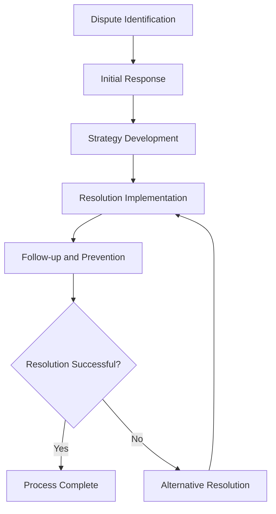

### Tools and Resources

- **Dispute Management System**: Digital dispute tracking and documentation capabilities
- **Legal Documentation**: Comprehensive dispute documentation and evidence management
- **Legal Counsel**: Attorney specializing in aviation law and dispute resolution
- **Mediation Services**: Professional mediation and alternative dispute resolution services
- **Documentation System**: Dispute record management and evidence storage
- **Communication Tools**: Professional communication and negotiation support resources

### Success Metrics

- **Completion Time:** Disputes resolved within 90 days of formal identification
- **Quality Standard:** 100% of disputes handled with proper legal compliance and documentation
- **Safety Standard:** Zero safety incidents related to dispute resolution procedures
- **Client Satisfaction:** 95% client satisfaction with dispute resolution process and outcomes

### Common Issues and Solutions

- **Issue:** Disputes escalating due to delayed or inadequate initial response
- **Solution:** Implement rapid response procedures with clear escalation protocols. Provide comprehensive training on dispute recognition and initial response procedures.

- **Issue:** Legal costs exceeding budget constraints affecting organizational sustainability
- **Solution:** Develop cost-effective dispute resolution strategies including mediation and alternative dispute resolution. Establish clear cost management procedures and approval processes.

- **Issue:** Client relationships damaged during dispute resolution process
- **Solution:** Implement professional dispute resolution procedures with clear client communication. Focus on relationship preservation while addressing dispute issues.

- **Issue:** Dispute resolution not addressing underlying causes leading to repeat issues
- **Solution:** Conduct thorough root cause analysis and implement preventive measures. Develop procedures to address systemic issues and prevent similar disputes.

### Safety Considerations

- ⚠️ **WARNING**: Never compromise safety standards during dispute resolution procedures
- ⚠️ **WARNING**: Ensure all dispute resolution procedures comply with legal and regulatory requirements
- ⚡ **CAUTION**: Verify operational continuity and safety compliance during dispute resolution
- ⚡ **CAUTION**: Monitor potential safety risks during operational modifications
- ℹ️ **NOTE**: Maintain confidentiality of dispute information and legal proceedings
- ℹ️ **NOTE**: Conduct regular reviews of dispute resolution procedures for effectiveness
- ✅ **BEST PRACTICE**: Implement comprehensive dispute prevention and early resolution procedures
- ✅ **BEST PRACTICE**: Maintain detailed records of all dispute resolution activities and outcomes

### Regulatory References

- **Federal Aviation Regulations** - FAA requirements for aviation operations and disputes
- **Alternative Dispute Resolution Act** - Federal requirements for dispute resolution procedures
- **State Dispute Resolution Laws** - Applicable state laws governing dispute resolution
- **Aviation Insurance Requirements** - Insurance coverage and dispute resolution requirements
- **Employment Laws** - Employment-related dispute resolution and legal requirements

### Aviation Industry Requirements

#### Dispute Resolution Standards
- **Aviation Compliance**: Dispute resolution procedures meeting aviation industry standards
- **Safety Focus**: Dispute resolution maintaining aviation safety and operational excellence
- **Regulatory Compliance**: Dispute resolution procedures meeting FAA and industry requirements
- **Professional Standards**: Dispute resolution maintaining organizational reputation and professionalism

#### Resolution Requirements
- **Legal Compliance**: Comprehensive compliance with aviation and business law requirements
- **Documentation**: Complete documentation of dispute resolution process and outcomes
- **Operational Continuity**: Dispute resolution ensuring operational continuity and safety
- **Client Protection**: Dispute resolution protecting client relationships and service quality

---

## Business Entity Management

Manage corporate structure and governance procedures to ensure legal compliance, organizational protection, and operational sustainability while supporting business objectives and regulatory requirements.

### Purpose

Establish systematic procedures for managing corporate structure and governance that ensure legal compliance, organizational protection, and operational sustainability while supporting business objectives, regulatory requirements, and long-term organizational success.

### Roles and Responsibilities

**Business Leader:**

- Approve corporate structure and governance policies
- Review corporate compliance and regulatory requirements
- Oversee corporate governance and board responsibilities
- Monitor corporate performance and strategic objectives
- Authorize corporate structure modifications and governance changes

**Operations Leader:**

- Oversee operational alignment with corporate structure
- Monitor operational compliance with corporate governance
- Coordinate operational procedures with corporate requirements
- Ensure operational standards meet corporate objectives
- Authorize operational modifications supporting corporate goals

**Safety Officer:**

- Review safety implications of corporate structure and governance
- Verify safety compliance with corporate policies and procedures
- Monitor safety performance within corporate governance framework
- Ensure safety standards align with corporate objectives
- Coordinate safety considerations in corporate decision-making

**Finance Leader:**

- Oversee financial aspects of corporate structure and governance
- Monitor financial compliance with corporate requirements
- Coordinate financial reporting with corporate governance
- Review financial impact of corporate structure decisions
- Authorize financial modifications supporting corporate objectives

**Client Service Representative:**

- Coordinate client service alignment with corporate structure
- Monitor client service procedures within corporate governance
- Maintain client relationships supporting corporate objectives
- Document client feedback for corporate decision-making
- Support corporate governance through client service excellence

### Process Steps

#### Corporate Structure Assessment Phase

- **Review current structure** - Evaluate existing corporate structure and governance framework
- **Assess compliance status** - Determine compliance with legal and regulatory requirements
- **Identify improvement opportunities** - Recognize areas for enhancement and optimization
- **Evaluate strategic alignment** - Assess alignment with business objectives and goals

#### Governance Framework Development Phase

- **Develop governance policies** - Create comprehensive corporate governance policies and procedures
- **Establish board structure** - Define board composition, responsibilities, and operating procedures
- **Create compliance procedures** - Develop compliance monitoring and reporting procedures
- **Design decision-making processes** - Establish clear decision-making and approval procedures

#### Implementation and Documentation Phase

- **Implement governance framework** - Execute new corporate governance policies and procedures
- **Document corporate structure** - Create comprehensive documentation of corporate structure
- **Establish monitoring systems** - Implement ongoing monitoring and compliance verification
- **Provide training and communication** - Deliver comprehensive training on governance procedures

#### Ongoing Management Phase

- **Monitor governance effectiveness** - Track governance performance and compliance status
- **Update corporate documentation** - Maintain current and accurate corporate documentation
- **Conduct regular reviews** - Perform periodic governance assessments and evaluations
- **Address governance issues** - Identify and resolve governance deficiencies promptly

#### Compliance and Reporting Phase

- **Maintain regulatory compliance** - Ensure ongoing compliance with corporate and aviation regulations
- **Generate compliance reports** - Create comprehensive compliance reporting and documentation
- **Submit regulatory filings** - Complete and submit required corporate and regulatory filings
- **Conduct governance audits** - Perform regular governance audits and assessments

### Process Mapping

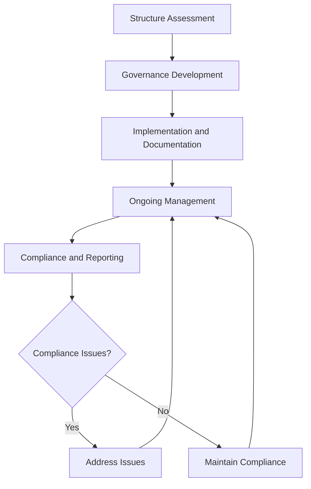

### Tools and Resources

- **Corporate Management System**: Digital corporate governance tracking and documentation capabilities
- **Legal Documentation**: Comprehensive corporate documentation and compliance records
- **Legal Counsel**: Attorney specializing in corporate law and aviation business requirements
- **Governance Software**: Corporate governance and compliance management tools
- **Regulatory Resources**: Corporate and aviation regulatory guidance materials
- **Documentation System**: Corporate record management and storage

### Success Metrics

- **Completion Time:** Corporate structure modifications implemented within 120 days of approval
- **Quality Standard:** 100% of corporate governance procedures meet legal and regulatory requirements
- **Safety Standard:** Zero safety incidents related to corporate structure or governance procedures
- **Client Satisfaction:** 95% client satisfaction with corporate governance and organizational structure

### Common Issues and Solutions

- **Issue:** Corporate structure not aligned with business objectives and operational requirements
- **Solution:** Conduct comprehensive business analysis and align corporate structure with strategic objectives. Implement regular reviews to ensure ongoing alignment.

- **Issue:** Governance procedures not meeting legal or regulatory compliance requirements
- **Solution:** Work with legal counsel to develop compliant governance procedures. Implement regular compliance audits and updates to maintain regulatory adherence.

- **Issue:** Corporate documentation not current or accessible for regulatory requirements
- **Solution:** Implement comprehensive documentation management procedures with regular updates. Establish clear responsibilities for documentation maintenance and accessibility.

- **Issue:** Governance decision-making processes not supporting operational efficiency
- **Solution:** Streamline governance procedures to support operational requirements. Implement clear decision-making frameworks that balance governance needs with operational efficiency.

### Safety Considerations

- ⚠️ **WARNING**: Never compromise safety standards for corporate governance or structural convenience
- ⚠️ **WARNING**: Ensure all corporate governance procedures comply with aviation safety and regulatory requirements
- ⚡ **CAUTION**: Verify corporate structure supports safety and operational excellence objectives
- ⚡ **CAUTION**: Monitor governance procedures for effectiveness and safety compliance
- ℹ️ **NOTE**: Maintain current corporate knowledge and update procedures as requirements change
- ℹ️ **NOTE**: Conduct regular governance reviews to ensure ongoing safety and operational alignment
- ✅ **BEST PRACTICE**: Implement comprehensive corporate governance training and documentation procedures
- ✅ **BEST PRACTICE**: Maintain detailed records of all corporate governance activities and decisions

### Regulatory References

- **State Corporate Laws** - Applicable state laws governing corporate structure and governance
- **Federal Aviation Regulations** - FAA requirements for aviation business operations
- **Securities and Exchange Commission (SEC) Regulations** - Applicable securities and reporting requirements
- **Internal Revenue Service (IRS) Requirements** - Tax compliance and reporting requirements
- **Aviation Business Regulations** - Industry-specific corporate and business requirements

### Aviation Industry Requirements

#### Corporate Structure Standards
- **Aviation Compliance**: Corporate structure meeting aviation industry and regulatory requirements
- **Safety Focus**: Corporate governance supporting aviation safety and operational excellence
- **Operational Alignment**: Corporate structure supporting efficient aviation operations
- **Regulatory Compliance**: Corporate governance meeting FAA and industry requirements

#### Governance Requirements
- **Legal Compliance**: Comprehensive compliance with corporate and aviation law requirements
- **Documentation**: Complete documentation of corporate structure and governance procedures
- **Operational Support**: Governance procedures supporting operational excellence and safety
- **Strategic Alignment**: Corporate governance supporting long-term business objectives

---

## Intellectual Property Protection

Protect intellectual property and manage licensing agreements to ensure organizational assets, competitive advantages, and legal protection while supporting business growth and innovation.

### Purpose

Establish systematic procedures for protecting intellectual property and managing licensing agreements that ensure organizational assets, competitive advantages, and legal protection while supporting business growth, innovation, and long-term organizational success.

### Roles and Responsibilities

**Business Leader:**

- Approve intellectual property protection strategies and policies
- Review intellectual property portfolio and protection requirements
- Oversee licensing agreements and intellectual property management
- Monitor intellectual property value and competitive advantages
- Authorize intellectual property protection and licensing decisions

**Operations Leader:**

- Oversee operational use of intellectual property and licensing
- Monitor operational compliance with intellectual property requirements
- Coordinate operational procedures with intellectual property protection
- Ensure operational standards support intellectual property objectives
- Authorize operational modifications supporting intellectual property goals

**Safety Officer:**

- Review safety implications of intellectual property and licensing
- Verify safety compliance with intellectual property requirements
- Monitor safety performance within intellectual property framework
- Ensure safety standards align with intellectual property objectives
- Coordinate safety considerations in intellectual property decisions

**Finance Leader:**

- Oversee financial aspects of intellectual property and licensing
- Monitor intellectual property costs and financial implications
- Coordinate financial reporting with intellectual property requirements
- Review financial impact of intellectual property decisions
- Authorize financial modifications supporting intellectual property objectives

**Client Service Representative:**

- Coordinate client service alignment with intellectual property protection
- Monitor client service procedures within intellectual property framework
- Maintain client relationships supporting intellectual property objectives
- Document client feedback for intellectual property decision-making
- Support intellectual property protection through client service excellence

### Process Steps

#### Intellectual Property Assessment Phase

- **Identify intellectual property assets** - Recognize and catalog all organizational intellectual property
- **Assess protection requirements** - Determine appropriate protection levels and strategies
- **Evaluate competitive advantages** - Analyze intellectual property value and competitive position
- **Prioritize protection needs** - Determine critical intellectual property requiring immediate protection

#### Protection Strategy Development Phase

- **Develop protection strategies** - Create comprehensive intellectual property protection plans
- **Select protection methods** - Choose appropriate protection mechanisms and procedures
- **Create protection procedures** - Develop systematic protection and monitoring procedures
- **Design licensing frameworks** - Establish licensing agreement structures and terms

#### Implementation and Registration Phase

- **Implement protection measures** - Execute intellectual property protection strategies
- **Register intellectual property** - Complete formal registration and protection procedures
- **Establish monitoring systems** - Implement ongoing monitoring and protection verification
- **Create documentation procedures** - Develop comprehensive documentation and record-keeping

#### Licensing and Management Phase

- **Develop licensing agreements** - Create comprehensive licensing terms and conditions
- **Negotiate licensing arrangements** - Conduct licensing negotiations and agreement execution
- **Monitor licensing compliance** - Track licensing agreement compliance and performance
- **Manage licensing relationships** - Maintain ongoing licensing relationships and communications

#### Ongoing Protection and Enforcement Phase

- **Monitor intellectual property status** - Track intellectual property protection and compliance
- **Enforce protection rights** - Take action to protect intellectual property rights when necessary
- **Update protection measures** - Maintain current and effective protection procedures
- **Conduct regular reviews** - Perform periodic intellectual property assessments and evaluations

### Process Mapping

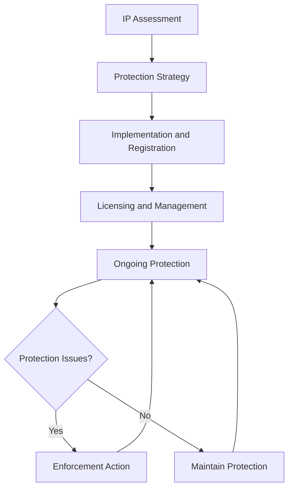

### Tools and Resources

- **Intellectual Property Management System**: Digital IP tracking and protection capabilities
- **Legal Documentation**: Comprehensive IP documentation and protection records
- **Legal Counsel**: Attorney specializing in intellectual property law and aviation business
- **IP Registration Services**: Professional IP registration and protection services
- **Licensing Software**: IP licensing and agreement management tools
- **Documentation System**: IP record management and storage

### Success Metrics

- **Completion Time:** Intellectual property protection implemented within 60 days of identification
- **Quality Standard:** 100% of intellectual property assets properly protected and documented
- **Safety Standard:** Zero safety incidents related to intellectual property protection procedures
- **Client Satisfaction:** 95% client satisfaction with intellectual property protection and licensing

### Common Issues and Solutions

- **Issue:** Intellectual property not properly identified or protected leading to asset loss
- **Solution:** Implement comprehensive IP identification and protection procedures. Conduct regular IP audits and maintain current protection measures.

- **Issue:** Licensing agreements not generating expected value or compliance issues
- **Solution:** Develop comprehensive licensing strategies with clear terms and monitoring procedures. Implement regular licensing performance reviews and optimization.

- **Issue:** Intellectual property infringement not detected or addressed promptly
- **Solution:** Implement proactive IP monitoring and enforcement procedures. Establish clear escalation protocols and legal support for infringement response.

- **Issue:** Intellectual property costs exceeding budget constraints affecting protection effectiveness
- **Solution:** Prioritize IP protection based on value and competitive importance. Implement cost-effective protection strategies and regular cost-benefit analysis.

### Safety Considerations

- ⚠️ **WARNING**: Never compromise safety standards for intellectual property protection or licensing convenience
- ⚠️ **WARNING**: Ensure all intellectual property procedures comply with aviation safety and regulatory requirements
- ⚡ **CAUTION**: Verify intellectual property protection supports safety and operational excellence objectives
- ⚡ **CAUTION**: Monitor intellectual property procedures for effectiveness and safety compliance
- ℹ️ **NOTE**: Maintain current intellectual property knowledge and update procedures as requirements change
- ℹ️ **NOTE**: Conduct regular IP reviews to ensure ongoing safety and operational alignment
- ✅ **BEST PRACTICE**: Implement comprehensive intellectual property training and documentation procedures
- ✅ **BEST PRACTICE**: Maintain detailed records of all intellectual property activities and decisions

### Regulatory References

- **Patent and Trademark Laws** - Federal intellectual property protection requirements
- **Copyright Laws** - Copyright protection and licensing requirements
- **Trade Secret Laws** - Trade secret protection and confidentiality requirements
- **Aviation Intellectual Property Regulations** - Industry-specific IP protection requirements
- **International IP Agreements** - International intellectual property protection requirements

### Aviation Industry Requirements

#### Intellectual Property Standards
- **Aviation Compliance**: Intellectual property protection meeting aviation industry requirements
- **Safety Focus**: IP protection supporting aviation safety and operational excellence
- **Operational Alignment**: IP protection supporting efficient aviation operations
- **Regulatory Compliance**: IP protection meeting FAA and industry requirements

#### Protection Requirements
- **Legal Compliance**: Comprehensive compliance with intellectual property law requirements
- **Documentation**: Complete documentation of intellectual property protection and licensing procedures
- **Operational Support**: IP protection supporting operational excellence and safety
- **Strategic Alignment**: IP protection supporting long-term business objectives and competitive advantages

---

## Employment Law Compliance

Ensure compliance with employment laws and regulations to protect team members, maintain organizational integrity, and support operational excellence while meeting legal requirements and industry standards.

### Purpose

Establish systematic procedures for ensuring compliance with employment laws and regulations that protect team members, maintain organizational integrity, and support operational excellence while meeting legal requirements, industry standards, and aviation-specific employment considerations.

### Roles and Responsibilities

**Business Leader:**

- Approve employment law compliance policies and procedures
- Review employment law compliance status and requirements
- Oversee compliance monitoring and audit preparation
- Monitor employment law changes and compliance updates
- Authorize employment law compliance modifications and updates

**Operations Leader:**

- Oversee operational compliance with employment law requirements
- Monitor operational procedures for employment law compliance
- Coordinate operational procedures with employment law requirements
- Ensure operational standards meet employment law requirements
- Authorize operational modifications supporting employment law compliance

**Safety Officer:**

- Review safety implications of employment law compliance
- Verify safety procedures meet employment law requirements
- Monitor safety incidents and employment law implications
- Ensure safety documentation supports employment law compliance
- Coordinate safety training and employment law requirements

**Finance Leader:**

- Oversee financial aspects of employment law compliance
- Monitor compensation and benefits for employment law compliance
- Coordinate financial reporting with employment law requirements
- Review financial impact of employment law compliance requirements
- Authorize financial modifications supporting employment law compliance

**Client Service Representative:**

- Coordinate client service alignment with employment law compliance
- Monitor client service procedures for employment law compliance
- Maintain client relationships supporting employment law compliance
- Document client interactions for employment law compliance purposes
- Support employment law compliance through client service excellence

### Process Steps

#### Employment Law Assessment Phase

- **Identify applicable employment laws** - Determine all applicable federal, state, and local employment laws
- **Assess current compliance status** - Evaluate existing procedures and practices for compliance
- **Identify compliance gaps** - Recognize areas requiring attention and improvement
- **Prioritize compliance needs** - Determine critical compliance requirements and timelines

#### Compliance Policy Development Phase

- **Develop compliance policies** - Create comprehensive employment law compliance policies
- **Create compliance procedures** - Develop systematic compliance procedures and practices
- **Establish monitoring systems** - Implement ongoing compliance monitoring and verification
- **Design training programs** - Create comprehensive training on employment law requirements

#### Implementation and Training Phase

- **Implement compliance policies** - Execute new employment law compliance policies and procedures
- **Provide team member training** - Deliver comprehensive training on employment law requirements
- **Establish monitoring procedures** - Create ongoing compliance monitoring and verification
- **Launch compliance reporting** - Begin regular compliance reporting and documentation

#### Ongoing Monitoring Phase

- **Monitor compliance status** - Track ongoing compliance with employment law requirements
- **Update compliance procedures** - Maintain current and accurate compliance procedures
- **Conduct regular reviews** - Perform periodic compliance assessments and evaluations
- **Address compliance issues** - Identify and resolve compliance deficiencies promptly

#### Audit and Reporting Phase

- **Prepare for employment law audits** - Organize documentation and prepare for regulatory reviews
- **Conduct internal audits** - Perform regular internal compliance audits and assessments
- **Generate compliance reports** - Create comprehensive compliance reporting and documentation
- **Submit regulatory reports** - Complete and submit required employment law reports and documentation

### Process Mapping

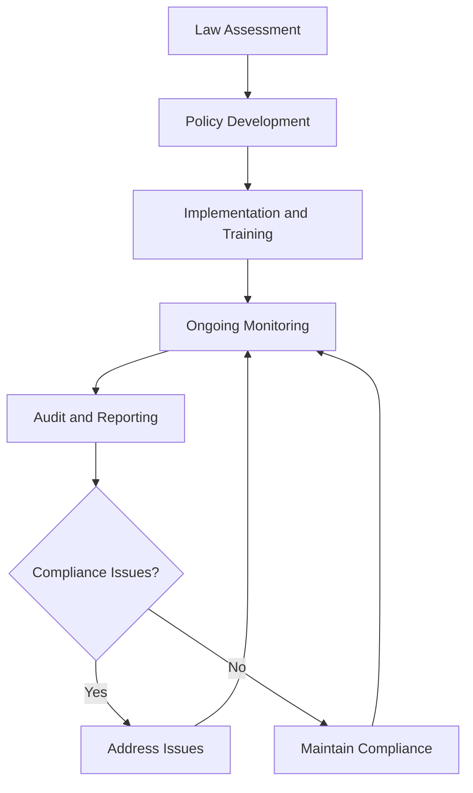

### Tools and Resources

- **Employment Law Compliance System**: Digital compliance tracking and documentation capabilities
- **Legal Documentation**: Comprehensive employment law documentation and compliance records
- **Legal Counsel**: Attorney specializing in employment law and aviation business requirements
- **Compliance Software**: Employment law compliance and monitoring tools
- **Training Resources**: Employment law training and education materials
- **Documentation System**: Employment law record management and storage

### Success Metrics

- **Completion Time:** Employment law compliance procedures updated within 30 days of law changes
- **Quality Standard:** 100% of employment law requirements documented and procedures implemented
- **Safety Standard:** Zero safety incidents related to employment law compliance procedures
- **Client Satisfaction:** 95% team member satisfaction with employment law compliance and practices

### Common Issues and Solutions

- **Issue:** Employment law requirements not clearly understood or documented
- **Solution:** Work with employment law counsel to develop comprehensive understanding. Create clear documentation and training materials for all team members.

- **Issue:** Employment law compliance not current with regulatory changes
- **Solution:** Implement regular employment law monitoring and update procedures. Establish automated systems for tracking law changes and updating compliance procedures.

- **Issue:** Team member training insufficient for employment law requirements
- **Solution:** Develop comprehensive training programs covering all employment law requirements. Provide regular updates and refresher training on law changes.

- **Issue:** Employment law compliance reporting not meeting regulatory deadlines or requirements
- **Solution:** Implement automated reporting systems with clear deadlines and responsibilities. Establish backup procedures for critical compliance reporting.

### Safety Considerations

- ⚠️ **WARNING**: Never compromise safety standards for employment law compliance convenience
- ⚠️ **WARNING**: Ensure all employment law procedures comply with aviation safety and regulatory requirements
- ⚡ **CAUTION**: Verify employment law compliance supports safety and operational excellence objectives
- ⚡ **CAUTION**: Monitor employment law procedures for effectiveness and safety compliance
- ℹ️ **NOTE**: Maintain current employment law knowledge and update procedures as requirements change
- ℹ️ **NOTE**: Conduct regular employment law reviews to ensure ongoing safety and operational alignment
- ✅ **BEST PRACTICE**: Implement comprehensive employment law training and documentation procedures
- ✅ **BEST PRACTICE**: Maintain detailed records of all employment law compliance activities and decisions

### Regulatory References

- **Fair Labor Standards Act (FLSA)** - Minimum wage, overtime, and employment standards
- **Title VII of Civil Rights Act** - Anti-discrimination and equal employment opportunity
- **Americans with Disabilities Act (ADA)** - Disability accommodation and employment protection
- **Family and Medical Leave Act (FMLA)** - Leave and employment protection requirements
- **State Employment Laws** - Applicable state employment and labor regulations

### Aviation Industry Requirements

#### Employment Law Standards
- **Aviation Compliance**: Employment law compliance meeting aviation industry requirements
- **Safety Focus**: Employment law procedures supporting aviation safety and operational excellence
- **Operational Alignment**: Employment law compliance supporting efficient aviation operations
- **Regulatory Compliance**: Employment law procedures meeting FAA and industry requirements

#### Compliance Requirements
- **Legal Compliance**: Comprehensive compliance with employment and labor law requirements
- **Documentation**: Complete documentation of employment law compliance procedures
- **Operational Support**: Employment law compliance supporting operational excellence and safety
- **Team Member Protection**: Employment law compliance protecting team member rights and interests

---

## Legal Document Management

Manage legal document creation, storage, and security to ensure organizational protection, regulatory compliance, and operational efficiency while maintaining document integrity and accessibility.

### Purpose

Establish systematic procedures for managing legal document creation, storage, and security that ensure organizational protection, regulatory compliance, and operational efficiency while maintaining document integrity, accessibility, and long-term organizational success.

### Roles and Responsibilities

**Business Leader:**

- Approve legal document management policies and procedures
- Review legal document security and compliance requirements
- Oversee legal document management and security protocols
- Monitor legal document effectiveness and organizational protection
- Authorize legal document management modifications and updates

**Operations Leader:**

- Oversee operational alignment with legal document requirements
- Monitor operational procedures for legal document compliance
- Coordinate operational procedures with legal document management
- Ensure operational standards meet legal document requirements
- Authorize operational modifications supporting legal document objectives

**Safety Officer:**

- Review safety implications of legal document management
- Verify safety procedures meet legal document requirements
- Monitor safety incidents and legal document implications
- Ensure safety documentation supports legal document compliance
- Coordinate safety training and legal document requirements

**Finance Leader:**

- Oversee financial aspects of legal document management
- Monitor legal document costs and financial implications
- Coordinate financial reporting with legal document requirements
- Review financial impact of legal document management decisions
- Authorize financial modifications supporting legal document objectives

**Client Service Representative:**

- Coordinate client service alignment with legal document management
- Monitor client service procedures for legal document compliance
- Maintain client relationships supporting legal document objectives
- Document client interactions for legal document purposes
- Support legal document management through client service excellence

### Process Steps

#### Document Creation Phase

- **Identify document requirements** - Determine legal document needs and specifications
- **Develop document templates** - Create standardized legal document templates and formats
- **Establish creation procedures** - Develop systematic document creation and review procedures
- **Implement quality control** - Create quality assurance procedures for document creation

#### Document Storage and Organization Phase

- **Design storage system** - Create comprehensive document storage and organization system
- **Establish filing procedures** - Develop systematic filing and organization procedures
- **Implement access controls** - Create secure access and authorization procedures
- **Establish backup procedures** - Develop comprehensive backup and recovery procedures

#### Document Security and Protection Phase

- **Implement security measures** - Create comprehensive document security and protection
- **Establish access protocols** - Develop secure access and authorization protocols
- **Create audit trails** - Implement comprehensive audit and tracking procedures
- **Establish retention policies** - Develop document retention and disposal procedures

#### Document Management and Maintenance Phase

- **Monitor document status** - Track document status, updates, and maintenance requirements
- **Update document procedures** - Maintain current and accurate document management procedures
- **Conduct regular reviews** - Perform periodic document assessments and evaluations
- **Address document issues** - Identify and resolve document management deficiencies promptly

#### Compliance and Reporting Phase

- **Maintain regulatory compliance** - Ensure ongoing compliance with document management requirements
- **Generate compliance reports** - Create comprehensive compliance reporting and documentation
- **Submit regulatory reports** - Complete and submit required document management reports
- **Conduct compliance audits** - Perform regular compliance audits and assessments

### Process Mapping

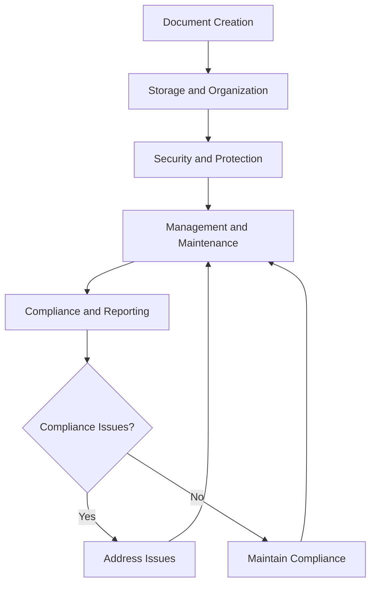

### Tools and Resources

- **Legal Document Management System**: Digital document tracking and management capabilities
- **Document Storage System**: Secure document storage and organization platform
- **Legal Documentation**: Comprehensive legal document templates and procedures
- **Legal Counsel**: Attorney specializing in legal document management and compliance
- **Document Security Software**: Legal document security and access control tools
- **Documentation System**: Legal document record management and storage

### Success Metrics

- **Completion Time:** Legal documents created and stored within 48 hours of requirements identification
- **Quality Standard:** 100% of legal documents properly created, stored, and secured
- **Safety Standard:** Zero safety incidents related to legal document management procedures
- **Client Satisfaction:** 95% client satisfaction with legal document management and accessibility

### Common Issues and Solutions

- **Issue:** Legal documents not properly organized or accessible when needed
- **Solution:** Implement comprehensive document organization and indexing procedures. Create clear filing systems and access protocols for efficient document retrieval.

- **Issue:** Legal document security not adequate for sensitive information protection
- **Solution:** Develop comprehensive security procedures with access controls and encryption. Implement regular security audits and updates to maintain protection.

- **Issue:** Legal document retention not meeting regulatory requirements
- **Solution:** Establish clear retention policies based on regulatory requirements. Implement automated retention tracking and disposal procedures.

- **Issue:** Legal document creation not standardized leading to inconsistencies
- **Solution:** Develop comprehensive document templates and creation procedures. Provide training on document creation standards and quality control.

### Safety Considerations

- ⚠️ **WARNING**: Never compromise document security for operational convenience or accessibility
- ⚠️ **WARNING**: Ensure all legal document procedures comply with security and regulatory requirements
- ⚡ **CAUTION**: Verify legal document management supports safety and operational excellence objectives
- ⚡ **CAUTION**: Monitor legal document procedures for effectiveness and security compliance
- ℹ️ **NOTE**: Maintain current legal document knowledge and update procedures as requirements change
- ℹ️ **NOTE**: Conduct regular document reviews to ensure ongoing security and operational alignment
- ✅ **BEST PRACTICE**: Implement comprehensive legal document training and security procedures
- ✅ **BEST PRACTICE**: Maintain detailed records of all legal document activities and access

### Regulatory References

- **Federal Records Management Laws** - Federal requirements for document management and retention
- **State Document Management Laws** - Applicable state requirements for document management
- **Aviation Document Regulations** - Industry-specific document management requirements
- **Security and Privacy Laws** - Document security and privacy protection requirements
- **Electronic Records Laws** - Electronic document management and signature requirements

### Aviation Industry Requirements

#### Legal Document Standards
- **Aviation Compliance**: Legal document management meeting aviation industry requirements
- **Safety Focus**: Legal document procedures supporting aviation safety and operational excellence
- **Operational Alignment**: Legal document management supporting efficient aviation operations
- **Regulatory Compliance**: Legal document procedures meeting FAA and industry requirements

#### Document Management Requirements
- **Legal Compliance**: Comprehensive compliance with document management law requirements
- **Documentation**: Complete documentation of legal document management procedures
- **Operational Support**: Legal document management supporting operational excellence and safety
- **Security Protection**: Legal document management ensuring document security and integrity

---

## Legal Audit Preparation

Prepare for legal audits and compliance reviews to ensure organizational readiness, regulatory compliance, and operational excellence while maintaining audit readiness and organizational protection.

### Purpose

Establish systematic procedures for preparing for legal audits and compliance reviews that ensure organizational readiness, regulatory compliance, and operational excellence while maintaining audit readiness, organizational protection, and long-term organizational success.

### Roles and Responsibilities

**Business Leader:**

- Approve legal audit preparation policies and procedures
- Review legal audit requirements and compliance status
- Oversee legal audit preparation and organizational readiness
- Monitor legal audit outcomes and organizational protection
- Authorize legal audit preparation modifications and updates

**Operations Leader:**

- Oversee operational alignment with legal audit requirements
- Monitor operational procedures for legal audit compliance
- Coordinate operational procedures with legal audit preparation
- Ensure operational standards meet legal audit requirements
- Authorize operational modifications supporting legal audit objectives

**Safety Officer:**

- Review safety implications of legal audit preparation
- Verify safety procedures meet legal audit requirements
- Monitor safety incidents and legal audit implications
- Ensure safety documentation supports legal audit compliance
- Coordinate safety training and legal audit requirements

**Finance Leader:**

- Oversee financial aspects of legal audit preparation
- Monitor legal audit costs and financial implications
- Coordinate financial reporting with legal audit requirements
- Review financial impact of legal audit preparation decisions
- Authorize financial modifications supporting legal audit objectives

**Client Service Representative:**

- Coordinate client service alignment with legal audit preparation
- Monitor client service procedures for legal audit compliance
- Maintain client relationships supporting legal audit objectives
- Document client interactions for legal audit purposes
- Support legal audit preparation through client service excellence

### Process Steps

#### Audit Assessment Phase

- **Identify audit requirements** - Determine legal audit scope, requirements, and timelines
- **Assess current compliance status** - Evaluate existing procedures and practices for compliance
- **Identify compliance gaps** - Recognize areas requiring attention and improvement
- **Prioritize preparation needs** - Determine critical preparation requirements and timelines

#### Preparation Planning Phase

- **Develop preparation strategy** - Create comprehensive legal audit preparation plan
- **Establish preparation procedures** - Develop systematic preparation and review procedures
- **Create documentation procedures** - Develop comprehensive documentation and organization procedures
- **Design review processes** - Establish review and verification procedures

#### Documentation and Organization Phase

- **Organize existing documentation** - Compile and organize all relevant legal documentation
- **Create missing documentation** - Develop any missing or incomplete documentation
- **Establish documentation systems** - Create systematic documentation organization and access
- **Implement quality control** - Establish quality assurance procedures for documentation

#### Compliance Verification Phase

- **Conduct internal audits** - Perform comprehensive internal compliance audits
- **Verify compliance status** - Confirm compliance with all applicable legal requirements
- **Address compliance issues** - Identify and resolve compliance deficiencies promptly
- **Document compliance status** - Create comprehensive compliance documentation

#### Final Preparation Phase

- **Conduct mock audits** - Perform practice audits to identify potential issues
- **Prepare audit team** - Train and prepare team members for audit participation
- **Organize audit materials** - Prepare all materials and documentation for audit
- **Establish communication protocols** - Create clear communication procedures for audit

### Process Mapping

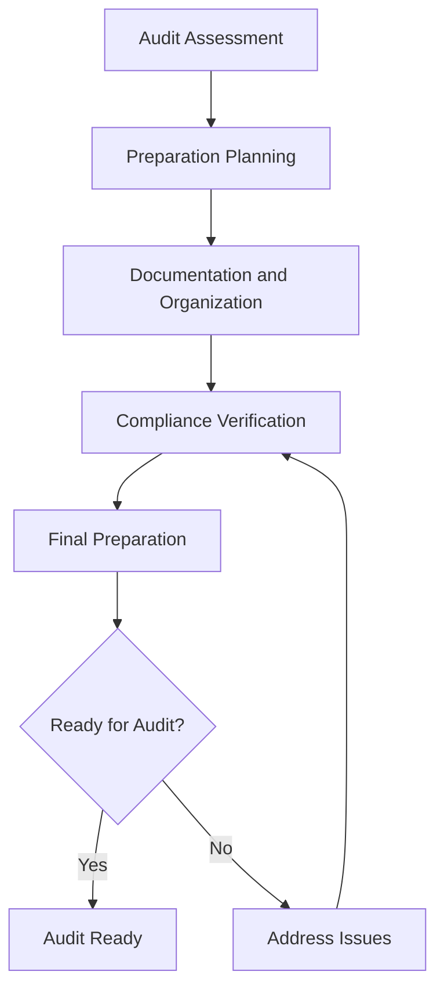

### Tools and Resources

- **Legal Audit Preparation System**: Digital audit preparation tracking and documentation capabilities
- **Compliance Documentation**: Comprehensive legal compliance documentation and records
- **Legal Counsel**: Attorney specializing in legal audit preparation and compliance
- **Audit Preparation Software**: Legal audit preparation and compliance monitoring tools
- **Documentation System**: Legal audit record management and storage
- **Training Resources**: Legal audit preparation and compliance training materials

### Success Metrics

- **Completion Time:** Legal audit preparation completed within 30 days of audit notification
- **Quality Standard:** 100% of legal audit requirements addressed and documented
- **Safety Standard:** Zero safety incidents related to legal audit preparation procedures
- **Client Satisfaction:** 95% client satisfaction with legal audit preparation and outcomes

### Common Issues and Solutions

- **Issue:** Legal audit requirements not clearly understood or documented
- **Solution:** Work with legal counsel to develop comprehensive understanding of audit requirements. Create clear documentation and preparation procedures for all team members.

- **Issue:** Documentation not organized or accessible for audit review
- **Solution:** Implement comprehensive documentation organization and indexing procedures. Create clear filing systems and access protocols for efficient audit review.

- **Issue:** Compliance gaps not identified or addressed before audit
- **Solution:** Conduct thorough internal audits and compliance reviews. Implement systematic gap analysis and corrective action procedures.

- **Issue:** Team members not prepared for audit participation
- **Solution:** Develop comprehensive training programs covering audit requirements and procedures. Provide regular updates and practice sessions for audit preparation.

### Safety Considerations

- ⚠️ **WARNING**: Never compromise safety standards for legal audit preparation convenience
- ⚠️ **WARNING**: Ensure all legal audit procedures comply with aviation safety and regulatory requirements
- ⚡ **CAUTION**: Verify legal audit preparation supports safety and operational excellence objectives
- ⚡ **CAUTION**: Monitor legal audit procedures for effectiveness and safety compliance
- ℹ️ **NOTE**: Maintain current legal audit knowledge and update procedures as requirements change
- ℹ️ **NOTE**: Conduct regular audit preparation reviews to ensure ongoing safety and operational alignment
- ✅ **BEST PRACTICE**: Implement comprehensive legal audit training and preparation procedures
- ✅ **BEST PRACTICE**: Maintain detailed records of all legal audit preparation activities and outcomes

### Regulatory References

- **Federal Audit Requirements** - Federal requirements for legal audits and compliance reviews
- **State Audit Laws** - Applicable state requirements for legal audits and compliance
- **Aviation Audit Regulations** - Industry-specific audit and compliance requirements
- **Compliance Review Standards** - Professional standards for legal audit and compliance reviews
- **Documentation Requirements** - Legal requirements for audit documentation and record-keeping

### Aviation Industry Requirements

#### Legal Audit Standards
- **Aviation Compliance**: Legal audit preparation meeting aviation industry requirements
- **Safety Focus**: Legal audit procedures supporting aviation safety and operational excellence
- **Operational Alignment**: Legal audit preparation supporting efficient aviation operations
- **Regulatory Compliance**: Legal audit procedures meeting FAA and industry requirements

#### Audit Preparation Requirements
- **Legal Compliance**: Comprehensive compliance with legal audit and review requirements
- **Documentation**: Complete documentation of legal audit preparation procedures
- **Operational Support**: Legal audit preparation supporting operational excellence and safety
- **Organizational Protection**: Legal audit preparation ensuring organizational protection and compliance